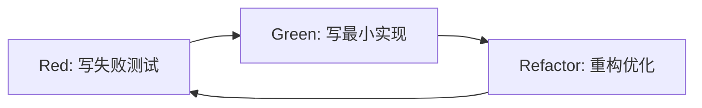
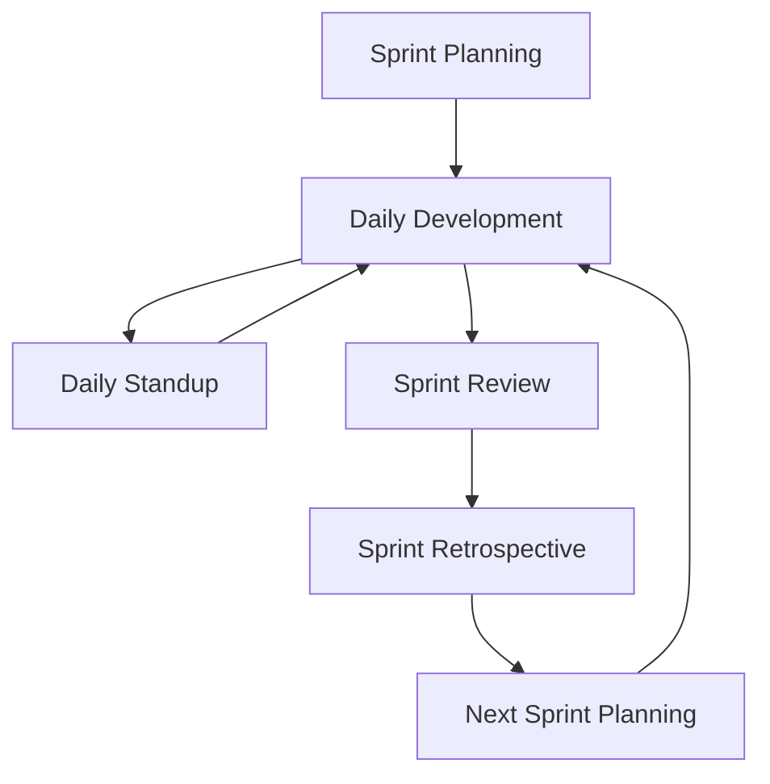

# CLAUDE.md - StatCal 项目开发指导文档

> 为 Claude Code AI 助手提供的项目开发指导原则和最佳实践

## 📖 文档概述

本文档为 StatCal 统计工具网站项目提供统一的开发指导原则，确保代码质量、开发效率和团队协作的一致性。所有开发决策都应遵循以下三大核心理念：

1. **测试驱动开发 (TDD)** - 以测试为先导的开发模式
2. **迭代开发模型** - 小步快跑的渐进式开发
3. **Linus 工程哲学** - 代码优于讨论的务实主义

---

## 🐧 核心开发哲学：Linus Torvalds 工程原则

### 1. "Talk is cheap. Show me the code." - 代码优于讨论

#### 在 StatCal 项目中的体现：
- **实证驱动决策**: 技术选型必须通过可工作的原型验证
- **可演示的进展**: 每日站会展示可运行的代码，而不是进度报告
- **测试即证明**: 功能正确性通过测试用例证明，而非口头描述
- **避免过度设计**: 所有架构决策必须有具体业务场景支撑

```typescript
// ✅ 好的实践 - 通过代码和测试证明功能
describe('Mean Calculator', () => {
  it('should calculate mean of valid numbers', () => {
    const result = calculateMean([1, 2, 3, 4, 5]);
    expect(result).toBe(3);
  });
  
  it('should handle edge cases', () => {
    expect(calculateMean([])).toBeNaN();
    expect(calculateMean([5])).toBe(5);
  });
});

// ❌ 避免的反模式 - 空洞的接口定义
interface AbstractCalculatorInterface {
  // 过度抽象，没有具体实现支撑
  calculate<T extends unknown>(input: T): T;
}
```

### 2. "Release early, release often." - 小步快跑，频繁交付

#### StatCal 项目交付节奏：
- **日常集成**: 每天至少一次代码合并到主分支
- **功能切片**: 用户故事分解为 ≤2 天的开发任务
- **即时反馈**: 功能完成后 24 小时内获得产品验证
- **渐进式完善**: 先实现 MVP，再迭代增强

```yaml
# StatCal 交付节奏配置
delivery_rhythm:
  daily_commits: ">=1"
  task_duration: "<=2 days"
  feedback_cycle: "<=24 hours"
  demo_frequency: "每个工作日"
  
sprint_milestones:
  - day_1: "项目架构搭建完成"
  - day_3: "核心组件库可用"
  - day_5: "Landing Page 基础版可访问"
  - day_10: "性能优化和 SEO 完成"
  - day_14: "生产环境部署就绪"
```

### 3. "Good programmers know what to write. Great programmers know what to rewrite." - 重构胜过重写

#### 在 StatCal 中的重构策略：
- **渐进式改进**: 在测试保护下持续重构，避免大爆炸式重写
- **代码演进历史**: 通过清晰的 Git 提交记录代码改进过程
- **择时重构**: 功能稳定后进行代码优化，不与新功能开发混合

```typescript
// ✅ 渐进式重构示例
// Phase 1: 基础实现
export function calculateMean(numbers: number[]): number {
  if (numbers.length === 0) return NaN;
  const sum = numbers.reduce((acc, num) => acc + num, 0);
  return sum / numbers.length;
}

// Phase 2: 增强错误处理（重构，不重写）
export function calculateMean(numbers: number[]): number {
  if (!Array.isArray(numbers)) throw new Error('Input must be an array');
  if (numbers.length === 0) return NaN;
  
  // 过滤无效值
  const validNumbers = numbers.filter(n => typeof n === 'number' && !isNaN(n));
  if (validNumbers.length === 0) return NaN;
  
  const sum = validNumbers.reduce((acc, num) => acc + num, 0);
  return sum / validNumbers.length;
}
```

### 4. "Perfect is achieved when there is nothing left to take away." - 简单性原则

#### StatCal 简单性实践：
- **YAGNI 原则**: 只实现当前 Sprint 需要的功能
- **删除优于添加**: 每次代码提交都考虑是否可以删除冗余代码
- **最小化接口**: API 和组件接口保持最小必要集

```typescript
// ✅ 简洁的组件设计
interface ButtonProps {
  children: React.ReactNode;
  onClick: () => void;
  variant?: 'primary' | 'secondary';
  disabled?: boolean;
}

// ❌ 过度复杂的组件接口
interface OverEngineeredButtonProps {
  children: React.ReactNode;
  onClick: () => void;
  onHover?: () => void;
  onFocus?: () => void;
  onBlur?: () => void;
  variant?: string;
  size?: string;
  color?: string;
  theme?: 'light' | 'dark' | 'auto';
  animation?: 'none' | 'hover' | 'click';
  loading?: boolean;
  loadingText?: string;
  icon?: React.ReactNode;
  iconPosition?: 'left' | 'right';
  // ... 20+ 更多不必要的属性
}
```

### 5. "Given enough eyeballs, all bugs are shallow." - 集体智慧

#### StatCal 代码审查流程：
- **强制代码审查**: 所有代码必须至少 2 人批准
- **及时技术分享**: 关键决策和难点解决方案团队内即时分享
- **透明沟通**: 技术问题和风险及时暴露，寻求集体解决方案

---

## 🔄 测试驱动开发 (TDD) 实践指南

### TDD 三步循环：Red-Green-Refactor



### 在 StatCal 项目中的 TDD 实践

#### 1. 统计计算器的 TDD 开发流程

```typescript
// Step 1: RED - 先写失败的测试
describe('StandardDeviationCalculator', () => {
  it('should calculate standard deviation for sample data', () => {
    const calculator = new StandardDeviationCalculator();
    const result = calculator.calculate([2, 4, 4, 4, 5, 5, 7, 9], 'sample');
    expect(result).toBeCloseTo(2.138, 3);
  });

  it('should calculate standard deviation for population data', () => {
    const calculator = new StandardDeviationCalculator();
    const result = calculator.calculate([2, 4, 4, 4, 5, 5, 7, 9], 'population');
    expect(result).toBeCloseTo(2.0, 3);
  });
});

// Step 2: GREEN - 写最小可工作的实现
export class StandardDeviationCalculator {
  calculate(data: number[], type: 'sample' | 'population'): number {
    if (data.length === 0) return NaN;
    
    const mean = data.reduce((sum, x) => sum + x, 0) / data.length;
    const squaredDiffs = data.map(x => Math.pow(x - mean, 2));
    const sumSquaredDiffs = squaredDiffs.reduce((sum, x) => sum + x, 0);
    
    const divisor = type === 'sample' ? data.length - 1 : data.length;
    const variance = sumSquaredDiffs / divisor;
    
    return Math.sqrt(variance);
  }
}

// Step 3: REFACTOR - 重构优化（在测试保护下）
export class StandardDeviationCalculator {
  calculate(data: number[], type: 'sample' | 'population'): number {
    this.validateInput(data, type);
    
    const mean = this.calculateMean(data);
    const variance = this.calculateVariance(data, mean, type);
    
    return Math.sqrt(variance);
  }
  
  private validateInput(data: number[], type: string): void {
    if (!Array.isArray(data) || data.length === 0) {
      throw new Error('Data must be a non-empty array');
    }
    if (!['sample', 'population'].includes(type)) {
      throw new Error('Type must be either "sample" or "population"');
    }
  }
  
  private calculateMean(data: number[]): number {
    return data.reduce((sum, x) => sum + x, 0) / data.length;
  }
  
  private calculateVariance(data: number[], mean: number, type: string): number {
    const squaredDiffs = data.map(x => Math.pow(x - mean, 2));
    const sumSquaredDiffs = squaredDiffs.reduce((sum, x) => sum + x, 0);
    const divisor = type === 'sample' ? data.length - 1 : data.length;
    
    return sumSquaredDiffs / divisor;
  }
}
```

#### 2. React 组件的 TDD 开发

```typescript
// Step 1: RED - 组件测试先行
import { render, screen, fireEvent } from '@testing-library/react';
import { Calculator } from './Calculator';

describe('Calculator Component', () => {
  it('should render input field and calculate button', () => {
    render(<Calculator />);
    
    expect(screen.getByLabelText(/enter numbers/i)).toBeInTheDocument();
    expect(screen.getByRole('button', { name: /calculate/i })).toBeInTheDocument();
  });

  it('should display result when valid numbers are entered', async () => {
    render(<Calculator />);
    
    const input = screen.getByLabelText(/enter numbers/i);
    const button = screen.getByRole('button', { name: /calculate/i });
    
    fireEvent.change(input, { target: { value: '1, 2, 3, 4, 5' } });
    fireEvent.click(button);
    
    expect(await screen.findByText(/mean: 3/i)).toBeInTheDocument();
  });

  it('should show error for invalid input', async () => {
    render(<Calculator />);
    
    const input = screen.getByLabelText(/enter numbers/i);
    const button = screen.getByRole('button', { name: /calculate/i });
    
    fireEvent.change(input, { target: { value: 'invalid input' } });
    fireEvent.click(button);
    
    expect(await screen.findByText(/invalid input/i)).toBeInTheDocument();
  });
});

// Step 2: GREEN - 实现基础功能
export function Calculator() {
  const [input, setInput] = useState('');
  const [result, setResult] = useState<number | null>(null);
  const [error, setError] = useState<string | null>(null);

  const handleCalculate = () => {
    try {
      const numbers = input.split(',').map(s => parseFloat(s.trim()));
      if (numbers.some(isNaN)) {
        throw new Error('Invalid input: all values must be numbers');
      }
      
      const mean = numbers.reduce((sum, n) => sum + n, 0) / numbers.length;
      setResult(mean);
      setError(null);
    } catch (err) {
      setError(err instanceof Error ? err.message : 'Calculation error');
      setResult(null);
    }
  };

  return (
    <div>
      <label htmlFor="numbers-input">Enter Numbers:</label>
      <input
        id="numbers-input"
        type="text"
        value={input}
        onChange={(e) => setInput(e.target.value)}
        placeholder="1, 2, 3, 4, 5"
      />
      
      <button onClick={handleCalculate}>Calculate</button>
      
      {result !== null && <div>Mean: {result}</div>}
      {error && <div role="alert">{error}</div>}
    </div>
  );
}

// Step 3: REFACTOR - 重构优化
// (在测试保护下进行组件拆分、性能优化等)
```

### TDD 在 Sprint 1 中的应用

#### Landing Page 组件 TDD 开发计划

```typescript
// Week 1 Day 3-4: Hero 组件 TDD 开发
describe('Hero Component', () => {
  it('should render main headline and CTA button', () => {
    // 测试先行，确保关键元素渲染
  });
  
  it('should navigate to tools page when CTA clicked', () => {
    // 测试交互行为
  });
  
  it('should be responsive on mobile devices', () => {
    // 测试响应式行为
  });
});

// Week 1 Day 5: SEO 组件 TDD 开发  
describe('SEO Metadata', () => {
  it('should include correct structured data', () => {
    // 测试 JSON-LD 结构化数据
  });
  
  it('should have proper meta tags', () => {
    // 测试 SEO 元数据
  });
});
```

---

## 🔄 迭代开发模型

### Sprint 迭代周期设计



### StatCal 项目迭代策略

#### 1. MVP 迭代优先级

```yaml
# MVP 功能迭代路线图
iteration_1_infrastructure:
  duration: "Sprint 1 (2 weeks)"
  focus: "基础架构 + Landing Page"
  deliverables:
    - "Next.js 项目架构"
    - "设计系统组件库"
    - "Landing Page MVP"
    - "SEO 基础设施"

iteration_2_core_calculators:
  duration: "Sprint 2 (2 weeks)"
  focus: "核心计算器"
  deliverables:
    - "Mean Calculator"
    - "Standard Deviation Calculator" 
    - "Weighted Mean Calculator"
    - "计算结果解释系统"

iteration_3_advanced_features:
  duration: "Sprint 3 (2 weeks)"
  focus: "高级功能"
  deliverables:
    - "Confidence Interval Calculator"
    - "GPA Calculator"
    - "数据导入导出"
    - "计算历史记录"

iteration_4_optimization:
  duration: "Sprint 4 (2 weeks)"
  focus: "优化和完善"
  deliverables:
    - "性能优化"
    - "SEO 优化"
    - "用户体验优化"
    - "分析和监控"
```

#### 2. 每日迭代微循环

```typescript
// 每日开发迭代模式
const dailyIterationCycle = {
  morning: {
    time: "09:00-09:30",
    activity: "Daily Standup",
    focus: "昨日完成、今日计划、遇到阻碍",
    output: "当日开发任务清单"
  },
  
  development: {
    time: "09:30-17:30",
    activity: "TDD Development",
    cycle: [
      "Red: 写失败测试 (15 min)",
      "Green: 最小实现 (45 min)", 
      "Refactor: 重构优化 (30 min)",
      "Integration: 集成测试 (15 min)"
    ],
    target: ">=3 TDD cycles per day"
  },
  
  evening: {
    time: "17:30-18:00",
    activity: "Code Review & Commit",
    checklist: [
      "代码自我审查",
      "测试覆盖率检查",
      "创建 Pull Request",
      "更新任务状态"
    ]
  }
};
```

### 3. 功能迭代分解策略

#### Landing Page 迭代分解示例

```typescript
// Landing Page 功能分层迭代
const landingPageIterations = {
  iteration_1_skeleton: {
    scope: "页面骨架",
    tasks: [
      "创建 Next.js 页面路由",
      "基础 HTML 结构",
      "响应式布局容器"
    ],
    tests: ["页面可访问", "基础结构渲染"],
    duration: "0.5 day"
  },

  iteration_2_hero_section: {
    scope: "Hero 区域",
    tasks: [
      "主标题和副标题",
      "CTA 按钮组件",
      "背景和视觉设计"
    ],
    tests: ["Hero 内容渲染", "CTA 点击跳转", "移动端适配"],
    duration: "1 day"
  },

  iteration_3_features_section: {
    scope: "功能展示",
    tasks: [
      "工具分类展示",
      "特色功能介绍",
      "图标和插图集成"
    ],
    tests: ["功能列表渲染", "交互状态", "内容准确性"],
    duration: "1 day"
  },

  iteration_4_social_proof: {
    scope: "社会证明",
    tasks: [
      "用户评价组件",
      "使用统计展示",
      "FAQ 组件"
    ],
    tests: ["评价内容渲染", "FAQ 交互", "数据准确性"],
    duration: "0.5 day"
  },

  iteration_5_optimization: {
    scope: "优化完善",
    tasks: [
      "性能优化",
      "SEO 元数据",
      "可访问性改进"
    ],
    tests: ["Lighthouse 评分", "SEO 检测", "a11y 测试"],
    duration: "1 day"
  }
};
```

---

## 🎯 Sprint 1 开发实践指南

### Day-by-Day 开发计划

#### Week 1: 基础架构建设

```typescript
// Day 1: 项目初始化 (TDD + Linus 哲学实践)
const day1Plan = {
  morning: {
    task: "Next.js 项目创建",
    approach: "先写项目结构测试，再创建项目",
    code_first: "通过 scripts 验证项目可正常启动",
    deliverable: "可运行的 Next.js 应用"
  },
  
  afternoon: {
    task: "开发环境配置", 
    approach: "配置一个工具，立即验证一个工具",
    validation: [
      "TypeScript 编译通过",
      "ESLint 检查通过",
      "Prettier 格式化工作",
      "Git hooks 正常运行"
    ]
  }
};

// Day 2: 基础工具链 (迭代开发实践)
const day2Plan = {
  iteration1: "测试框架配置 + 第一个测试用例",
  iteration2: "Tailwind CSS 配置 + 样式测试",
  iteration3: "CI/CD 基础配置 + 部署验证",
  validation: "每个迭代都有可演示的工作成果"
};

// Day 3-4: 组件库开发 (TDD 实践)
const componentTDDPlan = {
  button_component: {
    red: "写 Button 组件失败测试",
    green: "实现最小 Button 组件",
    refactor: "优化 Button 组件 API",
    integration: "集成到 Storybook"
  },
  
  input_component: {
    red: "写 Input 组件测试用例",
    green: "实现基础 Input 功能", 
    refactor: "添加验证和错误处理",
    integration: "表单集成测试"
  }
};
```

#### Week 2: Landing Page 开发

```typescript
// Day 6-8: Landing Page 核心功能 (迭代 + TDD)
const landingPageTDD = {
  hero_section: {
    tests_first: [
      "Hero 标题渲染测试",
      "CTA 按钮点击测试", 
      "响应式布局测试"
    ],
    implementation: "基于测试实现 Hero 组件",
    integration: "集成到主页面"
  },
  
  features_section: {
    approach: "先定义功能展示的数据结构测试",
    implementation: "基于数据驱动实现组件",
    validation: "通过测试验证功能完整性"
  }
};

// Day 9-10: SEO 和性能优化 (Linus 哲学 - 可测量的改进)
const optimizationPlan = {
  seo_implementation: {
    measure_first: "获取 SEO 基线数据",
    implement: "添加结构化数据和元数据", 
    verify: "通过工具验证 SEO 改进",
    principle: "Show me the metrics, not the theory"
  },
  
  performance_optimization: {
    baseline: "Lighthouse 基线评分",
    optimization: "逐项性能优化",
    validation: "每次优化后重新测试",
    target: "Core Web Vitals 全绿"
  }
};
```

### 开发质量保证流程

#### 1. 代码提交检查清单

```typescript
interface CommitChecklist {
  // Linus 哲学: "Show me the code"
  codeQuality: {
    hasWorkingCode: boolean;           // 代码可运行
    hasTests: boolean;                 // 有对应测试
    testsPass: boolean;                // 测试通过
    noConsoleErrors: boolean;          // 无控制台错误
  };
  
  // TDD 实践
  tddCycle: {
    hasFailingTest: boolean;           // 有失败测试记录
    hasMinimalImplementation: boolean; // 有最小实现
    hasRefactoring: boolean;          // 有重构改进
  };
  
  // 迭代开发
  iterativeProgress: {
    smallChanges: boolean;             // 小步改进
    frequentCommits: boolean;          // 频繁提交
    workingIncrement: boolean;         // 工作增量
  };
}
```

#### 2. 每日站会检查点

```yaml
daily_standup_checklist:
  yesterday_completed:
    - "演示昨天完成的可工作代码"
    - "展示通过的测试用例"  
    - "显示 Git 提交记录"
  
  today_plan:
    - "确定今天的 TDD 任务"
    - "明确可演示的交付目标"
    - "识别需要的协作和依赖"
  
  blockers:
    - "技术障碍（需要代码解决方案）"
    - "测试失败（需要修复或重构）"
    - "集成问题（需要协作解决）"

linus_validation:
  - "是否有实际代码产出？"
  - "代码是否解决了实际问题？"
  - "是否可以向他人展示工作成果？"
```

#### 3. Sprint 审查标准

```typescript
// Sprint 1 最终交付验证
const sprint1AcceptanceCriteria = {
  // 基于 Linus 哲学的验证
  workingCode: {
    landingPageAccessible: "Landing Page 可通过浏览器访问",
    allTestsPass: "所有自动化测试通过",
    noRuntimeErrors: "生产环境无运行时错误",
    performanceMeetsTarget: "Core Web Vitals 达标"
  },
  
  // TDD 实践验证
  testCoverage: {
    unitTests: "单元测试覆盖率 ≥ 80%",
    integrationTests: "关键路径集成测试完整",
    e2eTests: "端到端测试覆盖主要用户流程"
  },
  
  // 迭代交付验证
  incrementalValue: {
    usableIncrement: "每日都有可用的产品增量",
    userValue: "Landing Page 提供实际用户价值",
    technicalDebt: "技术债务控制在可接受范围"
  }
};
```

---

## 🛠️ 开发工具和命令

### 常用开发命令

```bash
# 开发环境启动
npm run dev

# 运行测试套件 (TDD 核心)
npm run test           # 单元测试
npm run test:watch     # 监听模式测试
npm run test:coverage  # 测试覆盖率报告
npm run test:e2e       # 端到端测试

# 代码质量检查 (Linus 哲学 - 代码质量)
npm run lint           # ESLint 检查
npm run type-check     # TypeScript 类型检查
npm run prettier       # 代码格式化

# 构建和部署 (迭代交付)
npm run build          # 生产环境构建
npm run start          # 生产环境启动
npm run deploy         # 部署到测试环境

# 性能和 SEO 验证
npm run lighthouse     # Lighthouse 性能测试
npm run seo-check      # SEO 检查
npm run a11y-test      # 可访问性测试
```

### Git 工作流程

```bash
# 功能开发流程 (基于 TDD)
git checkout -b feature/calculator-mean-tdd
# 1. 先写失败测试
git add tests/
git commit -m "RED: Add failing tests for mean calculator"

# 2. 实现最小功能
git add src/
git commit -m "GREEN: Implement basic mean calculator"

# 3. 重构优化
git add src/ tests/
git commit -m "REFACTOR: Optimize mean calculator performance"

# 4. 创建 Pull Request
git push origin feature/calculator-mean-tdd
```

---

## 📋 项目特定指导

### StatCal 技术栈版本规范

**重要：所有开发必须严格遵循技术架构总方案(docs/04-architecture/)中定义的版本**

```yaml
# 技术栈版本（与架构总方案保持一致）
frontend_stack:
  framework: "Next.js 15.x"        # 全栈React框架，SSR/SSG能力
  ui_library: "React 19.x"         # 现代组件化开发框架  
  language: "TypeScript 5.x"       # 类型安全开发
  styling: "Tailwind CSS 3.x"      # 原子化CSS框架
  components: "Headless UI + 自定义" # 无头组件库
  
backend_stack:
  runtime: "Node.js 20.x"          # 服务端运行环境
  api: "Next.js 15 API Routes"     # RESTful API端点
  
development_tools:
  testing: "Jest + Testing Library + Playwright"
  linting: "ESLint + Prettier"
  deployment: "Docker + Coolify"
```

**版本一致性检查清单：**
- [ ] package.json 中的依赖版本与架构总方案一致
- [ ] 开发环境配置使用正确的 Node.js 版本
- [ ] 部署配置使用正确的技术栈版本
- [ ] 文档中技术栈描述与总方案保持同步

### StatCal 项目架构原则

```typescript
// 目录结构遵循关注点分离
src/
├── app/                    # Next.js App Router
│   ├── (marketing)/       # 营销页面组
│   │   └── page.tsx       # Landing Page
│   ├── calculators/       # 计算器页面
│   └── layout.tsx         
├── components/            # 可复用组件
│   ├── ui/               # 基础 UI 组件 (TDD 开发)
│   ├── calculators/      # 计算器特定组件
│   └── sections/         # 页面区块组件
├── lib/                  # 核心业务逻辑
│   ├── calculators/      # 计算器核心逻辑 (TDD 重点)
│   ├── validation/       # 输入验证
│   └── utils/            # 工具函数
├── types/                # TypeScript 类型定义
└── __tests__/            # 测试文件 (镜像 src 结构)
```

### 核心业务逻辑 TDD 开发模式

```typescript
// 计算器核心逻辑 TDD 示例
// lib/calculators/mean.ts

// 1. 先定义接口 (基于业务需求)
export interface MeanCalculatorOptions {
  data: number[];
  precision?: number;
  skipInvalidValues?: boolean;
}

export interface CalculationResult {
  value: number;
  steps: string[];
  metadata: {
    sampleSize: number;
    validValues: number;
    invalidValues: number;
  };
}

// 2. TDD 实现
export class MeanCalculator {
  // RED -> GREEN -> REFACTOR 循环开发
  calculate(options: MeanCalculatorOptions): CalculationResult {
    // 实现基于测试驱动开发
  }
}
```

### 组件开发最佳实践

```typescript
// React 组件 TDD 开发模式
// components/calculators/MeanCalculator.tsx

interface MeanCalculatorProps {
  onResultChange?: (result: CalculationResult) => void;
  defaultValues?: number[];
  disabled?: boolean;
}

export function MeanCalculator({ 
  onResultChange, 
  defaultValues = [], 
  disabled = false 
}: MeanCalculatorProps) {
  // 1. 状态管理 (简单优先)
  const [input, setInput] = useState<string>('');
  const [result, setResult] = useState<CalculationResult | null>(null);
  const [error, setError] = useState<string | null>(null);
  
  // 2. 业务逻辑 (TDD 验证)
  const handleCalculate = useCallback(() => {
    // 基于测试实现的计算逻辑
  }, [input]);
  
  // 3. 渲染 (可测试的结构)
  return (
    <div data-testid="mean-calculator">
      {/* 基于测试需求的 DOM 结构 */}
    </div>
  );
}
```

---

## 🎯 成功标准和验证

### Sprint 1 成功标准

```typescript
interface Sprint1SuccessCriteria {
  // Linus 哲学验证 - "Show me the code"
  demonstrableCode: {
    landingPageLive: boolean;          // Landing Page 线上可访问
    coreWebVitalsGreen: boolean;       // 性能指标达标
    seoStructuredData: boolean;        // SEO 数据验证通过
    zeroRuntimeErrors: boolean;        // 零运行时错误
  };
  
  // TDD 实践验证
  testDrivenDevelopment: {
    testCoverage: number;              // 测试覆盖率 ≥ 80%
    allTestsPass: boolean;             // 所有测试通过
    tddCycleDocumented: boolean;       // TDD 循环有记录
  };
  
  // 迭代开发验证
  iterativeDelivery: {
    dailyDemos: number;                // 每日演示次数
    workingIncrements: boolean;        // 每日工作增量
    frequentIntegration: boolean;      // 频繁集成
  };
}
```

---

## 📚 参考资源

### 开发实践参考
- [TDD by Example - Kent Beck](https://www.goodreads.com/book/show/387190.Test_Driven_Development)
- [Clean Code - Robert Martin](https://www.goodreads.com/book/show/3735293-clean-code)
- [The Pragmatic Programmer](https://pragprog.com/titles/tpp20/the-pragmatic-programmer-20th-anniversary-edition/)

### Next.js 和 React 测试
- [Testing Library](https://testing-library.com/)
- [Jest Testing Framework](https://jestjs.io/)
- [Playwright E2E Testing](https://playwright.dev/)

### Linus Torvalds 哲学原文
- ["Talk is cheap. Show me the code."](https://lkml.org/lkml/2000/8/25/132)
- [Linux Kernel Development Model](https://www.kernel.org/doc/html/latest/process/development-process.html)

---

**文档维护**: 每个 Sprint 结束后更新实践经验和改进措施  
**版本控制**: 随项目发展演进指导原则  
**团队共识**: 所有团队成员都应熟悉并遵循本文档指导原则