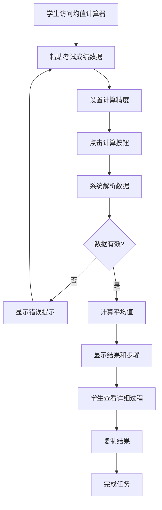

# US-001: 学生计算考试成绩平均分

id: US-001
---
id: US-001  
feature: Mean Calculator
priority: High
owner: @product-owner
assignee: TBD
version: 0.1
created: 2025-09-05
status: Draft
reviewers: []
---

## 1. **功能概述**
- **一句话定位**：为学生提供简单易用的考试成绩平均分计算工具，支持批量输入和详细解释
- **解决的核心痛点**：学生手工计算大量成绩容易出错，缺乏对平均分计算过程的理解

## 2. **用户故事（User Stories）**
| 角色 | 场景 | 期望 | 价值 |
| ---- | ---- | ---- | ---- |
| 学生 | 粘贴考试成绩并计算平均分 | 得到计算结果和分步解释过程 | 理解计算来源，提升数学理解能力 |

**用户故事描述**:
> 作为一名学生，当我有多门课程的考试成绩需要计算平均分时，我希望能够快速粘贴这些成绩数据到一个在线工具中，然后获得准确的平均分结果，同时能够看到详细的计算步骤，这样我就能理解计算过程并验证结果的正确性。

## 3. **业务流程**
- **流程步骤列表**：
  - Step 1 → 学生访问 `/mean-calculator` 页面
  - Step 2 → 在输入框中粘贴考试成绩（支持逗号、换行分隔）
  - Step 3 → 设置精度要求（小数位数）
  - Step 4 → 点击计算按钮执行计算
  - Step 5 → 查看平均分结果和详细步骤
  - Step 6 → 复制结果用于记录或分享

- **Mermaid 流程图**：

## 4. **数据设计**
- **关键数据实体及字段**：

| 实体名称 | 主要字段 | 类型 | 说明 |
|---------|---------|------|------|
| **学生输入** | raw_input | string | 学生粘贴的原始成绩数据 |
|  | scores | number[] | 解析后的成绩数组 |
|  | precision | integer | 精度设置(0-10) |
| **计算结果** | mean | number | 平均分 |
|  | count | integer | 成绩数量 |
|  | sum | number | 成绩总和 |
|  | steps | string[] | 计算步骤说明 |

- **接口/事件触发点**：
  - `POST /api/mean` - 后端验证计算API
  - `calc_execute` - GA4计算执行事件（记录使用情况）
  - `copy_result` - 复制结果事件（记录学习行为）

## 5. **功能性需求（FRs）**
- **FR-1.1**：支持多种数据输入格式（逗号分隔、换行分隔、空格分隔）
- **FR-1.2**：提供精度控制，支持0-10位小数设置
- **FR-1.3**：自动忽略非数值输入并给出清晰提示
- **FR-1.4**：显示详细的计算步骤，使用通俗英文解释
- **FR-1.5**：提供一键复制结果功能
- **FR-1.6**：支持URL参数保存计算状态，便于分享

## 6. **非功能性需求（NFRs）**
- **性能**：客户端计算响应<200ms，页面加载LCP≤2000ms(mobile)
- **安全**：不记录学生成绩原始数据，仅记录脱敏使用统计
- **合规**：符合学生隐私保护要求，不存储个人可识别信息
- **可用性与可维护性**：支持键盘操作，兼容屏幕阅读器，响应式设计

## 7. **边界条件与异常场景**
- **输入异常**：全部为非数值数据 → 显示"未发现有效数字"提示
- **数据过多**：超过1000个成绩 → 提示"数据量过大，请分批计算"
- **精度异常**：设置超出范围 → 自动调整到有效范围
- **网络异常**：本地计算不受影响，API验证失败时提供离线计算

## 8. **验收标准（DoD）**
- **功能测试**：
  - [ ] 能正确解析逗号、换行、空格分隔的成绩数据
  - [ ] 精度设置正确生效，四舍五入计算准确
  - [ ] 非数值数据能被正确识别和忽略
  - [ ] 计算结果与标准数学计算一致

- **兼容性测试**：
  - [ ] 在Chrome、Firefox、Safari浏览器正常运行
  - [ ] 移动端界面适配良好，操作便捷
  - [ ] 键盘导航功能完整

- **合规检查**：
  - [ ] 不记录学生具体成绩数据
  - [ ] GA4事件数据已脱敏处理
  - [ ] 隐私政策中明确说明数据处理方式

- **UAT通过条件**：
  - [ ] 10名学生测试，任务完成率>90%
  - [ ] 平均任务完成时间<2分钟
  - [ ] 用户满意度评分>4.0/5.0

## 9. **风险与依赖**
- **技术风险**：
  - JavaScript浮点计算精度限制 → 实施精度控制和边界测试
  - 大量数据可能影响浏览器性能 → 设置合理的数据量限制

- **法规风险**：
  - 学生成绩数据的隐私保护 → 确保不记录原始数据
  - 不同国家的教育数据保护法规 → 遵循GDPR等国际标准

- **用户体验风险**：
  - 学生可能不理解计算步骤 → 提供清晰的Plain English解释
  - 输入格式多样性可能造成困惑 → 提供示例和实时预览

- **外部系统依赖**：
  - Google Analytics服务稳定性
  - CDN服务可用性

## 10. **交互与原型要点**
- **关键界面组件**：
  - 大号文本框，占位符提示输入格式："输入成绩，用逗号或换行分隔，如：85, 92, 78, 96"
  - 精度滑块控件，直观显示小数位数
  - 突出的"计算"按钮，支持回车键快捷操作
  - 结果展示区：大号数字显示平均分，可折叠的详细步骤区域

- **页面布局要点**：
  - 移动优先设计，确保小屏幕设备良好体验
  - 首屏即可完成基本计算，无需滚动
  - 错误提示友好且具体，帮助学生纠正输入
  - 提供"清除"和"示例"按钮，降低使用门槛

- **用户引导**：
  - 首次访问显示使用示例
  - 输入时实时显示解析预览（前5个数字）
  - 计算完成后引导查看详细步骤

---

**验收负责人**: 产品经理  
**开发预估**: 3-5个开发日  
**测试预估**: 2-3个测试日  
**上线目标**: MVP第一批功能