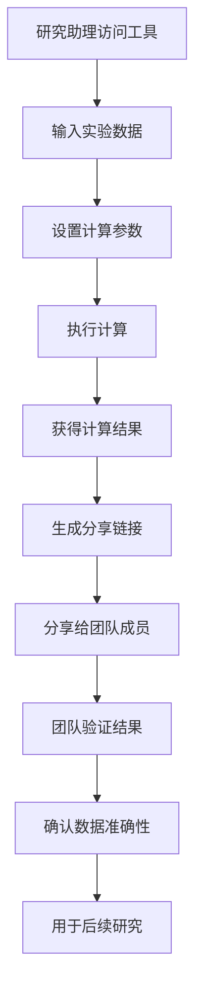

# US-002: 研究助理处理实验数据平均值

id: US-002
---
id: US-002  
feature: Mean Calculator
priority: High
owner: @product-owner
assignee: TBD
version: 0.1
created: 2025-09-05
status: Draft
reviewers: []
---

## 1. **功能概述**
- **一句话定位**：为研究助理提供可复现的实验数据平均值计算工具，支持参数保存和结果验证
- **解决的核心痛点**：研究工作需要计算过程透明可追溯，结果需要与同事分享和验证

## 2. **用户故事（User Stories）**
| 角色 | 场景 | 期望 | 价值 |
| ---- | ---- | ---- | ---- |
| 研究助理 | 处理实验数据的平均值 | 输入数据并获得可复现的计算结果 | 确保计算准确性，便于与同事分享 |

**用户故事描述**:
> 作为一名研究助理，当我需要处理实验收集的数据并计算平均值时，我希望有一个可靠的在线工具，不仅能给出准确的计算结果，还能保存计算参数并生成可分享的链接，让我的导师和同事能够验证计算过程和重现结果。

## 3. **业务流程**
- **流程步骤列表**：
  - Step 1 → 研究助理访问工具页面
  - Step 2 → 输入实验数据（支持批量粘贴）
  - Step 3 → 设置精度和数据处理参数
  - Step 4 → 执行计算并查看结果
  - Step 5 → 生成包含参数的分享链接
  - Step 6 → 与团队成员分享验证

- **Mermaid 流程图**：

## 4. **数据设计**
- **关键数据实体及字段**：

| 实体名称 | 主要字段 | 类型 | 说明 |
|---------|---------|------|------|
| **实验数据** | raw_input | string | 原始实验数据 |
|  | data_points | number[] | 解析后的数据点 |
|  | precision | integer | 科学计算精度 |
|  | ignore_outliers | boolean | 是否忽略异常值 |
| **计算结果** | mean | number | 平均值 |
|  | std_error | number | 标准误差 |
|  | confidence_level | number | 置信水平 |
|  | share_url | string | 分享链接 |

- **接口/事件触发点**：
  - `POST /api/mean` - 计算验证API
  - `calc_execute` - 执行计算事件
  - `share_link` - 生成分享链接事件
  - `result_verified` - 结果验证事件

## 5. **功能性需求（FRs）**
- **FR-2.1**：支持科学记数法和高精度数值输入
- **FR-2.2**：提供参数编码到URL的功能，确保结果可重现
- **FR-2.3**：显示计算过程的详细数学公式
- **FR-2.4**：支持异常值检测和处理选项
- **FR-2.5**：提供计算结果的统计学解释
- **FR-2.6**：生成标准格式的计算报告

## 6. **非功能性需求（NFRs）**
- **性能**：处理1000+数据点，计算时间<500ms
- **安全**：研究数据不存储在服务器，本地计算优先
- **合规**：符合科研数据处理规范，支持数据来源标注
- **可用性与可维护性**：提供计算历史记录，支持批量导出

## 7. **边界条件与异常场景**
- **数据质量问题**：包含明显异常值 → 提供异常值检测和处理建议
- **精度要求高**：需要高精度计算 → 支持最多10位小数精度
- **团队协作**：多人需要验证同一结果 → URL链接保持长期有效
- **数据安全**：敏感研究数据 → 提供本地计算选项，不上传数据

## 8. **验收标准（DoD）**
- **功能测试**：
  - [ ] 科学记数法格式正确解析
  - [ ] URL参数能完全重现计算状态
  - [ ] 异常值检测算法准确性验证
  - [ ] 高精度计算结果与参考软件一致

- **兼容性测试**：
  - [ ] 分享链接在不同设备上正常工作
  - [ ] 大数据集处理不影响页面性能

- **合规检查**：
  - [ ] 不在服务器端存储研究数据
  - [ ] 计算过程完全透明可审计

- **UAT通过条件**：
  - [ ] 5名研究人员测试，结果验证100%通过
  - [ ] 计算结果与SPSS/R软件结果一致
  - [ ] 分享链接功能满意度>4.5/5.0

## 9. **风险与依赖**
- **技术风险**：
  - 高精度计算的浮点误差 → 使用专业数学库
  - URL长度限制 → 实现URL压缩算法

- **法规风险**：
  - 科研数据保密性要求 → 确保数据不离开用户设备
  - 不同机构的数据处理政策 → 提供灵活的隐私设置

- **用户体验风险**：
  - 研究人员对在线工具的信任度 → 提供详细的计算原理说明
  - 复杂参数设置可能造成困惑 → 提供预设模板

## 10. **交互与原型要点**
- **关键界面组件**：
  - 专业的数据输入区，支持CSV格式粘贴
  - 高级参数面板，包含异常值处理、精度设置等
  - 详细的计算报告区，包含统计学解释
  - 突出的"生成分享链接"按钮

- **页面布局要点**：
  - 专业简洁的设计风格，符合科研工具审美
  - 提供计算历史和收藏功能
  - 支持全屏模式，适合处理大数据集
  - 集成帮助文档，解释统计学概念

---

**验收负责人**: 产品经理 + 科研用户代表  
**开发预估**: 5-7个开发日  
**测试预估**: 3-4个测试日  
**上线目标**: MVP第一批功能