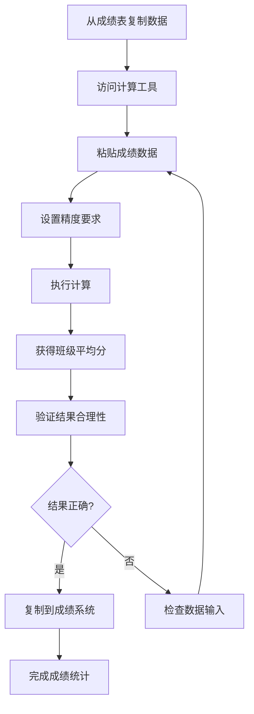

# US-003: 教师快速计算班级成绩平均值

id: US-003
---
id: US-003  
feature: Mean Calculator
priority: High
owner: @product-owner
assignee: TBD
version: 0.1
created: 2025-09-05
status: Draft
reviewers: []
---

## 1. **功能概述**
- **一句话定位**：为教师提供快速批量计算班级成绩平均值的工具，提高成绩处理效率
- **解决的核心痛点**：教师需要频繁计算不同班级、不同科目的平均成绩，手工计算效率低且易错

## 2. **用户故事（User Stories）**
| 角色 | 场景 | 期望 | 价值 |
| ---- | ---- | ---- | ---- |
| 教师 | 快速计算班级成绩平均值 | 批量输入并设置精度要求 | 提高工作效率，减少计算错误 |

**用户故事描述**:
> 作为一名教师，当我需要处理班级的考试成绩并计算平均分时，我希望能够快速粘贴整个班级的成绩数据，设置合适的精度（如保留1位小数），然后立即获得准确的平均分结果，这样我就能高效地完成成绩统计工作，避免手工计算的错误。

## 3. **业务流程**
- **流程步骤列表**：
  - Step 1 → 教师从成绩表复制学生成绩
  - Step 2 → 访问均值计算器工具
  - Step 3 → 粘贴成绩数据（支持Excel格式）
  - Step 4 → 设置教育适用的精度（通常1-2位小数）
  - Step 5 → 执行计算并获得班级平均分
  - Step 6 → 将结果复制回成绩管理系统

- **Mermaid 流程图**：

## 4. **数据设计**
- **关键数据实体及字段**：

| 实体名称 | 主要字段 | 类型 | 说明 |
|---------|---------|------|------|
| **班级成绩** | raw_scores | string | 原始成绩数据 |
|  | valid_scores | number[] | 有效成绩数组 |
|  | invalid_entries | string[] | 无效输入项 |
|  | precision | integer | 精度设置(1-2位为主) |
| **统计结果** | class_mean | number | 班级平均分 |
|  | student_count | integer | 参与计算的学生数 |
|  | score_range | object | 成绩范围{min, max} |
|  | grade_distribution | object | 成绩分布统计 |

- **接口/事件触发点**：
  - `calc_execute` - 教师计算事件（记录教育用途）
  - `copy_result` - 复制结果事件
  - `data_validation` - 数据验证事件

## 5. **功能性需求（FRs）**
- **FR-3.1**：支持从Excel表格直接复制粘贴成绩数据
- **FR-3.2**：自动识别并标记无效成绩（如缺考、作弊等标记）
- **FR-3.3**：提供教育场景常用的精度预设（1位、2位小数）
- **FR-3.4**：显示参与计算的学生数量和排除的条目
- **FR-3.5**：提供成绩分布的基本统计（最高分、最低分）
- **FR-3.6**：支持成绩合理性检查（如满分100分制验证）

## 6. **非功能性需求（NFRs）**
- **性能**：支持50-100名学生成绩的快速计算（<100ms）
- **安全**：学生成绩数据高度敏感，不在服务器存储
- **合规**：符合教育数据保护法规（FERPA等）
- **可用性与可维护性**：简单直观的操作，适合非技术用户

## 7. **边界条件与异常场景**
- **数据格式问题**：Excel复制包含格式字符 → 智能清理和提示
- **无效成绩处理**：包含"缺考"、"作弊"等文字 → 自动排除并统计
- **成绩范围异常**：超出常见分数范围 → 提醒确认数据正确性
- **隐私保护**：避免成绩数据泄露 → 本地计算，不上传数据

## 8. **验收标准（DoD）**
- **功能测试**：
  - [ ] 能正确解析Excel复制的成绩数据
  - [ ] 自动识别并排除非数值成绩条目
  - [ ] 精度设置符合教育场景需求
  - [ ] 成绩合理性检查功能正常

- **兼容性测试**：
  - [ ] 支持不同版本Excel的数据格式
  - [ ] 在学校常用浏览器中稳定运行

- **合规检查**：
  - [ ] 不记录任何学生成绩原始数据
  - [ ] 符合教育数据隐私保护要求

- **UAT通过条件**：
  - [ ] 10名教师测试，操作成功率>95%
  - [ ] 平均完成时间<1分钟
  - [ ] 教师满意度评分>4.2/5.0

## 9. **风险与依赖**
- **技术风险**：
  - Excel格式的多样性 → 建立完善的格式解析库
  - 大班级数据处理性能 → 优化算法处理100+学生

- **法规风险**：
  - 学生成绩隐私保护 → 严格的本地计算策略
  - 不同地区教育法规差异 → 遵循最严格的隐私标准

- **用户体验风险**：
  - 教师技术水平参差不齐 → 提供详细的使用指导
  - 成绩数据格式复杂 → 智能识别和容错处理

- **业务风险**：
  - 计算错误影响学生成绩 → 严格的测试和验证流程

## 10. **交互与原型要点**
- **关键界面组件**：
  - 大型文本区域，专门优化Excel数据粘贴
  - 数据预览区，显示解析后的成绩和排除项
  - 教育专用的精度快速选择按钮（1位/2位小数）
  - 结果区显示班级统计概览（平均分、人数、分数范围）

- **页面布局要点**：
  - 专业的教育工具外观，符合教师工作场景
  - 突出显示数据验证结果，确保教师信心
  - 提供"重新计算"和"清空数据"快捷操作
  - 集成简单的成绩分析提示（如分布是否正常）

- **用户引导**：
  - 首次使用提供Excel数据粘贴示例
  - 实时显示数据解析状态和排除项
  - 计算后提供结果合理性提示

---

**验收负责人**: 产品经理 + 教育用户代表  
**开发预估**: 4-6个开发日  
**测试预估**: 3个测试日  
**上线目标**: MVP第一批功能