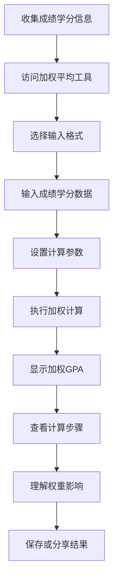

# US-004: 学生计算课程成绩的加权平均GPA

id: US-004
---
id: US-004  
feature: Weighted Mean Calculator
priority: High
owner: @product-owner
assignee: TBD
version: 0.1
created: 2025-09-05
status: Draft
reviewers: []
---

## 1. **功能概述**
- **一句话定位**：为学生提供课程成绩按学分加权计算平均GPA的工具，支持多种输入格式
- **解决的核心痛点**：学生需要根据不同课程的学分权重计算准确的GPA，手工计算复杂且易错

## 2. **用户故事（User Stories）**
| 角色 | 场景 | 期望 | 价值 |
| ---- | ---- | ---- | ---- |
| 学生 | 计算课程成绩的加权平均GPA | 输入成绩和学分，得到加权平均并查看步骤 | 准确计算学术成绩，理解加权原理 |

**用户故事描述**:
> 作为一名学生，当我需要计算本学期或累计的加权平均GPA时，我希望能够输入各科成绩和对应的学分，然后获得准确的加权平均分和详细的计算步骤，这样我就能了解自己的真实学术表现，并理解不同学分课程对总成绩的影响程度。

## 3. **业务流程**
- **流程步骤列表**：
  - Step 1 → 学生收集各科成绩和学分信息
  - Step 2 → 访问加权平均计算器工具
  - Step 3 → 选择输入格式（成绩:学分 或 双列输入）
  - Step 4 → 输入成绩和学分数据
  - Step 5 → 设置计算精度和处理选项
  - Step 6 → 查看加权GPA结果和详细计算过程

- **Mermaid 流程图**：

## 4. **数据设计**
- **关键数据实体及字段**：

| 实体名称 | 主要字段 | 类型 | 说明 |
|---------|---------|------|------|
| **课程成绩** | raw_input | string | 原始输入数据 |
|  | course_pairs | [[number,number]] | 成绩-学分对数组 |
|  | precision | integer | 计算精度 |
|  | ignore_zero_credits | boolean | 是否忽略零学分课程 |
| **GPA结果** | weighted_gpa | number | 加权平均GPA |
|  | total_credits | number | 总学分 |
|  | total_points | number | 总绩点 |
|  | course_breakdown | array | 各科贡献明细 |

- **接口/事件触发点**：
  - `POST /api/weighted-mean` - 加权计算验证API
  - `calc_execute` - 计算执行事件
  - `view_breakdown` - 查看明细事件

## 5. **功能性需求（FRs）**
- **FR-4.1**：支持三种输入格式：成绩:学分对、双列粘贴、并行输入框
- **FR-4.2**：自动处理零学分课程（如通过/不通过课程）
- **FR-4.3**：显示每门课程对总GPA的贡献度
- **FR-4.4**：提供加权计算的详细步骤和公式解释
- **FR-4.5**：支持不同学分制度（整数或小数学分）
- **FR-4.6**：提供GPA解释和学术表现评价

## 6. **非功能性需求（NFRs）**
- **性能**：支持20-30门课程的快速计算（<100ms）
- **安全**：学生成绩数据本地处理，不上传服务器
- **合规**：符合学生教育记录隐私保护要求
- **可用性与可维护性**：直观的权重概念解释，适合非专业用户

## 7. **边界条件与异常场景**
- **学分异常**：总学分为零 → 提示"需要至少一门有学分的课程"
- **数据不匹配**：成绩和学分数量不一致 → 智能配对或提示修正
- **格式错误**：无法识别成绩:学分格式 → 提供格式示例和纠错
- **异常成绩**：成绩超出合理范围 → 提醒确认数据正确性

## 8. **验收标准（DoD）**
- **功能测试**：
  - [ ] 三种输入格式都能正确解析
  - [ ] 加权计算结果数学准确
  - [ ] 零学分课程处理逻辑正确
  - [ ] 详细步骤解释清晰易懂

- **兼容性测试**：
  - [ ] 在移动设备上输入体验良好
  - [ ] 支持不同学分制度计算

- **合规检查**：
  - [ ] 不记录学生具体成绩数据
  - [ ] 数据处理透明可审计

- **UAT通过条件**：
  - [ ] 15名学生测试，计算准确率100%
  - [ ] 用户理解加权概念比例>85%
  - [ ] 操作满意度评分>4.3/5.0

## 9. **风险与依赖**
- **技术风险**：
  - 多种输入格式的解析复杂性 → 建立健壮的解析算法
  - 浮点计算精度问题 → 使用专业数学库

- **用户体验风险**：
  - 学生可能不理解加权概念 → 提供清晰的概念解释
  - 输入格式选择可能造成困惑 → 智能格式识别

- **法规风险**：
  - 成绩数据隐私保护 → 严格的本地计算策略

## 10. **交互与原型要点**
- **关键界面组件**：
  - 格式选择Tab，支持快速切换输入方式
  - 实时数据预览，显示解析后的成绩-学分对
  - 详细结果面板，展示总GPA和各科贡献
  - 权重可视化图表，帮助理解学分影响

- **页面布局要点**：
  - 清晰的输入格式说明和示例
  - 突出显示最终GPA结果
  - 可展开的计算步骤详情
  - 学术表现解释和改进建议

---

**验收负责人**: 产品经理 + 学生用户代表  
**开发预估**: 5-7个开发日  
**测试预估**: 3-4个测试日  
**上线目标**: MVP第一批功能