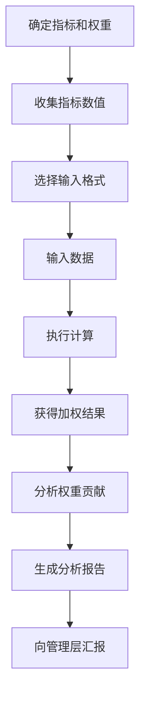

# US-006: 分析师计算重要性加权的指标

id: US-006
---
id: US-006  
feature: Weighted Mean Calculator
priority: High
owner: @product-owner
assignee: TBD
version: 0.1
created: 2025-09-05
status: Draft
reviewers: []
---

## 1. **功能概述**
- **一句话定位**：为数据分析师提供按重要性加权计算各类指标的专业工具
- **解决的核心痛点**：业务分析中经常需要根据指标重要性计算综合评分，手工计算复杂且易错

## 2. **用户故事（User Stories）**
| 角色 | 场景 | 期望 | 价值 |
| ---- | ---- | ---- | ---- |
| 分析师 | 计算重要性加权的指标 | 快速输入数值-权重对并获得详细计算过程 | 提高分析效率，便于结果验证 |

**用户故事描述**:
> 作为一名数据分析师，当我需要计算客户满意度综合评分、产品评价加权平均或KPI综合得分时，我希望有一个专业的加权计算工具，能够处理不同权重的指标数据，提供清晰的计算步骤，并支持结果导出，让我能够快速完成分析任务并向管理层展示计算依据。

## 3. **业务流程**
- **流程步骤列表**：
  - Step 1 → 确定各项指标及其重要性权重
  - Step 2 → 收集各指标的实际数值
  - Step 3 → 选择合适的输入格式
  - Step 4 → 输入指标数值和权重数据
  - Step 5 → 执行加权计算
  - Step 6 → 分析结果并生成报告

- **Mermaid 流程图**：

## 4. **数据设计**
- **关键数据实体及字段**：

| 实体名称 | 主要字段 | 类型 | 说明 |
|---------|---------|------|------|
| **业务指标** | indicator_name | string | 指标名称 |
|  | value | number | 指标数值 |
|  | weight | number | 重要性权重 |
|  | category | string | 指标分类 |
| **分析结果** | weighted_score | number | 加权综合得分 |
|  | contribution_analysis | array | 各指标贡献度分析 |
|  | sensitivity_analysis | object | 权重敏感性分析 |
|  | benchmark_comparison | object | 基准对比 |

- **接口/事件触发点**：
  - `calc_execute` - 执行计算事件
  - `export_report` - 导出报告事件
  - `sensitivity_analysis` - 敏感性分析事件

## 5. **功能性需求（FRs）**
- **FR-6.1**：支持指标名称标注，便于结果理解
- **FR-6.2**：提供权重贡献度可视化分析
- **FR-6.3**：支持权重敏感性分析功能
- **FR-6.4**：提供多种业务场景的预设模板
- **FR-6.5**：支持结果导出为Excel或PDF格式
- **FR-6.6**：提供基准值对比功能

## 6. **非功能性需求（NFRs）**
- **性能**：支持50+指标的快速计算和可视化
- **安全**：业务数据本地处理，支持企业级安全要求
- **合规**：符合企业数据治理规范
- **可用性与可维护性**：专业的商务界面，支持团队协作

## 7. **边界条件与异常场景**
- **权重设计问题**：权重总和不为100% → 提供权重标准化选项
- **数据缺失**：部分指标数据缺失 → 提供缺失值处理策略
- **异常数值**：指标值超出合理范围 → 提供数据验证提示
- **权重冲突**：不同利益相关者对权重有分歧 → 支持多情景分析

## 8. **验收标准（DoD）**
- **功能测试**：
  - [ ] 权重贡献度分析准确
  - [ ] 敏感性分析功能正常
  - [ ] 多种导出格式工作正常
  - [ ] 预设模板覆盖常见业务场景

- **兼容性测试**：
  - [ ] 与主流BI工具数据格式兼容
  - [ ] 导出文件在Office套件中正常显示

- **合规检查**：
  - [ ] 业务数据处理合规
  - [ ] 计算过程可审计追踪

- **UAT通过条件**：
  - [ ] 10名分析师测试，计算准确率100%
  - [ ] 报告生成满意度>4.3/5.0
  - [ ] 相比手工计算效率提升>70%

## 9. **风险与依赖**
- **技术风险**：
  - 复杂权重算法的性能优化 → 使用高效计算库
  - 大量指标的可视化性能 → 实现渐进式加载

- **业务风险**：
  - 权重设定的主观性可能影响结果客观性 → 提供权重设定指导
  - 计算错误可能影响商业决策 → 严格的测试和验证流程

- **用户体验风险**：
  - 专业功能可能对普通用户过于复杂 → 提供简化模式

## 10. **交互与原型要点**
- **关键界面组件**：
  - 专业的指标管理表格，支持拖拽排序
  - 权重分配可视化滑块和饼图
  - 实时的贡献度分析图表
  - 多情景对比分析面板

- **页面布局要点**：
  - 商务专业的设计风格
  - 清晰的数据输入和结果展示分区
  - 支持全屏模式的详细分析视图
  - 便捷的模板选择和保存功能

- **分析功能设计**：
  - 交互式的权重调整和结果实时更新
  - 直观的帕累托图显示主要贡献因子
  - 敏感性分析的热力图展示
  - 一键生成专业分析报告

---

**验收负责人**: 产品经理 + 业务分析专家  
**开发预估**: 6-8个开发日  
**测试预估**: 4个测试日  
**上线目标**: MVP第一批功能