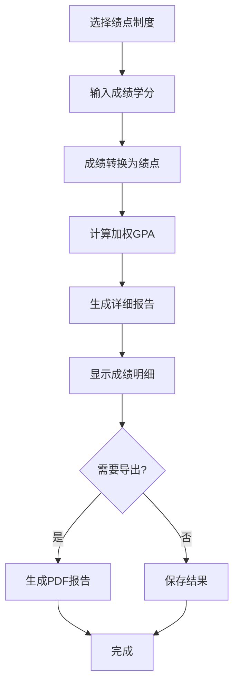

# US-007: 学生计算学期或累计GPA

id: US-007
---
id: US-007  
feature: GPA Calculator
priority: High
owner: @product-owner
assignee: TBD
version: 0.1
created: 2025-09-05
status: Draft
reviewers: []
---

## 1. **功能概述**
- **一句话定位**：为学生提供支持多种绩点制度的GPA计算工具，可处理学期和累计成绩
- **解决的核心痛点**：不同学校绩点制度差异，学生难以准确计算和转换GPA

## 2. **用户故事（User Stories）**
| 角色 | 场景 | 期望 | 价值 |
| ---- | ---- | ---- | ---- |
| 学生 | 计算学期或累计GPA | 输入课程成绩和学分，选择绩点制度，获得GPA和明细 | 准确了解学术表现，规划学习目标 |

**用户故事描述**:
> 作为一名学生，我需要计算本学期的GPA或者累计GPA，由于不同学校使用不同的绩点制度（如4.0、4.3、4.5分制），我希望有一个工具能够让我选择正确的绩点制度，输入我的课程成绩和学分，然后获得准确的GPA计算结果和详细的成绩转换明细。

## 3. **业务流程**
- **流程步骤列表**：
  - Step 1 → 学生选择绩点制度（4.0/4.3/4.5/自定义）
  - Step 2 → 输入课程成绩和学分信息
  - Step 3 → 系统转换成绩为绩点
  - Step 4 → 计算加权平均GPA
  - Step 5 → 显示详细成绩转换明细
  - Step 6 → 保存或导出GPA报告

- **Mermaid 流程图**：

## 4. **数据设计**
- **关键数据实体及字段**：

| 实体名称 | 主要字段 | 类型 | 说明 |
|---------|---------|------|----- |
| **成绩条目** | course_name | string | 课程名称(可选) |
|  | score | number | 课程成绩 |
|  | credit | number | 课程学分 |
|  | grade_point | number | 转换后绩点 |
| **GPA系统** | scale_type | string | 绩点制度类型 |
|  | mapping_rules | object | 成绩-绩点映射规则 |
|  | final_gpa | number | 最终GPA |
|  | total_credits | number | 总学分 |

- **接口/事件触发点**：
  - `POST /api/gpa` - GPA计算API
  - `gpa_calculate` - GPA计算事件
  - `export_transcript` - 导出成绩单事件

## 5. **功能性需求（FRs）**
- **FR-7.1**：支持4.0、4.3、4.5等主流绩点制度
- **FR-7.2**：提供自定义绩点映射功能
- **FR-7.3**：显示详细的成绩转换规则和依据
- **FR-7.4**：支持学期GPA和累计GPA分别计算
- **FR-7.5**：提供成绩分析和学术表现评估
- **FR-7.6**：支持导出正式的GPA报告

## 6. **非功能性需求（NFRs）**
- **性能**：支持100+课程记录的快速计算
- **安全**：成绩数据高度敏感，采用本地存储
- **合规**：符合教育记录隐私保护法规
- **可用性与可维护性**：直观的绩点制度选择，清晰的转换规则显示

## 7. **边界条件与异常场景**
- **制度不匹配**：成绩超出选定绩点制度范围 → 提示选择正确制度
- **数据不完整**：缺少学分信息 → 提示补充必要信息
- **计算异常**：出现不合理的GPA结果 → 提供数据检查建议

## 8. **验收标准（DoD）**
- **功能测试**：
  - [ ] 多种绩点制度计算结果准确
  - [ ] 成绩转换映射规则正确
  - [ ] 导出报告格式专业完整

- **合规检查**：
  - [ ] 成绩数据本地处理
  - [ ] 符合教育隐私保护要求

- **UAT通过条件**：
  - [ ] 不同绩点制度测试准确率100%
  - [ ] 学生理解度评分>4.0/5.0

## 9. **风险与依赖**
- **技术风险**：不同绩点制度的复杂映射规则
- **法规风险**：学生成绩数据的隐私保护
- **业务风险**：GPA计算错误可能影响学生升学

## 10. **交互与原型要点**
- **关键界面组件**：
  - 绩点制度选择器，清晰显示各制度差异
  - 成绩录入表格，支持批量输入
  - 实时GPA显示，随输入动态更新
  - 详细转换规则说明面板

---

**验收负责人**: 产品经理 + 教育专家  
**开发预估**: 6-8个开发日  
**测试预估**: 4个测试日  
**上线目标**: MVP第一批功能