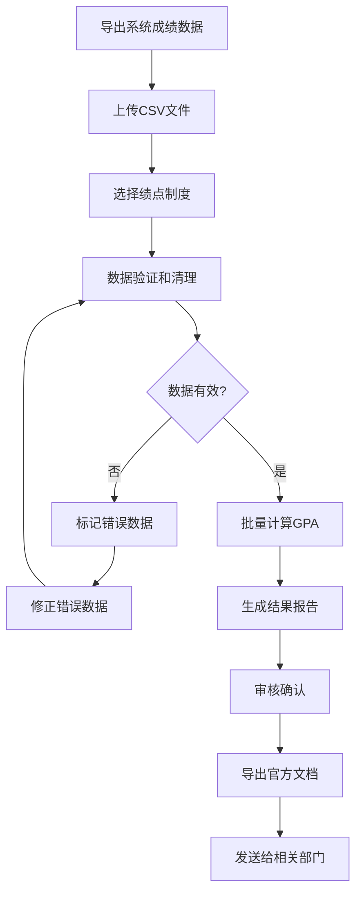

# US-008: 教务人员批量处理学生成绩

id: US-008
---
id: US-008  
feature: GPA Calculator
priority: Medium
owner: @product-owner
assignee: TBD
version: 0.1
created: 2025-09-05
status: Draft
reviewers: []
---

## 1. **功能概述**
- **一句话定位**：为教务人员提供批量处理学生成绩和GPA计算的专业工具
- **解决的核心痛点**：教务工作中需要处理大量学生成绩数据，手工计算GPA效率低且容易出错

## 2. **用户故事（User Stories）**
| 角色 | 场景 | 期望 | 价值 |
| ---- | ---- | ---- | ---- |
| 教务人员 | 批量处理学生成绩 | 支持CSV导入导出，切换不同绩点制度 | 提高工作效率，确保成绩处理准确性 |

**用户故事描述**:
> 作为一名教务人员，当我需要处理整个班级或年级的学生成绩并计算GPA时，我希望能够批量导入成绩数据，根据不同专业或合作项目的要求切换绩点制度，然后批量计算所有学生的GPA，最后导出标准格式的成绩单和统计报告，以便提交给相关部门或发送给学生。

## 3. **业务流程**
- **流程步骤列表**：
  - Step 1 → 从学生信息系统导出成绩数据
  - Step 2 → 上传CSV格式的批量成绩文件
  - Step 3 → 选择适用的绩点制度和转换规则
  - Step 4 → 系统批量计算所有学生GPA
  - Step 5 → 审核和确认计算结果
  - Step 6 → 导出官方格式的成绩单和统计报告

- **Mermaid 流程图**：

## 4. **数据设计**
- **关键数据实体及字段**：

| 实体名称 | 主要字段 | 类型 | 说明 |
|---------|---------|------|------|
| **批量成绩** | student_id | string | 学生学号 |
|  | student_name | string | 学生姓名 |
|  | course_records | array | 课程成绩记录数组 |
|  | semester | string | 学期信息 |
| **批处理任务** | task_id | string | 处理任务ID |
|  | total_students | integer | 学生总数 |
|  | processed_count | integer | 已处理数量 |
|  | error_count | integer | 错误数量 |
|  | status | string | 处理状态 |

- **接口/事件触发点**：
  - `POST /api/gpa/batch` - 批量GPA计算API
  - `batch_upload` - 文件上传事件
  - `batch_process` - 批处理执行事件
  - `export_transcripts` - 导出成绩单事件

## 5. **功能性需求（FRs）**
- **FR-8.1**：支持CSV格式的批量成绩数据导入
- **FR-8.2**：提供数据验证和错误标记功能
- **FR-8.3**：支持多种绩点制度的批量转换
- **FR-8.4**：提供批处理进度监控和错误报告
- **FR-8.5**：生成标准格式的官方成绩单
- **FR-8.6**：提供班级/年级统计分析报告

## 6. **非功能性需求（NFRs）**
- **性能**：支持1000+学生记录的批量处理，完成时间<5分钟
- **安全**：学生成绩数据加密存储，访问权限严格控制
- **合规**：符合教育部成绩管理规范和隐私保护要求
- **可用性与可维护性**：操作界面专业化，支持操作日志和审计追踪

## 7. **边界条件与异常场景**
- **文件格式错误**：上传非标准CSV格式 → 提供格式模板和校验
- **数据不完整**：部分学生缺少必要信息 → 标记并生成缺失数据报告
- **系统负载**：大量并发处理请求 → 实现队列机制和负载均衡
- **权限控制**：非授权人员访问 → 严格的身份验证和权限检查

## 8. **验收标准（DoD）**
- **功能测试**：
  - [ ] CSV导入导出功能完整正确
  - [ ] 批量计算结果100%准确
  - [ ] 错误数据标记和处理正确
  - [ ] 官方文档格式符合标准

- **兼容性测试**：
  - [ ] 支持主流学生信息系统的数据格式
  - [ ] 生成的文档与教务系统兼容

- **合规检查**：
  - [ ] 数据处理符合教育隐私法规
  - [ ] 操作日志完整可审计

- **UAT通过条件**：
  - [ ] 5名教务人员测试，批处理成功率>98%
  - [ ] 处理效率相比手工提升>80%
  - [ ] 用户满意度评分>4.4/5.0

## 9. **风险与依赖**
- **技术风险**：
  - 大文件处理的内存和性能问题 → 实现流式处理
  - 数据格式的多样性和兼容性 → 建立完善的解析库

- **法规风险**：
  - 学生成绩数据的隐私保护 → 严格的访问控制和审计
  - 不同地区教育法规的差异 → 灵活的配置和合规检查

- **业务风险**：
  - 批量处理错误可能影响大量学生 → 完善的回滚和纠错机制
  - 系统故障可能中断重要的成绩处理工作 → 高可用性设计

- **外部依赖**：
  - 学生信息系统的数据接口稳定性
  - 教育部门的标准和规范变更

## 10. **交互与原型要点**
- **关键界面组件**：
  - 文件上传区域，支持拖拽和格式预览
  - 批处理进度条和实时状态显示
  - 数据验证结果表格，突出显示错误项
  - 绩点制度选择面板，清晰显示转换规则

- **页面布局要点**：
  - 专业的教务管理界面风格
  - 分步骤的向导式操作流程
  - 详细的操作日志和审计记录
  - 便捷的批量操作和快捷功能

- **批处理特色功能**：
  - 实时的处理进度监控
  - 错误数据的批量修正界面
  - 多格式的结果导出选项
  - 历史任务的查询和重新执行

---

**验收负责人**: 产品经理 + 教务管理专家  
**开发预估**: 8-10个开发日  
**测试预估**: 5-6个测试日  
**上线目标**: MVP第二批功能