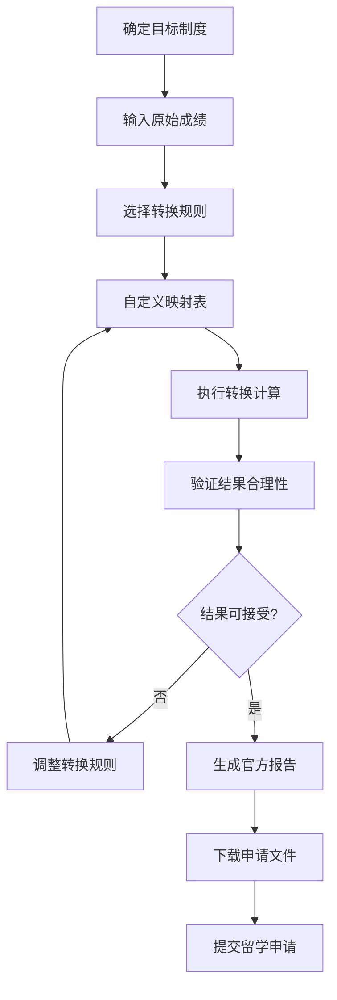

# US-009: 留学申请者转换不同绩点制度

id: US-009
---
id: US-009  
feature: GPA Calculator
priority: Medium
owner: @product-owner
assignee: TBD
version: 0.1
created: 2025-09-05
status: Draft
reviewers: []
---

## 1. **功能概述**
- **一句话定位**：为留学申请者提供不同绩点制度间的成绩转换工具
- **解决的核心痛点**：留学申请需要将本国成绩转换为目标学校的绩点制度，转换规则复杂

## 2. **用户故事（User Stories）**
| 角色 | 场景 | 期望 | 价值 |
| ---- | ---- | ---- | ---- |
| 留学申请者 | 转换不同绩点制度 | 使用自定义映射规则转换成绩制度 | 满足不同学校的申请要求 |

**用户故事描述**:
> 作为一名留学申请者，当我需要申请不同国家的大学时，每个学校都有不同的绩点制度要求，我希望有一个工具能够让我输入我的原始成绩，然后根据不同学校的要求设置转换规则，生成符合要求的GPA成绩单和计算说明。

## 3. **业务流程**
- **流程步骤列表**：
  - Step 1 → 确定目标学校的绩点制度要求
  - Step 2 → 输入本国教育系统的原始成绩
  - Step 3 → 选择或自定义成绩转换规则
  - Step 4 → 验证转换结果的合理性
  - Step 5 → 生成官方格式的GPA报告
  - Step 6 → 下载用于申请的成绩文件

- **Mermaid 流程图**：

## 4. **数据设计**
- **关键数据实体及字段**：

| 实体名称 | 主要字段 | 类型 | 说明 |
|---------|---------|------|----- |
| **转换规则** | source_system | string | 源教育系统 |
|  | target_system | string | 目标绩点制度 |
|  | mapping_table | object | 成绩映射对照表 |
|  | conversion_notes | string | 转换说明 |
| **申请文件** | applicant_info | object | 申请者基本信息 |
|  | original_transcript | array | 原始成绩单 |
|  | converted_gpa | number | 转换后GPA |
|  | certification | string | 计算认证声明 |

- **接口/事件触发点**：
  - `POST /api/gpa/convert` - 绩点转换API
  - `conversion_execute` - 执行转换事件
  - `download_transcript` - 下载成绩单事件

## 5. **功能性需求（FRs）**
- **FR-9.1**：支持主流留学目标国的绩点制度模板
- **FR-9.2**：提供灵活的自定义成绩映射功能
- **FR-9.3**：生成符合学校要求的正式成绩文件
- **FR-9.4**：提供转换过程的详细说明和依据
- **FR-9.5**：支持多个学校申请的成绩管理
- **FR-9.6**：提供转换结果的合理性验证

## 6. **非功能性需求（NFRs）**
- **性能**：支持复杂转换规则的快速计算
- **安全**：个人教育记录高度保密，本地处理优先
- **合规**：符合国际教育认证和转换标准
- **可用性与可维护性**：支持多语言界面，适应不同国家用户

## 7. **边界条件与异常场景**
- **制度不匹配**：源制度和目标制度差异很大 → 提供转换建议和说明
- **成绩缺失**：部分课程成绩不完整 → 提供预估和补充建议
- **文化差异**：不同国家教育体系差异 → 提供背景说明和注释
- **法规问题**：某些国家对成绩转换有特殊要求 → 提供合规检查

## 8. **验收标准（DoD）**
- **功能测试**：
  - [ ] 主流留学目标国的转换准确
  - [ ] 自定义规则功能灵活可用
  - [ ] 生成文件格式符合学校要求
  - [ ] 转换过程透明可查

- **合规检查**：
  - [ ] 个人教育记录保密合规
  - [ ] 符合国际教育认证标准

- **UAT通过条件**：
  - [ ] 20名留学申请者测试，转换准确率>95%
  - [ ] 生成文件被学校接受率>90%
  - [ ] 用户满意度评分>4.2/5.0

## 9. **风险与依赖**
- **技术风险**：
  - 转换规则的复杂性和多样性 → 建立完善的规则库
  - 不同教育系统的兼容性 → 持续的数据和规则更新

- **法规风险**：
  - 个人教育记录的跨境传输和处理 → 严格的数据保护
  - 不同国家的教育认证法规差异 → 建立合规检查机制

- **业务风险**：
  - 转换错误可能影响留学申请结果 → 完善的验证和审核机制
  - 学校要求变化可能导致规则过时 → 建立更新机制

## 10. **交互与原型要点**
- **关键界面组件**：
  - 目标学校和制度选择器，支持搜索和筛选
  - 直观的成绩映射表编辑器
  - 实时的转换预览和结果对比
  - 专业的成绩单生成和下载功能

- **页面布局要点**：
  - 国际化的设计风格，支持多语言
  - 清晰的步骤引导和进度指示
  - 详细的转换说明和帮助文档
  - 专业的认证和安全保障显示

- **留学特色功能**：
  - 多个学校申请的成绩管理
  - 转换历史和模板保存
  - 专业的申请文件生成
  - 留学顾问和机构的协作功能

---

**验收负责人**: 产品经理 + 留学专家  
**开发预估**: 10-12个开发日  
**测试预估**: 6-7个测试日  
**上线目标**: MVP第二批功能