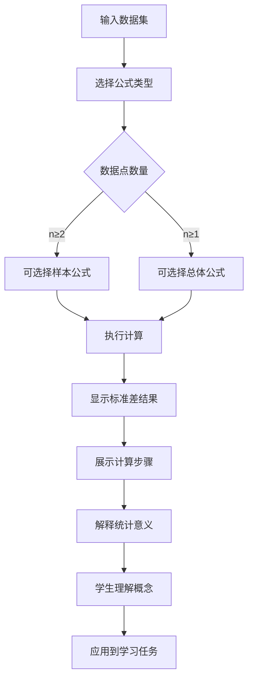

# US-010: 学生分析数据集的离散程度

id: US-010
---
id: US-010  
feature: Standard Deviation Calculator
priority: High
owner: @product-owner
assignee: TBD
version: 0.1
created: 2025-09-05
status: Draft
reviewers: []
---

## 1. **功能概述**
- **一句话定位**：为学生提供理解和计算数据集离散程度的标准差工具，支持样本和总体公式
- **解决的核心痛点**：学生难以理解标准差概念和计算方法，不知道何时使用样本vs总体公式

## 2. **用户故事（User Stories）**
| 角色 | 场景 | 期望 | 价值 |
| ---- | ---- | ---- | ---- |
| 学生 | 分析数据集的离散程度 | 输入数据并理解标准差的含义和计算过程 | 提升统计学理解，完成学习任务 |

**用户故事描述**:
> 作为一名正在学习统计学的学生，当我需要分析一组数据的离散程度时，我希望有一个工具不仅能帮我计算标准差，还能清楚地解释什么时候应该使用样本标准差公式，什么时候使用总体标准差公式，并且用简单易懂的语言说明标准差的实际含义。

## 3. **业务流程**
- **流程步骤列表**：
  - Step 1 → 学生输入需要分析的数据
  - Step 2 → 选择合适的计算公式（样本/总体）
  - Step 3 → 系统执行标准差计算
  - Step 4 → 显示计算结果和详细步骤
  - Step 5 → 查看标准差的实际意义解释
  - Step 6 → 理解数据分布特征

- **Mermaid 流程图**：

## 4. **数据设计**
- **关键数据实体及字段**：

| 实体名称 | 主要字段 | 类型 | 说明 |
|---------|---------|------|------|
| **数据输入** | raw_data | string | 学生输入的原始数据 |
|  | data_points | number[] | 解析后的数值数组 |
|  | formula_type | string | 样本或总体公式 |
|  | output_type | string | 标准差或方差 |
| **计算结果** | n | integer | 数据点数量 |
|  | mean | number | 平均值 |
|  | variance | number | 方差 |
|  | std_deviation | number | 标准差 |
|  | calculation_steps | array | 详细计算步骤 |

- **接口/事件触发点**：
  - `POST /api/stddev` - 标准差计算API
  - `calc_execute` - 执行计算事件
  - `formula_switch` - 公式切换事件
  - `view_explanation` - 查看解释事件

## 5. **功能性需求（FRs）**
- **FR-10.1**：支持样本标准差和总体标准差两种公式计算
- **FR-10.2**：提供公式选择指导，解释何时使用哪种公式
- **FR-10.3**：显示详细的计算步骤，包括方差到标准差的转换
- **FR-10.4**：用Plain English解释标准差的实际含义
- **FR-10.5**：支持实时切换公式类型并更新结果
- **FR-10.6**：提供数据分布的直观理解（如"68-95-99.7规则"）

## 6. **非功能性需求（NFRs）**
- **性能**：客户端计算<200ms(n<1000)，大数据集降级处理
- **安全**：学习数据本地处理，不上传到服务器
- **合规**：符合教育数据使用规范
- **可用性与可维护性**：概念解释清晰，适合初学者理解

## 7. **边界条件与异常场景**
- **样本不足**：样本公式需要n≥2 → 提示"样本标准差至少需要2个数据点"
- **单个数值**：总体公式n=1 → 标准差为0，提供合理解释
- **极端数值**：包含异常大或小的数值 → 提醒可能存在异常值
- **概念混淆**：学生不理解样本vs总体 → 提供具体例子说明

## 8. **验收标准（DoD）**
- **功能测试**：
  - [ ] 样本和总体公式计算结果准确
  - [ ] 公式切换功能正常工作
  - [ ] 边界条件处理正确（n=1, n=2等）
  - [ ] 计算步骤解释清晰完整

- **兼容性测试**：
  - [ ] 在移动设备上操作体验良好
  - [ ] 实时公式切换响应快速

- **合规检查**：
  - [ ] 不记录学生学习数据
  - [ ] 概念解释准确无误

- **UAT通过条件**：
  - [ ] 15名学生测试，概念理解率>80%
  - [ ] 公式选择正确率>90%
  - [ ] 学习满意度评分>4.2/5.0

## 9. **风险与依赖**
- **技术风险**：
  - 浮点计算精度问题 → 使用专业数学库
  - 大数据集性能问题 → 实现计算优化算法

- **教育风险**：
  - 概念解释不准确可能误导学生 → 邀请统计学专家审核
  - 公式选择指导不清晰 → 提供具体场景例子

- **用户体验风险**：
  - 数学概念可能过于复杂 → 使用通俗语言和类比
  - 界面操作可能令初学者困惑 → 简化交互设计

## 10. **交互与原型要点**
- **关键界面组件**：
  - 数据输入区，支持多种分隔符
  - 公式选择器，清楚标识样本vs总体
  - 实时结果显示，突出标准差数值
  - 可展开的计算步骤区域
  - 概念解释面板，包含实际意义说明

- **页面布局要点**：
  - 教育友好的设计风格
  - 重要概念用颜色或图标突出
  - 公式和解释并排显示
  - 提供"何时使用"指导面板

- **教育特色设计**：
  - 提供数据分布可视化（如直方图）
  - 标注68-95-99.7经验规则
  - 包含实际应用场景例子
  - 相关统计概念的链接推荐

---

**验收负责人**: 产品经理 + 教育专家  
**开发预估**: 5-7个开发日  
**测试预估**: 3-4个测试日  
**上线目标**: MVP第一批功能