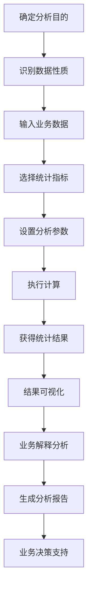

# US-011: 分析师评估数据的变异性

id: US-011
---
id: US-011  
feature: Standard Deviation Calculator
priority: High
owner: @product-owner
assignee: TBD
version: 0.1
created: 2025-09-05
status: Draft
reviewers: []
---

## 1. **功能概述**
- **一句话定位**：为数据分析师提供专业的数据变异性评估工具，支持多种统计指标计算
- **解决的核心痛点**：业务分析中需要评估数据稳定性和离散程度，手工计算复杂且容易出错

## 2. **用户故事（User Stories）**
| 角色 | 场景 | 期望 | 价值 |
| ---- | ---- | ---- | ---- |
| 分析师 | 评估数据的变异性 | 选择合适的公式（样本/总体）并获得准确结果 | 确保分析结果的准确性和专业性 |

**用户故事描述**:
> 作为一名数据分析师，当我需要评估销售数据的波动性、客户行为的稳定性或产品质量的一致性时，我希望有一个专业的变异性分析工具，能够根据数据特征选择合适的统计公式，提供详细的计算过程和结果解释，并支持结果可视化，让我能够准确判断数据的离散程度并为业务决策提供依据。

## 3. **业务流程**
- **流程步骤列表**：
  - Step 1 → 确定分析目的和数据性质（样本/总体）
  - Step 2 → 输入需要分析的业务数据
  - Step 3 → 选择合适的变异性指标（标准差/方差/变异系数）
  - Step 4 → 设置分析参数和精度要求
  - Step 5 → 执行计算并获得统计结果
  - Step 6 → 分析结果并生成业务报告

- **Mermaid 流程图**：

## 4. **数据设计**
- **关键数据实体及字段**：

| 实体名称 | 主要字段 | 类型 | 说明 |
|---------|---------|------|------|
| **业务数据** | data_series | number[] | 业务数据序列 |
|  | data_label | string | 数据标签/名称 |
|  | time_period | string | 时间周期 |
|  | business_context | string | 业务背景 |
| **变异性指标** | standard_deviation | number | 标准差 |
|  | variance | number | 方差 |
|  | coefficient_variation | number | 变异系数 |
|  | range | object | 极差{min, max} |
|  | quartiles | object | 四分位数 |

- **接口/事件触发点**：
  - `POST /api/variance-analysis` - 变异性分析API
  - `calc_execute` - 执行计算事件
  - `visualization_generate` - 生成可视化事件
  - `report_export` - 导出报告事件

## 5. **功能性需求（FRs）**
- **FR-11.1**：支持多种变异性指标计算（标准差、方差、变异系数、极差）
- **FR-11.2**：提供数据分布的可视化展示（直方图、箱线图）
- **FR-11.3**：支持异常值检测和影响分析
- **FR-11.4**：提供业务场景的统计解释和建议
- **FR-11.5**：支持时间序列数据的趋势分析
- **FR-11.6**：提供基准对比和行业标准参考

## 6. **非功能性需求（NFRs）**
- **性能**：支持大规模数据集分析（>10000个数据点），计算时间<2秒
- **安全**：业务数据本地处理优先，敏感数据不上传
- **合规**：符合企业数据治理和分析规范
- **可用性与可维护性**：专业的分析界面，支持结果导出和分享

## 7. **边界条件与异常场景**
- **数据质量问题**：包含缺失值或异常值 → 提供数据清洗建议和处理选项
- **样本量不足**：数据点过少影响统计有效性 → 提醒并建议最小样本量
- **分布异常**：数据严重偏态或多峰分布 → 提供分布诊断和替代分析方法
- **计算溢出**：极大或极小数值导致计算问题 → 实现稳健的数值算法

## 8. **验收标准（DoD）**
- **功能测试**：
  - [ ] 多种变异性指标计算准确
  - [ ] 样本和总体公式结果正确
  - [ ] 异常值检测算法有效
  - [ ] 可视化图表准确反映数据特征

- **兼容性测试**：
  - [ ] 支持主流数据格式导入
  - [ ] 生成的报告与BI工具兼容

- **合规检查**：
  - [ ] 业务数据处理安全合规
  - [ ] 统计方法科学可靠

- **UAT通过条件**：
  - [ ] 10名分析师测试，计算准确率100%
  - [ ] 业务解释准确性>90%
  - [ ] 分析效率相比手工提升>75%

## 9. **风险与依赖**
- **技术风险**：
  - 复杂统计算法的准确性和性能 → 使用经过验证的统计库
  - 大数据集的内存和计算资源消耗 → 优化算法和分批处理

- **业务风险**：
  - 统计结果的误解可能导致错误决策 → 提供清晰的业务解释
  - 不同业务场景对变异性的理解差异 → 建立行业标准参考

- **用户体验风险**：
  - 专业统计概念可能对业务用户复杂 → 提供通俗解释和业务化表达

## 10. **交互与原型要点**
- **关键界面组件**：
  - 专业的数据输入和预处理面板
  - 统计指标选择器，清楚说明适用场景
  - 实时的统计结果仪表板
  - 交互式的数据分布可视化图表

- **页面布局要点**：
  - 专业的商业分析工具界面风格
  - 数据、计算、结果的清晰分区布局
  - 支持大屏幕的详细分析视图
  - 便捷的报告生成和导出功能

- **分析特色功能**：
  - 数据分布的多维度可视化
  - 异常值的交互式标注和分析
  - 变异性趋势的时间序列图表
  - 与业务KPI的关联分析展示

---

**验收负责人**: 产品经理 + 数据分析专家  
**开发预估**: 7-9个开发日  
**测试预估**: 4-5个测试日  
**上线目标**: MVP第一批功能