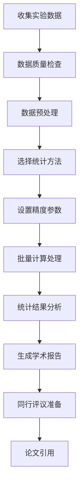

# US-012: 研究人员快速计算实验数据的离散度

id: US-012
---
id: US-012  
feature: Standard Deviation Calculator
priority: High
owner: @product-owner
assignee: TBD
version: 0.1
created: 2025-09-05
status: Draft
reviewers: []
---

## 1. **功能概述**
- **一句话定位**：为科研人员提供快速准确的实验数据离散度计算工具，支持科研级精度要求
- **解决的核心痛点**：科研实验数据分析需要高精度和可重现的统计计算，传统工具可能精度不足

## 2. **用户故事（User Stories）**
| 角色 | 场景 | 期望 | 价值 |
| ---- | ---- | ---- | ---- |
| 研究人员 | 快速计算实验数据的离散度 | 批量输入数据，获得方差和标准差结果 | 提高研究效率，验证数据质量 |

**用户故事描述**:
> 作为一名科研人员，当我完成实验数据收集后，需要快速评估数据的离散程度以判断实验的可靠性和重现性，我希望有一个支持科研级精度的工具，能够处理大量实验数据，提供详细的统计分析结果，并生成符合学术规范的计算报告，便于在论文中引用和同行评议。

## 3. **业务流程**
- **流程步骤列表**：
  - Step 1 → 从实验设备或记录中收集原始数据
  - Step 2 → 数据预处理和质量检查
  - Step 3 → 选择合适的统计方法（样本/总体）
  - Step 4 → 设置科研级精度和置信水平
  - Step 5 → 批量计算多组实验数据
  - Step 6 → 生成学术格式的分析报告

- **Mermaid 流程图**：

## 4. **数据设计**
- **关键数据实体及字段**：

| 实体名称 | 主要字段 | 类型 | 说明 |
|---------|---------|------|------|
| **实验数据** | experiment_id | string | 实验编号 |
|  | data_series | number[] | 测量数据序列 |
|  | measurement_unit | string | 测量单位 |
|  | experimental_conditions | object | 实验条件 |
|  | researcher_notes | string | 研究员备注 |
| **统计结果** | sample_size | integer | 样本数量 |
|  | mean | number | 平均值 |
|  | std_deviation | number | 标准差 |
|  | variance | number | 方差 |
|  | confidence_interval | object | 置信区间 |
|  | statistical_significance | object | 统计显著性 |

- **接口/事件触发点**：
  - `POST /api/research/stddev` - 科研标准差计算API
  - `batch_analysis` - 批量分析事件
  - `export_academic` - 导出学术报告事件
  - `peer_review_share` - 同行评议分享事件

## 5. **功能性需求（FRs）**
- **FR-12.1**：支持科学记数法和极高精度数值计算
- **FR-12.2**：提供实验重复性和再现性分析
- **FR-12.3**：支持多组实验数据的批量对比分析
- **FR-12.4**：生成符合学术期刊要求的统计报告
- **FR-12.5**：提供置信区间和统计显著性检验
- **FR-12.6**：支持实验数据的版本管理和追溯

## 6. **非功能性需求（NFRs）**
- **性能**：支持大规模实验数据集（>50000个数据点），保持高精度计算
- **安全**：科研数据严格保密，支持本地部署和离线计算
- **合规**：符合科研数据管理规范和期刊投稿要求
- **可用性与可维护性**：提供API接口，支持与科研软件集成

## 7. **边界条件与异常场景**
- **数据精度要求**：需要超高精度计算 → 使用专业数学库和任意精度算法
- **实验异常值**：测量误差或设备故障导致的异常数据 → 提供异常值检测和处理建议
- **样本量限制**：某些实验样本量很小 → 提供小样本统计方法和注意事项
- **数据保密性**：敏感科研数据 → 提供完全离线的本地计算模式

## 8. **验收标准（DoD）**
- **功能测试**：
  - [ ] 科学记数法数据正确处理
  - [ ] 高精度计算结果与专业软件一致
  - [ ] 批量数据处理功能稳定
  - [ ] 学术报告格式符合期刊要求

- **兼容性测试**：
  - [ ] 与主流科研软件数据格式兼容
  - [ ] API接口与Python/R等工具集成正常

- **合规检查**：
  - [ ] 科研数据处理符合机构政策
  - [ ] 计算方法的科学性和可靠性验证

- **UAT通过条件**：
  - [ ] 10名科研人员测试，计算准确性100%
  - [ ] 与专业软件结果一致性>99.9%
  - [ ] 科研工作效率提升>60%

## 9. **风险与依赖**
- **技术风险**：
  - 极高精度计算的算法复杂性 → 使用经过同行评议的科学计算库
  - 大数据量处理的性能和内存问题 → 优化算法和分布式计算

- **科研风险**：
  - 计算错误可能影响科研结论的可靠性 → 建立多重验证机制
  - 不同学科对统计方法的要求差异 → 提供学科专门的计算模板

- **合规风险**：
  - 科研数据的机构和国家安全政策 → 严格的本地处理和访问控制
  - 国际合作中的数据共享限制 → 提供合规的数据处理说明

## 10. **交互与原型要点**
- **关键界面组件**：
  - 科研数据专用的高精度输入界面
  - 实验条件和元数据标注功能
  - 批量数据处理的进度监控面板
  - 学术级别的结果展示和报告生成

- **页面布局要点**：
  - 简洁专业的科研工具界面设计
  - 支持大数据集的高效浏览和操作
  - 详细的计算过程记录和审计日志
  - 符合学术规范的输出格式选择

- **科研特色功能**：
  - 实验数据的版本控制和比较
  - 统计方法的理论依据和参考文献
  - 与常用科研软件的数据交换
  - 同行评议和合作的数据分享机制

---

**验收负责人**: 产品经理 + 科研统计专家  
**开发预估**: 8-10个开发日  
**测试预估**: 5-6个测试日  
**上线目标**: MVP第一批功能