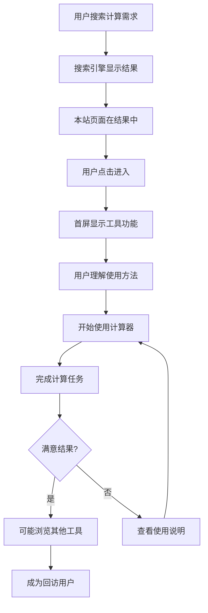

# US-013: 普通用户通过搜索引擎发现工具

id: US-013
---
id: US-013  
feature: Platform Features - SEO & Discovery
priority: High
owner: @product-owner
assignee: TBD
version: 0.1
created: 2025-09-05
status: Draft
reviewers: []
---

## 1. **功能概述**
- **一句话定位**：通过完善的SEO优化让用户能够通过搜索引擎快速发现和使用统计计算工具
- **解决的核心痛点**：用户在搜索统计计算需求时难以找到合适的在线工具，或找到的工具不易使用

## 2. **用户故事（User Stories）**
| 角色 | 场景 | 期望 | 价值 |
| ---- | ---- | ---- | ---- |
| 普通用户 | 通过搜索引擎发现工具 | 快速找到需要的计算器并了解使用方法 | 高效解决计算问题，无学习成本 |

**用户故事描述**:
> 作为一个普通用户，当我在Google搜索"calculate mean online"或"平均数计算器"时，我希望能够在搜索结果中看到这个工具网站，点击进入后立即就能理解如何使用，并且首屏就能完成基本的计算任务，不需要注册或学习复杂的操作步骤。

## 3. **业务流程**
- **流程步骤列表**：
  - Step 1 → 用户在搜索引擎输入计算相关查询
  - Step 2 → 搜索结果中显示本站链接和富结果
  - Step 3 → 用户点击进入相应的计算器页面
  - Step 4 → 首屏展示工具功能和使用说明
  - Step 5 → 用户立即开始使用工具计算
  - Step 6 → 系统记录用户访问和使用数据

- **Mermaid 流程图**：

## 4. **数据设计**
- **关键数据实体及字段**：

| 实体名称 | 主要字段 | 类型 | 说明 |
|---------|---------|------|------|
| **SEO数据** | page_title | string | 页面标题（包含关键词） |
|  | meta_description | string | 页面描述 |
|  | structured_data | json | JSON-LD结构化数据 |
|  | canonical_url | string | 规范URL |
| **搜索流量** | search_query | string | 搜索查询词 |
|  | referrer | string | 来源搜索引擎 |
|  | landing_page | string | 登陆页面 |
|  | user_agent | string | 用户设备信息 |
| **用户行为** | session_start | timestamp | 会话开始时间 |
|  | first_interaction | timestamp | 首次交互时间 |
|  | task_completion | boolean | 是否完成任务 |
|  | bounce_rate | number | 跳出率 |

- **接口/事件触发点**：
  - `page_view` - 页面访问事件
  - `first_interaction` - 首次交互事件  
  - `task_complete` - 任务完成事件
  - `search_discovery` - 搜索发现事件

## 5. **功能性需求（FRs）**
- **FR-13.1**：优化页面标题和描述，包含核心搜索关键词
- **FR-13.2**：实现完整的JSON-LD结构化数据（HowTo、FAQ、BreadcrumbList）
- **FR-13.3**：建立Hub页面(/statistics-calculators/)汇总所有工具
- **FR-13.4**：优化URL结构，使用语义化路径
- **FR-13.5**：实现sitemap.xml和robots.txt
- **FR-13.6**：建立内部链接体系，提升页面权重
- **FR-13.7**：优化Core Web Vitals性能指标

## 6. **非功能性需求（NFRs）**
- **性能**：LCP≤2000ms(mobile)，CLS≤0.1，TTFB≤500ms
- **安全**：HTTPS强制，CSP策略配置
- **合规**：Cookie同意机制，隐私政策完整
- **可用性与可维护性**：移动优先响应式设计，无障碍性支持

## 7. **边界条件与异常场景**
- **搜索爬虫访问**：确保Googlebot能够正常抓取所有页面
- **不同设备访问**：手机、平板、桌面设备都有良好体验
- **网络环境差**：慢网络下也能快速加载核心功能
- **竞争激烈**：搜索结果中存在大量竞品时的差异化展示

## 8. **验收标准（DoD）**
- **功能测试**：
  - [ ] 所有目标关键词页面都已优化
  - [ ] JSON-LD结构化数据通过Google测试
  - [ ] sitemap.xml包含所有重要页面
  - [ ] 内部链接结构完整合理

- **兼容性测试**：
  - [ ] 在主流搜索引擎中正常显示
  - [ ] 移动端搜索体验优良
  - [ ] 富结果展示正确

- **合规检查**：
  - [ ] 隐私政策符合GDPR要求
  - [ ] Cookie使用合规透明

- **UAT通过条件**：
  - [ ] 目标关键词搜索排名进入前10
  - [ ] 搜索流量转化率>60%
  - [ ] 页面跳出率<40%

## 9. **风险与依赖**
- **技术风险**：
  - 搜索引擎算法变化影响排名 → 建立多元化流量来源
  - Core Web Vitals指标要求提升 → 持续性能优化

- **法规风险**：
  - 各国隐私法规差异 → 遵循最严格的国际标准
  - Cookie政策变化 → 建立灵活的合规机制

- **竞争风险**：
  - 同类工具竞争激烈 → 差异化内容和用户体验
  - 大平台推出类似功能 → 专注细分需求和专业性

- **外部系统依赖**：
  - Google搜索算法和政策
  - CDN服务稳定性
  - 分析工具（GA4、GSC）可用性

## 10. **交互与原型要点**
- **关键界面组件**：
  - 清晰的页面标题，突出工具功能
  - 首屏工具介绍和快速开始按钮
  - 面包屑导航，帮助用户理解站点结构
  - 相关工具推荐，增加页面价值

- **页面布局要点**：
  - F型布局，符合用户阅读习惯
  - 重要信息在首屏展示，减少跳出
  - 清晰的视觉层次，引导用户行为
  - 信任元素展示（如使用说明、安全提示）

- **SEO优化要点**：
  - 关键词自然融入内容，避免过度优化
  - 高质量的内容深度，提供实际价值
  - 快速加载的图片和样式
  - 结构化数据帮助搜索引擎理解内容

- **用户引导设计**：
  - 简洁的工具说明，突出核心价值
  - 示例和教程，降低使用门槛  
  - 即时反馈，增强用户信心
  - 相关推荐，延长用户停留时间

---

**验收负责人**: 产品经理 + SEO专家  
**开发预估**: 4-6个开发日  
**测试预估**: 2-3个测试日  
**上线目标**: MVP第一批功能