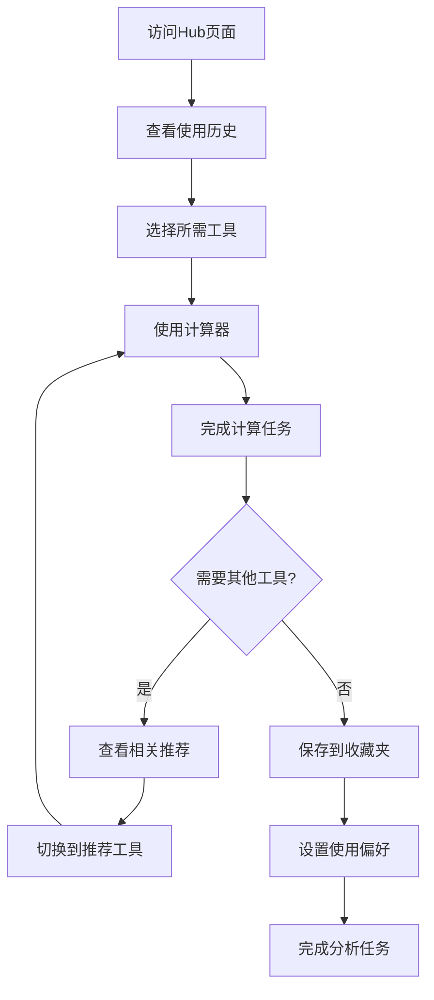

# US-014: 回访用户在工具间切换使用

id: US-014
---
id: US-014  
feature: Platform Features - User Experience
priority: Medium
owner: @product-owner
assignee: TBD
version: 0.1
created: 2025-09-05
status: Draft
reviewers: []
---

## 1. **功能概述**
- **一句话定位**：为回访用户提供便捷的工具间导航和使用历史管理功能
- **解决的核心痛点**：用户经常需要使用多个统计工具，缺乏高效的工具切换和历史记录功能

## 2. **用户故事（User Stories）**
| 角色 | 场景 | 期望 | 价值 |
| ---- | ---- | ---- | ---- |
| 回访用户 | 在工具间切换使用 | 通过Hub页面快速导航到不同计算器 | 提高使用效率，增强用户粘性 |

**用户故事描述**:
> 作为一名经常使用统计工具的回访用户，当我需要完成复杂的数据分析任务时，往往需要用到多个不同的计算器，我希望有一个统一的导航中心，能够快速切换到不同工具，记住我的使用历史和偏好设置，并提供相关工具推荐，让我能够高效地完成整套分析工作。

## 3. **业务流程**
- **流程步骤列表**：
  - Step 1 → 用户访问Hub页面或从收藏夹进入
  - Step 2 → 查看最近使用的工具和历史记录
  - Step 3 → 快速导航到需要的计算器工具
  - Step 4 → 使用工具完成计算任务
  - Step 5 → 通过相关推荐发现其他有用工具
  - Step 6 → 收藏常用工具和保存使用偏好

- **Mermaid 流程图**：

## 4. **数据设计**
- **关键数据实体及字段**：

| 实体名称 | 主要字段 | 类型 | 说明 |
|---------|---------|------|------|
| **用户会话** | session_id | string | 会话标识符 |
|  | user_fingerprint | string | 用户设备指纹 |
|  | last_visit | timestamp | 最后访问时间 |
|  | visit_count | integer | 访问次数 |
| **使用历史** | tool_name | string | 工具名称 |
|  | usage_count | integer | 使用次数 |
|  | last_used | timestamp | 最后使用时间 |
|  | avg_session_time | number | 平均使用时长 |
| **用户偏好** | favorite_tools | array | 收藏的工具列表 |
|  | preferred_precision | integer | 偏好精度设置 |
|  | ui_preferences | object | 界面偏好设置 |
|  | notification_settings | object | 通知设置 |

- **接口/事件触发点**：
  - `hub_visit` - Hub页面访问事件
  - `tool_switch` - 工具切换事件
  - `add_favorite` - 添加收藏事件
  - `recommendation_click` - 推荐点击事件

## 5. **功能性需求（FRs）**
- **FR-14.1**：提供统一的Hub页面，展示所有可用工具
- **FR-14.2**：记录和显示用户的工具使用历史
- **FR-14.3**：支持工具收藏和快速访问功能
- **FR-14.4**：提供基于使用模式的智能工具推荐
- **FR-14.5**：保存用户的界面和计算偏好设置
- **FR-14.6**：提供便捷的工具间导航和返回功能

## 6. **非功能性需求（NFRs）**
- **性能**：Hub页面加载时间<1秒，工具切换响应<500ms
- **安全**：用户数据本地存储优先，不强制注册
- **合规**：遵循隐私保护原则，明确数据使用方式
- **可用性与可维护性**：直观的导航设计，跨设备一致的体验

## 7. **边界条件与异常场景**
- **首次访问**：新用户没有使用历史 → 提供工具介绍和使用引导
- **跨设备访问**：不同设备间数据不同步 → 提供基本的工具发现功能
- **历史过多**：长期用户历史记录过多 → 智能整理和分页显示
- **存储限制**：浏览器存储空间不足 → 优化数据结构和清理机制

## 8. **验收标准（DoD）**
- **功能测试**：
  - [ ] Hub页面正确展示所有工具
  - [ ] 使用历史记录准确完整
  - [ ] 收藏功能工作正常
  - [ ] 工具推荐算法有效

- **兼容性测试**：
  - [ ] 在主流浏览器中表现一致
  - [ ] 移动端导航体验良好

- **合规检查**：
  - [ ] 本地存储使用合规
  - [ ] 隐私政策明确透明

- **UAT通过条件**：
  - [ ] 回访用户工具切换效率提升>50%
  - [ ] 推荐工具点击率>20%
  - [ ] 用户满意度评分>4.1/5.0

## 9. **风险与依赖**
- **技术风险**：
  - 浏览器存储限制和清理策略 → 设计合理的数据保留机制
  - 跨设备数据同步的复杂性 → 提供轻量级的云同步选项

- **用户体验风险**：
  - 过多的历史记录可能造成信息过载 → 智能筛选和分类显示
  - 推荐算法可能不准确 → 持续优化和用户反馈收集

- **隐私风险**：
  - 用户使用数据的收集和存储 → 严格的隐私保护和透明的数据使用

## 10. **交互与原型要点**
- **关键界面组件**：
  - 清晰的工具分类和搜索功能
  - 视觉化的使用历史时间轴
  - 便捷的收藏和快速访问面板
  - 智能的相关工具推荐卡片

- **页面布局要点**：
  - 用户友好的仪表板式布局
  - 快速操作的工具栏和快捷键
  - 个性化的内容排序和展示
  - 响应式的移动端适配

- **用户体验优化**：
  - 无缝的工具间切换动画
  - 上下文相关的帮助和提示
  - 渐进式的功能发现机制
  - 可定制的界面布局和主题

---

**验收负责人**: 产品经理 + UX设计师  
**开发预估**: 6-8个开发日  
**测试预估**: 3-4个测试日  
**上线目标**: MVP第二批功能