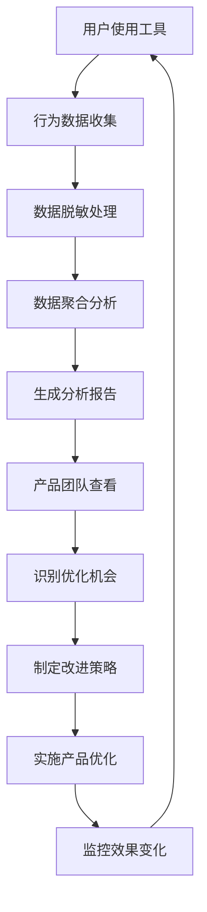

# US-015: 产品团队了解用户使用情况

id: US-015
---
id: US-015  
feature: Platform Features - Analytics & Monitoring
priority: Medium
owner: @product-owner
assignee: TBD
version: 0.1
created: 2025-09-05
status: Draft
reviewers: []
---

## 1. **功能概述**
- **一句话定位**：为产品团队提供全面的用户行为分析和产品使用数据监控系统
- **解决的核心痛点**：产品团队缺乏用户使用数据支持，难以做出数据驱动的产品优化决策

## 2. **用户故事（User Stories）**
| 角色 | 场景 | 期望 | 价值 |
| ---- | ---- | ---- | ---- |
| 产品团队 | 了解用户使用情况 | 获得详细的使用数据和用户行为分析 | 优化产品功能，改善用户体验 |

**用户故事描述**:
> 作为产品团队成员，我需要了解用户如何使用我们的统计工具，哪些功能最受欢迎，用户在哪些环节遇到困难，以及整体的用户满意度和留存情况。我希望有一个完整的数据分析体系，能够提供实时的使用统计、用户行为漏斗、功能使用热力图等，帮助我们做出基于数据的产品决策和优化方向。

## 3. **业务流程**
- **流程步骤列表**：
  - Step 1 → 用户在各工具中的行为被自动追踪记录
  - Step 2 → 数据经过脱敏处理和聚合分析
  - Step 3 → 生成各类分析报告和可视化图表
  - Step 4 → 产品团队定期查看数据仪表板
  - Step 5 → 基于数据洞察制定优化策略
  - Step 6 → 实施改进并监控效果变化

- **Mermaid 流程图**：

## 4. **数据设计**
- **关键数据实体及字段**：

| 实体名称 | 主要字段 | 类型 | 说明 |
|---------|---------|------|------|
| **用户行为事件** | event_name | string | 事件名称 |
|  | tool | string | 使用的工具 |
|  | session_id | string | 会话标识 |
|  | timestamp | timestamp | 事件时间 |
|  | user_properties | object | 用户属性（脱敏） |
| **使用统计** | daily_active_users | integer | 日活跃用户数 |
|  | tool_usage_count | object | 各工具使用次数 |
|  | session_duration | number | 平均会话时长 |
|  | conversion_rate | number | 转化率指标 |
| **性能指标** | page_load_time | number | 页面加载时间 |
|  | calculation_time | number | 计算执行时间 |
|  | error_rate | number | 错误率 |
|  | bounce_rate | number | 跳出率 |

- **接口/事件触发点**：
  - GA4事件自动收集 - 用户行为追踪
  - Core Web Vitals监控 - 性能数据收集
  - 错误监控系统 - 异常和错误追踪
  - 用户反馈系统 - 满意度和建议收集

## 5. **功能性需求（FRs）**
- **FR-15.1**：建立完整的GA4事件追踪体系，覆盖所有关键用户行为
- **FR-15.2**：提供实时和历史的用户使用统计仪表板
- **FR-15.3**：实现用户行为漏斗分析和转化率监控
- **FR-15.4**：提供工具使用热力图和功能受欢迎度排名
- **FR-15.5**：监控网站性能指标和用户体验质量
- **FR-15.6**：建立异常检测和告警机制

## 6. **非功能性需求（NFRs）**
- **性能**：数据收集不影响用户体验，分析报告生成时间<30秒
- **安全**：所有用户数据严格脱敏，符合隐私保护要求
- **合规**：遵循GDPR等数据保护法规，透明的数据收集政策
- **可用性与可维护性**：直观的数据可视化，支持自定义报告和导出

## 7. **边界条件与异常场景**
- **数据收集中断**：GA4服务异常或网络问题 → 建立备用数据收集机制
- **隐私合规**：用户拒绝数据收集 → 尊重用户选择，提供基本功能统计
- **数据量激增**：用户量快速增长导致数据处理压力 → 实施数据采样和优化
- **异常行为**：机器人或恶意访问 → 建立过滤和清洗机制

## 8. **验收标准（DoD）**
- **功能测试**：
  - [ ] 所有关键事件正确追踪记录
  - [ ] 数据仪表板准确反映使用情况
  - [ ] 漏斗分析和转化率计算正确
  - [ ] 性能监控数据准确可靠

- **兼容性测试**：
  - [ ] 各种设备和浏览器环境下数据收集正常
  - [ ] 数据导出格式与分析工具兼容

- **合规检查**：
  - [ ] 数据收集符合隐私法规要求
  - [ ] 用户同意机制完整有效

- **UAT通过条件**：
  - [ ] 产品团队能够获得所需的分析洞察
  - [ ] 数据驱动的优化决策效果可验证
  - [ ] 数据准确性和一致性>95%

## 9. **风险与依赖**
- **技术风险**：
  - GA4数据延迟和准确性问题 → 建立数据验证和校准机制
  - 大数据量的处理和存储成本 → 优化数据结构和保留策略

- **法规风险**：
  - 不同地区的数据保护法规差异 → 建立灵活的合规配置
  - Cookie政策变化影响数据收集 → 探索无Cookie的追踪方案

- **业务风险**：
  - 过度依赖数据可能忽略定性洞察 → 结合用户访谈等定性研究
  - 数据误解可能导致错误的产品决策 → 建立数据解读培训

- **外部系统依赖**：
  - Google Analytics服务的可用性和稳定性
  - 第三方监控和分析工具的集成

## 10. **交互与原型要点**
- **关键界面组件**：
  - 综合的产品数据仪表板
  - 交互式的用户行为漏斗图
  - 实时的工具使用统计面板
  - 可定制的性能监控图表

- **页面布局要点**：
  - 专业的数据分析界面设计
  - 清晰的数据层次和分类展示
  - 支持钻取和详细分析的交互
  - 便捷的报告生成和分享功能

- **数据分析特色功能**：
  - 多维度的用户细分分析
  - 时间序列的趋势对比展示
  - 异常检测和智能告警提醒
  - A/B测试效果的统计分析

- **团队协作功能**：
  - 数据权限管理和访问控制
  - 定期报告的自动生成和分发
  - 数据洞察的评论和讨论功能
  - 决策追踪和效果验证记录

---

**验收负责人**: 产品经理 + 数据分析师  
**开发预估**: 8-10个开发日  
**测试预估**: 4-5个测试日  
**上线目标**: MVP第二批功能