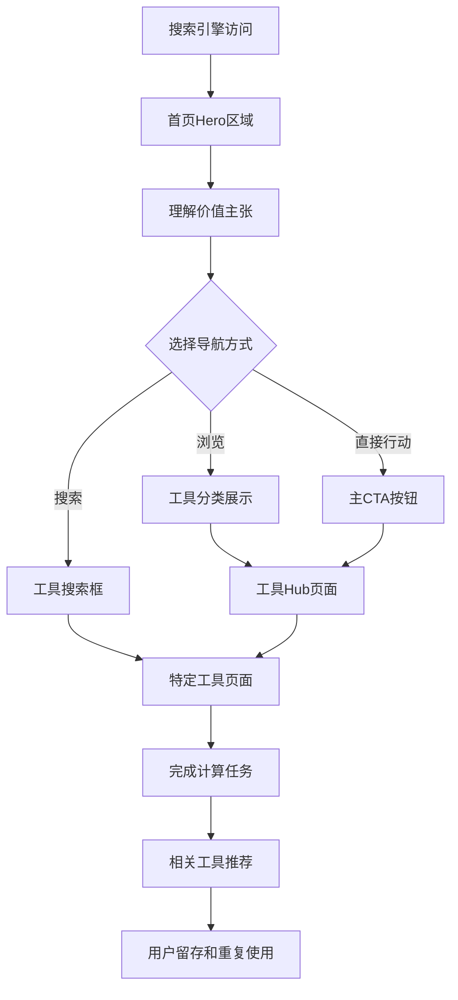

# US-016: 首页统计工具发现和转化

id: US-016
---
id: US-016  
feature: Landing Page - SEO & Conversion
priority: High
owner: @product-owner
assignee: TBD
version: 0.1
created: 2025-09-05
status: Draft
reviewers: []
---

## 1. **功能概述**
- **一句话定位**：为全球英文用户提供统计工具的权威入口，实现"能搜到、看得懂、算得对、跑得快"的用户体验
- **解决的核心痛点**：用户搜索统计计算需求时难以找到既专业又易用的工具，现有网站要么过于简单缺乏解释，要么过于复杂不易上手

## 2. **用户故事（User Stories）**
| 角色 | 场景 | 期望 | 价值 |
| ---- | ---- | ---- | ---- |
| 全球英文用户 | 通过搜索引擎寻找统计计算工具 | 快速找到权威、易用的统计计算器集合 | 高效解决计算问题，获得专业解释 |
| 学生/研究员 | 需要可信赖的统计分析工具 | 获得准确计算结果和学术级解释 | 提升学习效果，确保计算准确性 |
| 非专业用户 | 偶尔需要统计计算支持 | 无需专业背景即可理解和使用 | 降低使用门槛，获得即时帮助 |

**核心用户故事描述**:
> 作为一名搜索统计计算工具的用户，当我在Google搜索"statistical calculator"或"mean calculator"时，我希望能够找到一个既专业又易用的网站，首页就能让我快速理解这里有什么工具，这些工具如何帮助我，并且能够立即开始使用，不需要复杂的注册或学习过程。

## 3. **业务流程**
- **流程步骤列表**：
  - Step 1 → 用户通过搜索引擎访问首页
  - Step 2 → 快速理解网站价值主张和工具类型
  - Step 3 → 通过Hero区域的CTA或搜索找到需要的工具
  - Step 4 → 浏览工具展示区域了解可用功能
  - Step 5 → 选择具体工具开始计算任务
  - Step 6 → 通过相关推荐发现更多工具

- **Mermaid 流程图**：


## 4. **数据设计**
- **关键数据实体及字段**：

| 实体名称 | 主要字段 | 类型 | 说明 |
|---------|---------|------|------|
| **首页访问** | landing_source | string | 访问来源（搜索/直接/推荐） |
|  | search_query | string | 搜索关键词 |
|  | user_agent | string | 设备和浏览器信息 |
|  | geo_location | string | 地理位置（国家/地区） |
| **用户行为** | session_duration | number | 首页停留时间 |
|  | scroll_depth | number | 页面滚动深度 |
|  | cta_clicks | object | 各CTA按钮点击情况 |
|  | tool_searches | array | 工具搜索记录 |
| **转化数据** | conversion_path | array | 用户转化路径 |
|  | tool_engagement | boolean | 是否使用工具 |
|  | bounce_rate | boolean | 是否为跳出访问 |

- **接口/事件触发点**：
  - `homepage_view` - 首页访问事件
  - `hero_cta_click` - Hero区域CTA点击
  - `tool_search` - 工具搜索事件
  - `feature_scroll` - 功能区域浏览事件

## 5. **功能性需求（FRs）**
- **FR-16.1**：设计转化优化的Hero区域，包含清晰的价值主张和主要CTA
- **FR-16.2**：实现工具分类展示和快速搜索功能
- **FR-16.3**：提供用户类型导航（学生、研究员、专业人士）
- **FR-16.4**：建立社会证明展示（用户评价、使用统计）
- **FR-16.5**：优化移动端用户体验和响应式设计
- **FR-16.6**：实现SEO优化的页面结构和元数据

## 6. **非功能性需求（NFRs）**
- **性能**：LCP≤2.0秒（移动端），FID≤100ms，CLS≤0.1
- **安全**：全站HTTPS，CSP策略，安全的外部链接
- **合规**：GDPR合规的数据收集，透明的隐私政策
- **可用性与可维护性**：A11y标准，键盘导航，屏幕阅读器支持

## 7. **边界条件与异常场景**
- **搜索引擎访问**：确保爬虫能正确抓取和理解页面内容
- **低网络环境**：关键内容优先加载，渐进增强
- **JavaScript禁用**：基本导航和信息展示仍然可用
- **国际用户**：考虑不同地区的语言习惯和文化差异

## 8. **验收标准（DoD）**
- **功能测试**：
  - [ ] Hero区域CTA正确跳转到目标页面
  - [ ] 工具搜索功能准确匹配和过滤
  - [ ] 所有工具链接正常工作
  - [ ] 移动端所有功能正常

- **兼容性测试**：
  - [ ] 主流浏览器渲染一致
  - [ ] 移动设备适配完美
  - [ ] 屏幕阅读器兼容

- **合规检查**：
  - [ ] SEO元数据完整正确
  - [ ] 结构化数据验证通过
  - [ ] 页面性能达标

- **UAT通过条件**：
  - [ ] 首页到工具转化率>60%
  - [ ] 平均停留时间>45秒
  - [ ] 跳出率<40%
  - [ ] 移动端用户满意度>4.2/5.0

## 9. **风险与依赖**
- **技术风险**：
  - 页面性能优化的复杂性 → 使用CDN和优化策略
  - 多设备兼容性问题 → 广泛的设备测试

- **业务风险**：
  - 转化率不达预期 → A/B测试优化
  - SEO效果延迟显现 → 长期SEO策略坚持

- **用户体验风险**：
  - 信息过载导致用户困惑 → 简化和优先级排序
  - 专业性和易用性平衡 → 用户测试验证

## 10. **交互与原型要点**

### **页面布局设计**

#### **Hero Section（英雄区域）**
```
[Logo: StatTools] [Navigation: Tools | Guides | About]

📊 Professional Statistical Calculators
    For Students, Researchers & Professionals

"Get accurate calculations with step-by-step explanations 
in plain English. No complex software needed."

[🔍 Search Tools...] [Start Calculating →]

✓ 20+ Statistical Tools  ✓ Step-by-Step Guides  ✓ 100% Free
```

#### **What You Get（价值主张）**
```
🎯 Accurate Results        📚 Learn While You Calculate    ⚡ Lightning Fast
Professional-grade         Detailed explanations in        Results in seconds with
calculations you can       plain English help you          mobile-optimized interface
trust for academic work    understand the concepts
```

#### **For Who?（目标用户）**
```
👨‍🎓 Students               👩‍🔬 Researchers              👨‍💼 Professionals
Homework & assignments     Data analysis & papers        Business analytics
GPA calculations          Hypothesis testing            Quality control
Study statistics          Sample size planning          Performance metrics
```

#### **Features You'll Love（核心功能）**
```
🧮 Mean & Standard Deviation    📊 Hypothesis Testing         📈 Confidence Intervals
├ Sample vs Population          ├ t-test Calculator            ├ Mean CI Calculator  
├ Weighted Average             ├ Chi-square Test              ├ Proportion CI
└ GPA Calculator               └ ANOVA Calculator             └ Difference Tests

📋 Step-by-Step Solutions       🔗 Copy & Share Results       📱 Works Everywhere
Show your work with detailed   Generate shareable links      Mobile, tablet, desktop
calculation breakdowns         with your parameters          - always accessible
```

#### **Tools & Calculators（工具展示）**
```
Popular Calculators:
[Mean Calculator]  [Standard Deviation]  [t-Test]  [Confidence Interval]
[GPA Calculator]   [Correlation]         [ANOVA]   [Chi-Square Test]

[View All Tools →]
```

#### **Testimonials（社会证明）**
```
⭐⭐⭐⭐⭐ "Finally, a calculator that explains what the numbers mean!"
- Sarah M., Graduate Student

⭐⭐⭐⭐⭐ "Saved hours on my research project. The step-by-step breakdown is perfect."
- Dr. James Liu, Researcher
```

#### **FAQ（常见问题）**
```
❓ Are the calculations accurate?
Yes, all our calculators use industry-standard formulas and are tested against academic sources.

❓ Do I need to create an account?
No registration required. All tools are free to use immediately.

❓ Can I use this for academic work?
Absolutely! Our calculators provide detailed steps perfect for homework and research.

❓ Does it work on mobile?
Yes, all calculators are optimized for mobile, tablet, and desktop use.
```

### **技术SEO优化**

**页面优化要素：**
- **H1**: "Professional Statistical Calculators | Free Online Tools"
- **Meta Description**: "Free statistical calculators with step-by-step solutions. Perfect for students & researchers. Mean, standard deviation, t-tests & more. No signup required."
- **URL**: `/` (主页)
- **Core Keywords**: statistical calculators, statistics tools, free calculator

**结构化数据（JSON-LD）**：
```json
{
  "@context": "https://schema.org",
  "@type": "WebApplication",
  "name": "StatTools - Statistical Calculators",
  "description": "Professional statistical calculators with step-by-step explanations",
  "applicationCategory": "EducationalApplication",
  "operatingSystem": "Web",
  "offers": {
    "@type": "Offer",
    "price": "0",
    "priceCurrency": "USD"
  }
}
```

### **转化优化策略**

**主要CTA按钮：**
1. **Primary**: "Start Calculating" - 导向工具Hub页面
2. **Secondary**: "View All Tools" - 展示完整工具列表  
3. **Search**: 搜索框 - 直接找到特定工具

**转化路径设计：**
```
Landing Page → Tool Hub → Specific Calculator → Result → Related Tools → Repeat Use
```

**A/B测试计划：**
- Hero标题："Professional" vs "Free" vs "Accurate"
- CTA按钮文案："Start Calculating" vs "Try Now" vs "Get Started"
- 价值主张顺序：准确性优先 vs 教育性优先 vs 速度优先

---

**验收负责人**: 产品经理 + UI/UX设计师 + SEO专家  
**开发预估**: 8-10个开发日  
**测试预估**: 4-5个测试日  
**上线目标**: MVP第一批核心功能