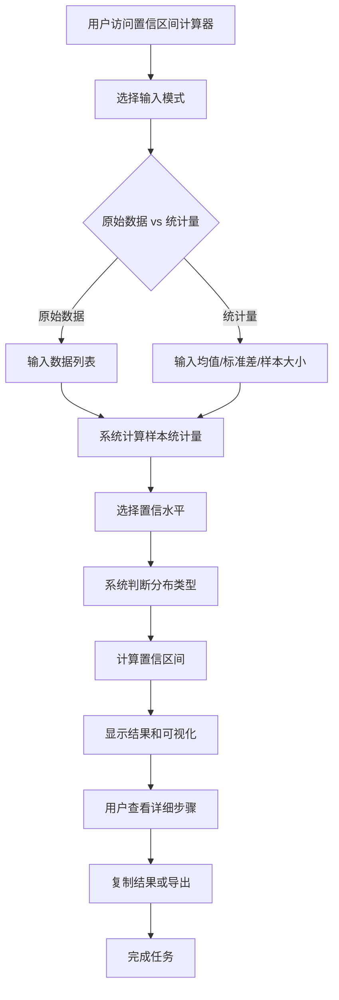

# US-017: 研究人员计算置信区间分析

id: US-017
---
id: US-017  
feature: Confidence Interval Calculator
priority: High
owner: @product-owner
assignee: TBD
version: 0.1
created: 2025-01-09
status: Draft
reviewers: []
---

## 1. **功能概述**
- **一句话定位**：为统计学习者和研究人员提供专业的置信区间计算工具，支持多种输入方式和分布类型，提供详细的统计解释
- **解决的核心痛点**：手工计算置信区间容易出错，需要查找临界值表格，缺乏计算步骤的清晰展示和统计解释

## 2. **用户故事（User Stories）**
| 角色 | 场景 | 期望 | 价值 |
| ---- | ---- | ---- | ---- |
| 统计学学生 | 完成作业需要计算样本均值的置信区间 | 输入原始数据或统计量，获得准确的置信区间和计算步骤 | 理解置信区间概念，验证手算结果 |
| 研究人员 | 分析实验数据，需要报告置信区间 | 支持不同置信水平和分布类型，获得专业的统计输出 | 提高研究质量和效率 |
| 学术工作者 | 撰写论文需要置信区间分析 | 获得标准化的统计结果和可视化图表 | 满足学术发表要求 |

**用户故事描述**:
> 作为一名研究人员，当我需要分析实验数据的置信区间时，我希望能够输入原始数据或直接提供统计量（样本均值、标准差、样本大小），选择合适的置信水平（90%、95%、99%等），然后获得准确的置信区间结果，同时能够看到详细的计算步骤和统计解释，以及直观的可视化图表，这样我就能理解计算过程并在学术报告中使用这些结果。

## 3. **业务流程**
- **流程步骤列表**：
  - Step 1 → 用户访问 `/confidence-interval-calculator` 页面
  - Step 2 → 选择输入模式（原始数据 vs 统计量）
  - Step 3 → 输入数据或统计量（样本均值、标准差、样本大小）
  - Step 4 → 选择置信水平（90%、95%、99%等）
  - Step 5 → 系统自动判断分布类型（正态/t分布/未知）
  - Step 6 → 点击计算按钮执行计算
  - Step 7 → 查看置信区间结果、计算步骤和可视化图表
  - Step 8 → 复制结果或导出报告

- **Mermaid 流程图**：

## 4. **数据设计**
- **关键数据实体及字段**：

| 实体名称 | 主要字段 | 类型 | 说明 |
|---------|---------|------|------|
| **用户输入** | input_mode | string | 输入模式："raw_data"或"statistics" |
|  | raw_data | number[] | 原始数据数组 |
|  | sample_mean | number | 样本均值（统计量模式） |
|  | sample_std | number | 样本标准差 |
|  | sample_size | integer | 样本大小 |
|  | confidence_level | number | 置信水平（0.90, 0.95, 0.99等） |
|  | known_population_std | boolean | 是否已知总体标准差 |
| **计算结果** | lower_bound | number | 置信区间下界 |
|  | upper_bound | number | 置信区间上界 |
|  | margin_error | number | 误差边界 |
|  | critical_value | number | 临界值 |
|  | distribution_type | string | 分布类型："normal"、"t"、"unknown" |
|  | steps | string[] | 计算步骤说明 |

- **接口/事件触发点**：
  - `POST /api/confidence-interval` - 后端验证计算API
  - `calc_execute` - GA4计算执行事件（记录使用情况）
  - `export_result` - 导出结果事件（记录学术使用）

## 5. **功能性需求（FRs）**
- **FR-17.1**：支持原始数据输入和统计量直接输入两种模式
- **FR-17.2**：支持多种置信水平选择（90%, 95%, 99%和自定义）
- **FR-17.3**：自动识别并支持正态分布、t分布和未知分布情况
- **FR-17.4**：提供详细的计算步骤，包括公式展示和数值代入
- **FR-17.5**：生成直观的置信区间可视化图表
- **FR-17.6**：支持结果复制和标准化报告导出
- **FR-17.7**：提供置信区间的统计解释和含义说明

## 6. **非功能性需求（NFRs）**
- **性能**：计算响应时间<500ms，支持最大1000个数据点
- **准确性**：计算精度与标准统计软件一致，支持6位有效数字
- **兼容性**：支持主流浏览器，响应式设计适配移动端
- **可用性**：提供清晰的统计术语解释，支持多种数据输入格式

## 7. **边界条件与异常场景**
- **样本过小**：样本大小<2 → 显示"样本量过小，无法计算置信区间"
- **数据异常**：包含非数值或极端异常值 → 提示数据清理建议
- **分布假设**：小样本且不满足正态假设 → 提示分布假设风险
- **置信水平异常**：输入无效置信水平 → 自动调整到标准值并提醒

## 8. **验收标准（DoD）**
- **功能测试**：
  - [ ] 能正确处理原始数据和统计量两种输入模式
  - [ ] 置信区间计算结果与标准统计软件一致
  - [ ] 自动分布识别功能准确可靠
  - [ ] 计算步骤展示完整清晰

- **统计准确性**：
  - [ ] 正态分布置信区间计算正确
  - [ ] t分布置信区间计算正确（小样本）
  - [ ] 临界值查找准确（z值、t值）

- **用户体验**：
  - [ ] 可视化图表直观准确
  - [ ] 统计解释通俗易懂
  - [ ] 支持学术格式导出
  - [ ] 移动端操作便捷

- **UAT通过条件**：
  - [ ] 10名统计学用户测试，任务完成率>95%
  - [ ] 计算结果准确性验证100%通过
  - [ ] 用户满意度评分>4.5/5.0

## 9. **风险与依赖**
- **统计风险**：
  - 分布假设识别可能不准确 → 提供手动分布选择选项
  - 小样本置信区间可能不可靠 → 添加样本量警告机制

- **技术风险**：
  - 复杂统计计算的JavaScript精度 → 使用专业数值计算库
  - 临界值表格数据完整性 → 建立完整的统计表格数据库

- **用户体验风险**：
  - 统计概念对普通用户过于复杂 → 提供分层次的解释内容
  - 可视化图表可能误导理解 → 设计准确直观的图表展示

## 10. **交互与原型要点**
- **关键界面组件**：
  - 输入模式切换器（原始数据/统计量）
  - 置信水平滑块或下拉选择器
  - 数据输入区域（支持粘贴和CSV导入）
  - 实时结果展示区域（置信区间数值+图表）
  - 可折叠的详细计算步骤区域

- **页面布局要点**：
  - 左侧输入区域，右侧结果展示的双栏布局
  - 可视化图表突出置信区间范围
  - 统计解释采用可展开的手风琴设计
  - 移动端采用垂直堆叠布局

- **用户引导**：
  - 首次访问展示典型使用场景示例
  - 输入时提供实时的数据验证反馈
  - 计算完成后引导查看统计解释
  - 提供"与均值计算器对比"的相关推荐

---

**验收负责人**: 产品经理  
**开发预估**: 5-7个开发日  
**测试预估**: 3-4个测试日  
**上线目标**: Sprint 2核心统计工具