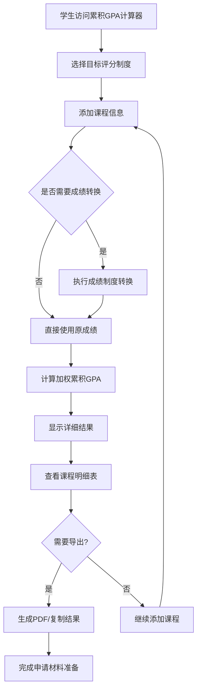

# US-018: 学生计算累积GPA申请研究生

id: US-018
---
id: US-018  
feature: Cumulative GPA Calculator
priority: High
owner: @product-owner
assignee: TBD
version: 0.1
created: 2025-01-09
status: Draft
reviewers: []
---

## 1. **功能概述**
- **一句话定位**：为毕业申请者和国际学生提供专业的累积GPA计算工具，支持多种评分制度转换和加权计算
- **解决的核心痛点**：学生需要快速准确地计算整体学业表现的累积GPA，支持不同评分制度间的转换，满足申请要求

## 2. **用户故事（User Stories）**
| 角色 | 场景 | 期望 | 价值 |
| ---- | ---- | ---- | ---- |
| 毕业申请者 | 申请研究生需要提供累积GPA | 输入所有课程成绩，计算准确的累积GPA | 满足申请要求，提高录取机会 |
| 国际学生 | 需要将本国成绩转换为4.0制GPA | 支持多种评分制度转换和详细说明 | 准确评估学业水平，便于申请 |
| 转学学生 | 整合多个学期/学校的成绩记录 | 批量处理课程数据，计算总体GPA | 了解转学后的整体学业表现 |

**用户故事描述**:
> 作为一名准备申请研究生的学生，当我需要计算整个大学期间的累积GPA时，我希望能够输入所有修过的课程（包括课程名称、成绩、学分），选择合适的评分制度（4.0制、5.0制、百分制等），然后获得准确的累积GPA结果。我还希望能够看到详细的计算过程，支持结果导出，这样我就能在申请材料中准确填写GPA信息。

## 3. **业务流程**
- **流程步骤列表**：
  - Step 1 → 学生访问 `/cumulative-gpa-calculator` 页面
  - Step 2 → 选择目标评分制度（4.0、5.0、百分制等）
  - Step 3 → 添加课程信息（课程名、成绩、学分）
  - Step 4 → 系统自动进行成绩制度转换（如需要）
  - Step 5 → 计算加权累积GPA（Σ成绩×学分 ÷ Σ学分）
  - Step 6 → 查看详细计算结果和课程明细
  - Step 7 → 导出GPA报告或复制结果

- **Mermaid 流程图**：

## 4. **数据设计**
- **关键数据实体及字段**：

| 实体名称 | 主要字段 | 类型 | 说明 |
|---------|---------|------|------|
| **课程信息** | course_name | string | 课程名称 |
|  | grade | string/number | 原始成绩（字母制/数值制） |
|  | credits | number | 学分数 |
|  | grade_type | string | 成绩类型：letter/percentage/4point/5point |
|  | semester | string | 学期信息（可选） |
| **评分系统** | target_scale | string | 目标制度：4.0/5.0/percentage |
|  | conversion_table | object | 成绩转换对照表 |
|  | country_standard | string | 国家/地区标准 |
| **计算结果** | cumulative_gpa | number | 累积GPA |
|  | total_credits | number | 总学分数 |
|  | total_grade_points | number | 总绩点 |
|  | course_count | integer | 课程总数 |
|  | detailed_breakdown | array | 课程明细列表 |

- **接口/事件触发点**：
  - `POST /api/cumulative-gpa` - 累积GPA计算API
  - `calc_execute` - GA4计算执行事件
  - `grade_conversion` - 成绩转换事件
  - `export_gpa_report` - 导出GPA报告事件

## 5. **功能性需求（FRs）**
- **FR-18.1**：支持多种评分制度输入和转换（4.0制、5.0制、百分制、字母制）
- **FR-18.2**：提供加权累积GPA计算（按学分权重）
- **FR-18.3**：支持批量课程添加和Excel/CSV数据导入
- **FR-18.4**：提供详细的课程明细表和计算过程展示
- **FR-18.5**：支持成绩制度转换的透明化说明
- **FR-18.6**：生成标准格式的GPA报告（支持PDF导出）
- **FR-18.7**：提供GPA等级评估和申请竞争力分析

## 6. **非功能性需求（NFRs）**
- **性能**：支持100+门课程的快速计算，响应时间<1秒
- **准确性**：成绩转换精度达到小数点后3位，符合国际标准
- **兼容性**：支持移动端操作，响应式设计优化
- **国际化**：支持多国评分制度，提供中英文界面

## 7. **边界条件与异常场景**
- **课程数据不足**：少于1门课程 → 提示"至少需要一门课程来计算GPA"
- **成绩格式异常**：无法识别的成绩格式 → 提供格式指导和示例
- **学分异常**：学分为0或负数 → 自动排除并提醒用户确认
- **转换精度**：不同评分制度转换可能有误差 → 提供转换说明和免责声明

## 8. **验收标准（DoD）**
- **功能测试**：
  - [ ] 多种评分制度转换计算正确
  - [ ] 加权GPA计算结果准确
  - [ ] 批量课程导入功能正常
  - [ ] PDF报告生成格式标准

- **国际化测试**：
  - [ ] 支持主要国家的评分制度转换
  - [ ] 转换结果与官方标准一致
  - [ ] 多语言界面显示正确

- **用户体验测试**：
  - [ ] 移动端操作流畅便捷
  - [ ] 计算过程透明易懂
  - [ ] 导出格式符合申请要求

- **UAT通过条件**：
  - [ ] 15名申请学生测试，计算准确率100%
  - [ ] 操作完成时间平均<5分钟
  - [ ] 用户满意度评分>4.3/5.0

## 9. **风险与依赖**
- **标准化风险**：
  - 不同国家评分制度差异大 → 建立权威的转换标准库
  - 转换精度可能影响申请结果 → 提供详细的转换说明

- **技术风险**：
  - 复杂的评分转换逻辑 → 建立完善的测试用例
  - 大量课程数据的处理性能 → 优化计算算法

- **业务风险**：
  - 计算错误可能影响学生申请 → 严格的质量保证流程
  - 不同院校GPA计算规则差异 → 提供灵活的配置选项

- **法规风险**：
  - 教育数据隐私保护要求 → 确保数据本地处理
  - 不同地区认证标准差异 → 遵循国际通用标准

## 10. **交互与原型要点**
- **关键界面组件**：
  - 评分制度选择器（支持主流国际标准）
  - 课程批量添加表格（支持拖拽排序）
  - 实时GPA计算结果显示
  - 详细的课程明细和转换说明
  - 一键导出PDF报告功能

- **页面布局要点**：
  - 清晰的三栏布局：输入-计算-结果
  - 突出显示累积GPA数值
  - 提供转换过程的透明展示
  - 移动端优化的紧凑设计

- **申请场景优化**：
  - 提供常见申请要求的GPA阈值参考
  - 支持多个GPA制度同时显示对比
  - 集成申请材料模板和填写指导
  - 提供GPA提升建议和学业规划

- **国际学生支持**：
  - 多国评分制度的详细说明
  - 成绩单术语的中英对照
  - 申请流程的国际化指导
  - 常见问题和解答集合

---

**验收负责人**: 产品经理 + 国际教育顾问  
**开发预估**: 6-8个开发日  
**测试预估**: 4-5个测试日  
**上线目标**: Sprint 2教育工具集