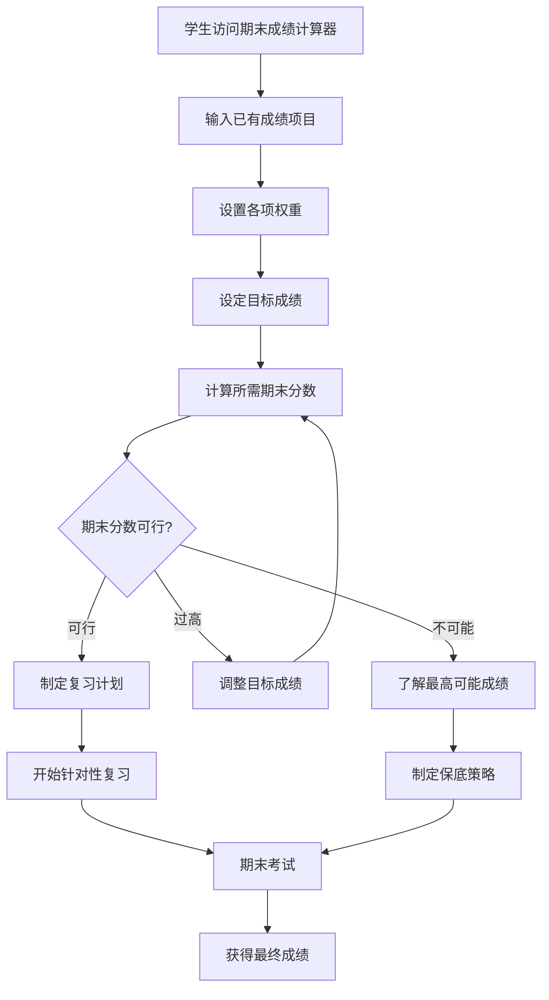

# US-019: 学生预测期末考试所需分数

id: US-019
---
id: US-019  
feature: Final Grade Calculator
priority: High
owner: @product-owner
assignee: TBD
version: 0.1
created: 2025-01-09
status: Draft
reviewers: []
---

## 1. **功能概述**
- **一句话定位**：为学生提供期末成绩预测工具，帮助计算达到目标课程成绩所需的期末考试分数
- **解决的核心痛点**：学生不知道期末考试需要考多少分才能达到理想的最终课程成绩，缺乏学习目标规划

## 2. **用户故事（User Stories）**
| 角色 | 场景 | 期望 | 价值 |
| ---- | ---- | ---- | ---- |
| 在校学生 | 期末考试前规划复习策略 | 输入已有成绩，预测达到目标成绩所需的期末分数 | 制定合理的学习计划和复习重点 |
| 焦虑学生 | 担心挂科需要了解及格要求 | 计算期末考试的最低通过分数 | 缓解焦虑，明确努力方向 |
| 优秀学生 | 追求高分需要精确计算 | 计算获得A等级所需的准确分数 | 优化学习资源分配，追求卓越 |

**用户故事描述**:
> 作为一名在校学生，当我完成了期中考试、作业、项目等课程要求后，我希望能够输入这些已获得的成绩和对应的权重，设定我期望的最终课程成绩目标（如90分、A等级），然后工具能告诉我期末考试需要考多少分才能达到这个目标，这样我就能制定合理的复习计划和分配学习时间。

## 3. **业务流程**
- **流程步骤列表**：
  - Step 1 → 学生访问 `/final-grade-calculator` 页面
  - Step 2 → 输入已完成的成绩项目（期中、作业、项目等）
  - Step 3 → 设置各项成绩的权重百分比
  - Step 4 → 输入期末考试的权重百分比
  - Step 5 → 设定目标最终成绩（数字或等级）
  - Step 6 → 系统计算所需的期末考试分数
  - Step 7 → 查看计算结果和可行性分析
  - Step 8 → 制定基于结果的学习计划

- **Mermaid 流程图**：

## 4. **数据设计**
- **关键数据实体及字段**：

| 实体名称 | 主要字段 | 类型 | 说明 |
|---------|---------|------|------|
| **成绩项目** | item_name | string | 成绩项目名称（期中、作业等） |
|  | score | number | 已获得分数 |
|  | weight | number | 权重百分比 |
|  | max_score | number | 满分（通常100） |
|  | is_completed | boolean | 是否已完成 |
| **期末设置** | final_weight | number | 期末考试权重百分比 |
|  | target_grade | number | 目标最终成绩 |
|  | passing_grade | number | 及格线（通常60） |
|  | grade_scale | string | 评分制度（百分制/字母制） |
| **计算结果** | required_final_score | number | 所需期末考试分数 |
|  | is_achievable | boolean | 是否可达成 |
|  | current_weighted_score | number | 当前加权成绩 |
|  | max_possible_grade | number | 最高可能的最终成绩 |
|  | grade_level | string | 对应等级（A/B/C等） |

- **接口/事件触发点**：
  - `calc_execute` - GA4计算执行事件
  - `target_adjustment` - 目标成绩调整事件
  - `study_plan_export` - 学习计划导出事件

## 5. **功能性需求（FRs）**
- **FR-19.1**：支持多种成绩项目和权重的灵活配置
- **FR-19.2**：支持百分制和字母等级制的目标设定
- **FR-19.3**：提供期末分数可行性分析和建议
- **FR-19.4**：计算及格线分析和保底策略
- **FR-19.5**：显示详细的计算步骤和公式
- **FR-19.6**：提供多个目标成绩的对比分析
- **FR-19.7**：支持"What-if"场景分析

## 6. **非功能性需求（NFRs）**
- **性能**：实时计算响应<200ms，支持复杂权重配置
- **准确性**：计算精度保持小数点后2位，符合教育场景
- **易用性**：直观的界面设计，适合学生快速操作
- **激励性**：提供积极的学习指导和目标达成建议

## 7. **边界条件与异常场景**
- **权重不匹配**：各项权重总和≠100% → 自动标准化并提醒用户
- **不可能的目标**：需要期末分数>100分 → 提示调整目标或显示最高可能成绩
- **已过及格线**：当前成绩已确保及格 → 提供提升成绩的建议
- **期末权重过小**：期末占比<10% → 提醒期末影响有限

## 8. **验收标准（DoD）**
- **功能测试**：
  - [ ] 各种权重配置计算结果准确
  - [ ] 边界情况处理正确（不可能目标等）
  - [ ] 等级制和百分制转换正确
  - [ ] "What-if"分析功能正常

- **用户体验测试**：
  - [ ] 界面操作直观易懂
  - [ ] 计算结果展示清晰
  - [ ] 学习建议具有指导价值
  - [ ] 移动端适配良好

- **教育价值测试**：
  - [ ] 计算公式透明可理解
  - [ ] 学习指导科学合理
  - [ ] 目标设定符合教育理念

- **UAT通过条件**：
  - [ ] 20名学生测试，计算准确率100%
  - [ ] 平均完成时间<3分钟
  - [ ] 学习指导有效性评分>4.0/5.0

## 9. **风险与依赖**
- **教育风险**：
  - 过度依赖工具可能忽视全面学习 → 提供平衡的学习建议
  - 不现实的目标设定可能增加压力 → 提供合理期望引导

- **技术风险**：
  - 复杂的权重计算逻辑 → 建立完善的测试用例
  - 不同学校评分标准差异 → 提供可配置的评分系统

- **用户体验风险**：
  - 计算结果可能令学生沮丧 → 提供积极的替代方案
  - 界面复杂可能影响使用 → 简化操作流程

## 10. **交互与原型要点**
- **关键界面组件**：
  - 成绩项目动态添加表格
  - 权重百分比滑块控件
  - 目标成绩输入器（支持数字和等级）
  - 醒目的期末所需分数显示
  - 可行性指示器（绿/黄/红灯）

- **页面布局要点**：
  - 清晰的三步操作流程指引
  - 实时的计算结果反馈
  - 视觉化的成绩权重饼图
  - 突出显示关键信息（所需分数）

- **学习指导功能**：
  - 基于结果的复习建议
  - 学习时间分配建议
  - 优先级排序指导
  - 压力管理提醒

- **激励设计元素**：
  - 进度条显示目标达成情况
  - 成就感的视觉反馈
  - 积极的文案和建议
  - 分享成功计划的功能

---

**验收负责人**: 产品经理 + 教育专家  
**开发预估**: 4-6个开发日  
**测试预估**: 3个测试日  
**上线目标**: Sprint 2期末季功能