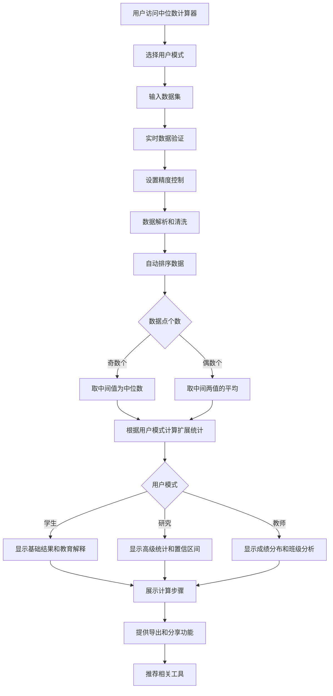

# US-020: 学生理解数据中心趋势

id: US-020
---
id: US-020  
feature: Median Calculator
priority: Medium
owner: @product-owner
assignee: TBD
version: 0.1
created: 2025-01-09
status: Draft
reviewers: []
---

## 1. **功能概述**
- **一句话定位**：为学生、研究人员和教师提供专业的中位数计算工具，支持多用户模式和高级统计分析功能
- **解决的核心痛点**：不同用户群体需要适合其场景的中位数计算工具，包括学生学习、研究分析和教学评估

## 2. **用户故事（User Stories）**
| 角色 | 场景 | 期望 | 价值 |
| ---- | ---- | ---- | ---- |
| 统计学学生 | 完成作业需要计算数据集的中位数 | 输入数据并获得准确的中位数结果和详细计算步骤 | 理解中位数概念，验证手算结果 |
| 研究人员 | 分析实验数据的中心位置和分布特征 | 获得高精度中位数计算、四分位数和异常值检测 | 准确描述数据分布，识别数据特征 |
| 教师 | 评估学生成绩的中位数表现 | 批量处理成绩数据，获得班级中位数和成绩分布 | 了解班级整体表现，制定教学策略 |

**用户故事描述**:
> 作为一名学习统计学的学生，当我需要分析一组数据的中心趋势时，我希望有一个专业的工具能帮我计算中位数，显示数据的排序过程和详细的计算步骤。我还希望能看到中位数与平均值的对比，理解它们在不同情况下的差异和适用性，并获得适合我学习水平的概念解释。

> 作为一名研究人员，当我分析实验数据时，我需要一个支持高精度计算的中位数工具，能够处理科学记数法数据，检测异常值，并提供四分位数等高级统计指标，帮助我准确描述数据的分布特征。

> 作为一名教师，当我需要分析学生成绩时，我希望能够批量处理电子表格数据，快速获得班级的中位数成绩，并查看成绩分布情况，以便了解学生的整体表现水平。

## 3. **业务流程**
- **流程步骤列表**：
  - Step 1 → 用户访问 `/calculator/median` 页面
  - Step 2 → 选择用户模式（学生/研究/教师）
  - Step 3 → 输入数据集（支持多种格式和批量导入）
  - Step 4 → 系统实时数据验证和解析
  - Step 5 → 设置计算精度和高级选项
  - Step 6 → 自动排序数据并计算中位数
  - Step 7 → 根据用户模式显示相应的统计结果
  - Step 8 → 展示详细的计算步骤和概念解释
  - Step 9 → 提供结果导出、复制和分享功能
  - Step 10 → 查看相关工具推荐和帮助文档

- **Mermaid 流程图**：

## 4. **数据设计**
- **关键数据实体及字段**：

| 实体名称 | 主要字段 | 类型 | 说明 |
|---------|---------|------|------|
| **数据输入** | raw_input | string | 用户输入的原始数据 |
|  | validNumbers | number[] | 解析后的有效数值数组 |
|  | invalidEntries | string[] | 无效输入项 |
|  | count | integer | 有效数据点个数 |
| **计算结果** | median | number | 中位数主值 |
|  | mean | number | 平均值（用于对比） |
|  | sorted_data | number[] | 排序后的数据 |
|  | steps | string[] | 详细计算步骤 |
|  | median_position | string | 中位数位置说明 |
| **基础统计** | min_value | number | 最小值 |
|  | max_value | number | 最大值 |
|  | q1 | number | 第一四分位数 |
|  | q3 | number | 第三四分位数 |
|  | iqr | number | 四分位距 |
| **研究模式扩展** | outliers | number[] | 异常值检测结果 |
|  | confidenceInterval | [number, number] | 中位数置信区间 |
|  | bootstrapSamples | number | 自助法采样次数 |
| **教师模式扩展** | gradeDistribution | {[key: string]: number} | 成绩分布统计 |
|  | scoreRange | {min: number, max: number} | 分数范围 |
|  | classPerformance | string | 班级表现评估 |

- **接口/事件触发点**：
  - `median_calculate` - GA4中位数计算事件
  - `user_mode_switch` - 用户模式切换事件
  - `precision_change` - 精度调整事件
  - `result_export` - 结果导出事件
  - `result_share` - 结果分享事件

## 5. **功能性需求（FRs）**
- **FR-20.1**：多用户模式支持（学生、研究、教师模式）
- **FR-20.2**：多种数据输入格式（逗号分隔、换行分隔、空格分隔、制表符）
- **FR-20.3**：实时数据验证和智能解析（支持科学记数法）
- **FR-20.4**：精度控制功能（2-6位小数精度可调）
- **FR-20.5**：自动数据排序和中位数计算（奇数/偶数个数据点）
- **FR-20.6**：详细计算步骤展示和概念解释
- **FR-20.7**：基础统计信息（最小值、最大值、四分位数）
- **FR-20.8**：研究模式：异常值检测和置信区间计算
- **FR-20.9**：教师模式：成绩分布分析和批量数据处理
- **FR-20.10**：结果导出功能（CSV、JSON、TXT格式）
- **FR-20.11**：结果复制和分享功能
- **FR-20.12**：响应式设计和移动端适配
- **FR-20.13**：SEO优化和结构化数据支持
- **FR-20.14**：相关工具推荐和导航功能

## 6. **非功能性需求（NFRs）**
- **性能**：计算响应时间<200ms（数据点<1000），大数据集<2秒
- **简洁性**：界面简单专注，突出核心功能
- **教育性**：提供清晰的概念解释和实际应用场景
- **准确性**：计算结果精确到小数点后3位

## 7. **边界条件与异常场景**
- **数据不足**：少于1个有效数据点 → 提示"至少需要一个有效数字"
- **单个数据点**：只有1个数据 → 中位数等于该数值，提供解释
- **相同数值**：所有数据点相同 → 中位数等于该数值，说明数据特征
- **极端数值**：包含异常大或小的数值 → 提醒检查数据，显示中位数的抗异常值特性

## 8. **验收标准（DoD）**
- **核心功能测试**：
  - [ ] 三种用户模式（学生/研究/教师）功能完整
  - [ ] 奇数和偶数个数据点的中位数计算100%准确
  - [ ] 多种输入格式（逗号、空格、换行、制表符）解析正确
  - [ ] 实时数据验证和错误处理机制有效
  - [ ] 精度控制功能（2-6位小数）工作正常

- **高级功能测试**：
  - [ ] 研究模式：异常值检测和置信区间计算准确
  - [ ] 教师模式：成绩分布分析和批量数据处理正常
  - [ ] 结果导出功能（CSV、JSON、TXT）完整可用
  - [ ] 复制和分享功能在各平台正常工作
  - [ ] 计算步骤展示详细且准确

- **用户体验测试**：
  - [ ] 响应式设计在各设备尺寸正常显示
  - [ ] 界面操作直观，学习成本低
  - [ ] 页面加载时间<2秒，计算响应<200ms
  - [ ] 无障碍访问标准符合WCAG 2.1 AA级别
  - [ ] SEO优化和结构化数据正确配置

- **教育价值测试**：
  - [ ] 不同用户模式的概念解释准确且适合目标群体
  - [ ] 计算步骤说明清晰易懂
  - [ ] 中位数与其他统计量的对比解释明确
  - [ ] 实际应用场景举例恰当且有教育意义

- **技术质量测试**：
  - [ ] 代码覆盖率>90%，单元测试通过率100%
  - [ ] 性能测试：支持1000+数据点处理
  - [ ] 安全测试：输入验证和XSS防护有效
  - [ ] 兼容性测试：主流浏览器和移动设备正常

- **UAT通过条件**：
  - [ ] 三种用户群体各15人测试，功能满意度>4.2/5.0
  - [ ] 学生群体概念理解率>85%
  - [ ] 研究人员高级功能使用成功率>90%
  - [ ] 教师批量数据处理效率提升>50%
  - [ ] 整体计算准确率100%，无严重bug

## 9. **风险与依赖**
- **教育风险**：
  - 概念解释可能不够清晰 → 邀请统计学专家审核内容
  - 与平均值的对比可能造成混淆 → 提供具体场景例子

- **技术风险**：
  - 大数据集的排序性能 → 使用高效排序算法
  - 浮点数精度问题 → 合理的精度控制

- **用户体验风险**：
  - 功能过于简单可能不满足需求 → 在简洁性和功能性间找平衡
  - 缺乏高级功能可能影响专业用户 → 明确定位为基础教育工具

## 10. **交互与原型要点**
- **关键界面组件**：
  - **CalculatorLayout**: 统一的页面布局和导航结构
  - **UserModeSelector**: 用户模式切换组件（学生/研究/教师）
  - **DataInput**: 智能数据输入框（支持多种分隔符和实时验证）
  - **PrecisionControl**: 精度控制滑块（2-6位小数）
  - **StatisticalResults**: 统计结果展示卡片（中位数突出显示）
  - **CalculationSteps**: 可折叠的详细计算步骤
  - **HelpSection**: 概念解释和帮助文档

- **页面布局架构**：
  - **顶部区域**: 面包屑导航 + 页面标题 + 描述
  - **模式选择区**: 用户模式选择器
  - **输入区域**: 数据输入框 + 精度控制 + 高级选项
  - **结果区域**: 主要统计结果 + 扩展信息 + 操作按钮
  - **步骤区域**: 详细计算过程 + 概念解释
  - **帮助区域**: 使用指南 + 常见问题 + 相关工具

- **用户模式差异化设计**：
  - **学生模式**: 简化界面、教育解释、基础统计
  - **研究模式**: 高精度显示、高级统计、置信区间
  - **教师模式**: 批量处理、成绩分布、班级分析

- **交互设计特点**：
  - 实时计算和结果更新
  - 智能数据格式识别
  - 一键复制和导出功能
  - 响应式移动端适配
  - 无障碍访问支持

- **视觉设计原则**：
  - 清晰的信息层次结构
  - 统一的设计语言和配色
  - 突出重要数据的视觉效果
  - 教育友好的图标和说明

---

**验收负责人**: 产品经理 + 教育专家  
**开发预估**: 3-4个开发日  
**测试预估**: 2个测试日  
**上线目标**: Sprint 2基础统计工具