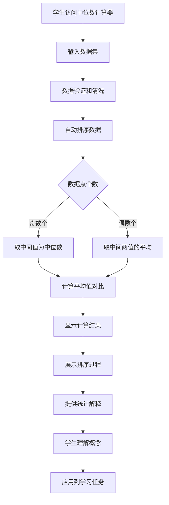

# US-020: 学生理解数据中心趋势

id: US-020
---
id: US-020  
feature: Median Calculator
priority: Medium
owner: @product-owner
assignee: TBD
version: 0.1
created: 2025-01-09
status: Draft
reviewers: []
---

## 1. **功能概述**
- **一句话定位**：为学生和数据分析者提供简单专注的中位数计算工具，帮助理解数据的中心趋势
- **解决的核心痛点**：学生需要快速找到数据集的中位数，理解其与平均值的区别和实际意义

## 2. **用户故事（User Stories）**
| 角色 | 场景 | 期望 | 价值 |
| ---- | ---- | ---- | ---- |
| 统计学学生 | 完成作业需要计算数据集的中位数 | 输入数据并获得准确的中位数结果和计算步骤 | 理解中位数概念，验证手算结果 |
| 数据分析师 | 需要了解数据的中心位置 | 快速计算中位数，对比均值差异 | 选择合适的中心趋势度量 |
| 研究人员 | 分析实验数据的典型值 | 获得中位数及其统计解释 | 准确描述数据分布特征 |

**用户故事描述**:
> 作为一名学习统计学的学生，当我需要分析一组数据的中心趋势时，我希望有一个简单的工具能帮我计算中位数，显示数据的排序过程，并解释中位数的实际含义。我还希望能看到中位数与平均值的对比，理解它们在不同情况下的差异和适用性。

## 3. **业务流程**
- **流程步骤列表**：
  - Step 1 → 学生访问 `/median-calculator` 页面
  - Step 2 → 输入数据集（支持多种格式）
  - Step 3 → 系统自动排序数据
  - Step 4 → 计算中位数（奇数/偶数个数据点）
  - Step 5 → 同时计算平均值进行对比
  - Step 6 → 显示详细的计算步骤
  - Step 7 → 查看统计解释和实际意义
  - Step 8 → 复制结果或继续分析

- **Mermaid 流程图**：

## 4. **数据设计**
- **关键数据实体及字段**：

| 实体名称 | 主要字段 | 类型 | 说明 |
|---------|---------|------|------|
| **数据输入** | raw_input | string | 用户输入的原始数据 |
|  | data_points | number[] | 解析后的数值数组 |
|  | valid_count | integer | 有效数据点个数 |
|  | invalid_entries | string[] | 无效输入项 |
| **计算结果** | median | number | 中位数 |
|  | mean | number | 平均值（用于对比） |
|  | sorted_data | number[] | 排序后的数据 |
|  | median_position | string | 中位数位置说明 |
|  | is_odd_count | boolean | 数据个数是否为奇数 |
| **统计信息** | min_value | number | 最小值 |
|  | max_value | number | 最大值 |
|  | data_range | number | 数据范围 |
|  | middle_values | number[] | 用于计算中位数的中间值 |

- **接口/事件触发点**：
  - `calc_execute` - GA4计算执行事件
  - `concept_explanation` - 查看概念解释事件
  - `compare_with_mean` - 对比平均值事件

## 5. **功能性需求（FRs）**
- **FR-20.1**：支持多种数据输入格式（逗号分隔、换行分隔、空格分隔）
- **FR-20.2**：自动数据排序和中位数计算（奇数/偶数个数据点）
- **FR-20.3**：显示详细的计算步骤和排序过程
- **FR-20.4**：提供中位数与平均值的对比分析
- **FR-20.5**：简洁清晰的统计概念解释
- **FR-20.6**：支持大数据集处理（1000+数据点）
- **FR-20.7**：提供数据的基本描述性统计

## 6. **非功能性需求（NFRs）**
- **性能**：计算响应时间<200ms（数据点<1000），大数据集<2秒
- **简洁性**：界面简单专注，突出核心功能
- **教育性**：提供清晰的概念解释和实际应用场景
- **准确性**：计算结果精确到小数点后3位

## 7. **边界条件与异常场景**
- **数据不足**：少于1个有效数据点 → 提示"至少需要一个有效数字"
- **单个数据点**：只有1个数据 → 中位数等于该数值，提供解释
- **相同数值**：所有数据点相同 → 中位数等于该数值，说明数据特征
- **极端数值**：包含异常大或小的数值 → 提醒检查数据，显示中位数的抗异常值特性

## 8. **验收标准（DoD）**
- **功能测试**：
  - [ ] 奇数和偶数个数据点的中位数计算正确
  - [ ] 数据排序算法准确可靠
  - [ ] 多种输入格式解析正确
  - [ ] 中位数与平均值对比功能正常

- **教育价值测试**：
  - [ ] 计算步骤解释清晰易懂
  - [ ] 统计概念说明准确
  - [ ] 与平均值的区别解释明确
  - [ ] 实际应用场景举例恰当

- **用户体验测试**：
  - [ ] 界面简洁直观
  - [ ] 操作流程顺畅
  - [ ] 结果展示清晰
  - [ ] 移动端适配良好

- **UAT通过条件**：
  - [ ] 15名学生测试，概念理解率>85%
  - [ ] 计算准确率100%
  - [ ] 操作满意度评分>4.0/5.0

## 9. **风险与依赖**
- **教育风险**：
  - 概念解释可能不够清晰 → 邀请统计学专家审核内容
  - 与平均值的对比可能造成混淆 → 提供具体场景例子

- **技术风险**：
  - 大数据集的排序性能 → 使用高效排序算法
  - 浮点数精度问题 → 合理的精度控制

- **用户体验风险**：
  - 功能过于简单可能不满足需求 → 在简洁性和功能性间找平衡
  - 缺乏高级功能可能影响专业用户 → 明确定位为基础教育工具

## 10. **交互与原型要点**
- **关键界面组件**：
  - 简洁的数据输入框（支持多种分隔符）
  - 清晰的结果显示区域（中位数突出显示）
  - 数据排序可视化展示
  - 中位数与平均值对比卡片
  - 可折叠的计算步骤说明

- **页面布局要点**：
  - 专注的单一功能设计
  - 重要信息突出显示
  - 教育友好的配色和字体
  - 简洁的操作流程指引

- **教育特色功能**：
  - 数据点的视觉化排列
  - 中位数位置的直观指示
  - "为什么使用中位数"的解释
  - 常见应用场景的举例

- **简洁性设计原则**：
  - 去除不必要的装饰元素
  - 突出核心计算功能
  - 清晰的信息层次结构
  - 一目了然的操作指引

---

**验收负责人**: 产品经理 + 教育专家  
**开发预估**: 3-4个开发日  
**测试预估**: 2个测试日  
**上线目标**: Sprint 2基础统计工具