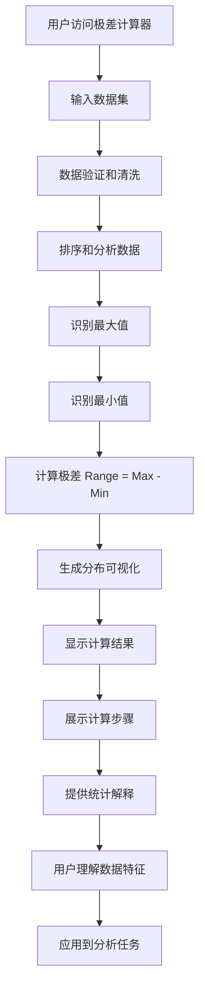

# US-021: 学生计算数据集的变化范围

id: US-021
---
id: US-021  
feature: Range Calculator
priority: Medium
owner: @product-owner
assignee: TBD
version: 0.1
created: 2025-01-09
status: Draft
reviewers: []
---

## 1. **功能概述**
- **一句话定位**：为学生和数据分析者提供数据区间（极差）计算工具，帮助理解数据的变化范围和分布特征
- **解决的核心痛点**：学生需要快速计算数据集的极差，理解数据的分散程度和变化幅度

## 2. **用户故事（User Stories）**
| 角色 | 场景 | 期望 | 价值 |
| ---- | ---- | ---- | ---- |
| 统计学学生 | 完成作业需要分析数据的变化范围 | 输入数据并获得极差值和计算步骤 | 理解数据分散度概念，完成学习任务 |
| 数据分析师 | 快速了解数据集的分布范围 | 计算极差并查看数据的分布可视化 | 初步评估数据特征和异常值 |
| 质量控制人员 | 监控产品质量数据的变异性 | 批量处理数据，获得变化范围分析 | 判断生产过程的稳定性 |

**用户故事描述**:
> 作为一名学习统计学的学生，当我需要分析一组数据的变化范围时，我希望有一个工具能帮我快速找到最大值和最小值，计算它们的差值（极差），并通过图表直观地展示数据的分布情况。我还希望能理解极差的统计意义以及它在数据分析中的应用。

## 3. **业务流程**
- **流程步骤列表**：
  - Step 1 → 用户访问 `/range-calculator` 页面
  - Step 2 → 输入数据集（支持多种输入方式）
  - Step 3 → 系统自动识别最大值和最小值
  - Step 4 → 计算极差（Range = Max - Min）
  - Step 5 → 生成数据分布可视化图表
  - Step 6 → 显示详细的计算步骤和解释
  - Step 7 → 查看极差的统计意义说明
  - Step 8 → 复制结果或导出分析报告

- **Mermaid 流程图**：

## 4. **数据设计**
- **关键数据实体及字段**：

| 实体名称 | 主要字段 | 类型 | 说明 |
|---------|---------|------|------|
| **数据输入** | raw_input | string | 用户输入的原始数据 |
|  | data_points | number[] | 解析后的数值数组 |
|  | valid_count | integer | 有效数据点个数 |
|  | input_method | string | 输入方式：manual/paste/csv |
| **计算结果** | range | number | 极差值（最大值-最小值） |
|  | min_value | number | 最小值 |
|  | max_value | number | 最大值 |
|  | min_positions | number[] | 最小值在数组中的位置 |
|  | max_positions | number[] | 最大值在数组中的位置 |
| **统计信息** | data_span | number | 数据跨度（与极差相同） |
|  | outlier_threshold | number | 异常值阈值 |
|  | distribution_type | string | 分布类型描述 |
|  | sorted_data | number[] | 排序后的数据（用于可视化） |

- **接口/事件触发点**：
  - `calc_execute` - GA4计算执行事件
  - `visualization_view` - 查看可视化事件
  - `concept_explanation` - 查看概念解释事件
  - `data_export` - 数据导出事件

## 5. **功能性需求（FRs）**
- **FR-21.1**：支持多种数据输入方式（手动输入、粘贴、CSV导入）
- **FR-21.2**：自动识别并计算数据集的最大值、最小值和极差
- **FR-21.3**：提供数据分布的可视化图表（柱状图或散点图）
- **FR-21.4**：显示详细的计算步骤和公式解释
- **FR-21.5**：支持大数据集处理（1000+数据点）
- **FR-21.6**：提供极差的统计意义和应用场景说明
- **FR-21.7**：标识可能的异常值和数据特征

## 6. **非功能性需求（NFRs）**
- **性能**：支持1000+数据点的快速处理，计算时间<1秒
- **可视化**：清晰直观的图表展示，支持交互式查看
- **教育性**：提供通俗易懂的统计概念解释
- **准确性**：计算结果精确，支持高精度数值处理

## 7. **边界条件与异常场景**
- **数据不足**：少于1个有效数据点 → 提示"至少需要一个有效数字"
- **单个数据点**：只有1个数据 → 极差为0，提供合理解释
- **相同数值**：所有数据点相同 → 极差为0，说明数据无变化
- **极端数值**：包含异常大或小的数值 → 标识异常值，说明对极差的影响

## 8. **验收标准（DoD）**
- **功能测试**：
  - [ ] 最大值和最小值识别准确
  - [ ] 极差计算结果正确
  - [ ] 多种输入格式解析正常
  - [ ] 大数据集处理性能达标

- **可视化测试**：
  - [ ] 图表展示清晰准确
  - [ ] 数据分布可视化符合实际
  - [ ] 异常值标识功能正常
  - [ ] 图表交互功能稳定

- **教育价值测试**：
  - [ ] 计算步骤解释清晰
  - [ ] 统计概念说明准确
  - [ ] 应用场景举例恰当
  - [ ] 概念理解辅助有效

- **UAT通过条件**：
  - [ ] 15名学生测试，概念理解率>80%
  - [ ] 计算准确率100%
  - [ ] 可视化满意度>4.0/5.0

## 9. **风险与依赖**
- **教育风险**：
  - 极差概念相对简单可能被轻视 → 强调其在数据分析中的重要性
  - 与其他变异性度量的区别 → 提供对比说明

- **技术风险**：
  - 大数据集的可视化性能 → 实现数据采样和优化算法
  - 异常值识别的准确性 → 使用标准的统计方法

- **用户体验风险**：
  - 功能看似过于简单 → 通过可视化和解释增加价值
  - 缺乏高级分析功能 → 明确定位为基础统计工具

## 10. **交互与原型要点**
- **关键界面组件**：
  - 多格式数据输入区域
  - 突出显示的极差结果
  - 最大值和最小值标识
  - 数据分布可视化图表
  - 计算步骤展示面板

- **页面布局要点**：
  - 左侧输入，右侧结果的布局
  - 可视化图表占据显著位置
  - 关键数值用大字号突出
  - 计算过程清晰展示

- **可视化设计**：
  - 数据点的散布图或柱状图
  - 最大值和最小值的特殊标记
  - 极差范围的视觉表示
  - 异常值的颜色区分

- **教育特色功能**：
  - "什么是极差"的概念解释
  - 极差与标准差的区别说明
  - 实际应用场景的具体例子
  - 数据变异性的直观理解

- **数据处理优化**：
  - 智能数据格式识别
  - 异常值的自动检测提醒
  - 大数据集的分批处理
  - 结果的多格式导出选项

---

**验收负责人**: 产品经理 + 数据分析专家  
**开发预估**: 4-5个开发日  
**测试预估**: 2-3个测试日  
**上线目标**: Sprint 2基础统计工具