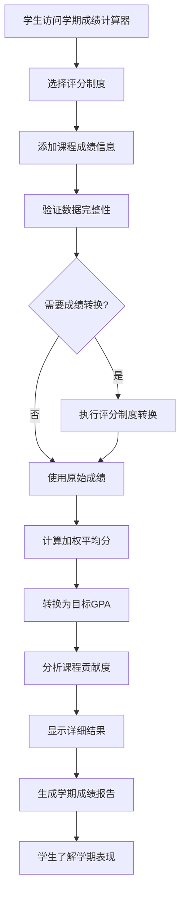

# US-022: 学生计算学期总成绩

id: US-022
---
id: US-022  
feature: Semester Grade Calculator
priority: Medium
owner: @product-owner
assignee: TBD
version: 0.1
created: 2025-01-09
status: Draft
reviewers: []
---

## 1. **功能概述**
- **一句话定位**：为学生提供学期多课程成绩综合计算工具，支持加权平均和不同评分制度转换
- **解决的核心痛点**：学生需要了解整个学期的学术表现，计算多门课程的加权平均成绩和学期GPA

## 2. **用户故事（User Stories）**
| 角色 | 场景 | 期望 | 价值 |
| ---- | ---- | ---- | ---- |
| 在校学生 | 学期末计算总体学术表现 | 输入各门课程成绩和学分，获得学期GPA | 了解学期表现，规划下学期选课 |
| 转学申请者 | 准备转学材料需要学期成绩 | 计算准确的学期加权平均分 | 满足转学申请的成绩要求 |
| 学术顾问 | 评估学生学期学术状况 | 快速计算多个学生的学期表现 | 提供准确的学术指导建议 |

**用户故事描述**:
> 作为一名大学生，当我完成一个学期的学习后，我希望能够输入这学期所有课程的成绩和学分信息，选择合适的评分制度，然后获得准确的学期加权平均分和GPA。我还希望能看到详细的计算过程，了解哪门课程对总成绩影响最大，这样我就能全面了解自己的学期学术表现。

## 3. **业务流程**
- **流程步骤列表**：
  - Step 1 → 学生访问 `/semester-grade-calculator` 页面
  - Step 2 → 选择评分制度（4.0制、百分制等）
  - Step 3 → 添加课程信息（课程名、成绩、学分）
  - Step 4 → 系统进行成绩制度转换（如需要）
  - Step 5 → 计算加权平均分（Σ成绩×学分 ÷ Σ学分）
  - Step 6 → 转换为目标制度的GPA
  - Step 7 → 显示详细计算结果和课程贡献分析
  - Step 8 → 复制结果或生成学期成绩报告

- **Mermaid 流程图**：

## 4. **数据设计**
- **关键数据实体及字段**：

| 实体名称 | 主要字段 | 类型 | 说明 |
|---------|---------|------|------|
| **课程信息** | course_name | string | 课程名称 |
|  | grade | string/number | 课程成绩 |
|  | credits | number | 课程学分 |
|  | grade_points | number | 转换后的绩点 |
|  | weight_contribution | number | 对总成绩的贡献度 |
| **学期设置** | grading_system | string | 评分制度 |
|  | target_gpa_scale | string | 目标GPA制度 |
|  | semester_name | string | 学期名称（可选） |
|  | academic_year | string | 学年信息（可选） |
| **计算结果** | weighted_average | number | 加权平均分 |
|  | semester_gpa | number | 学期GPA |
|  | total_credits | number | 总学分数 |
|  | total_grade_points | number | 总绩点 |
|  | course_count | integer | 课程数量 |
|  | performance_analysis | object | 学期表现分析 |

- **接口/事件触发点**：
  - `calc_execute` - GA4学期成绩计算事件
  - `grade_conversion` - 成绩转换事件
  - `performance_analysis` - 表现分析查看事件
  - `semester_report_export` - 学期报告导出事件

## 5. **功能性需求（FRs）**
- **FR-22.1**：支持多种评分制度输入（百分制、4.0制、字母制等）
- **FR-22.2**：计算学分加权的学期平均成绩
- **FR-22.3**：提供评分制度间的准确转换
- **FR-22.4**：显示各课程对总成绩的贡献度分析
- **FR-22.5**：生成完整的学期成绩摘要报告
- **FR-22.6**：支持及格线分析和学术警告提示
- **FR-22.7**：提供学期表现的等级评估

## 6. **非功能性需求（NFRs）**
- **性能**：支持20门课程的快速计算，响应时间<500ms
- **准确性**：GPA计算精度达到小数点后3位
- **易用性**：简洁直观的课程添加和编辑界面
- **教育性**：提供成绩分布和学习建议

## 7. **边界条件与异常场景**
- **课程数据不足**：没有添加任何课程 → 提示"请至少添加一门课程"
- **学分异常**：学分为0或负数 → 自动排除并提醒用户
- **成绩格式错误**：无法识别的成绩格式 → 提供格式指导
- **极端GPA**：计算结果超出正常范围 → 检查数据并提供警告

## 8. **验收标准（DoD）**
- **功能测试**：
  - [ ] 加权平均分计算准确
  - [ ] 多种评分制度转换正确
  - [ ] 课程贡献度分析准确
  - [ ] 学期报告生成完整

- **用户体验测试**：
  - [ ] 课程添加操作流畅
  - [ ] 结果展示清晰易懂
  - [ ] 移动端适配良好
  - [ ] 错误提示友好准确

- **教育价值测试**：
  - [ ] 计算过程透明可理解
  - [ ] 学术建议具有指导意义
  - [ ] 成绩分析符合教育理念
  - [ ] 等级评估标准合理

- **UAT通过条件**：
  - [ ] 20名学生测试，计算准确率100%
  - [ ] 操作完成时间平均<5分钟
  - [ ] 功能满意度评分>4.0/5.0

## 9. **风险与依赖**
- **教育标准风险**：
  - 不同学校GPA计算规则差异 → 提供可配置的计算选项
  - 评分制度转换可能不准确 → 建立权威的转换标准

- **技术风险**：
  - 复杂的权重计算逻辑 → 建立完整的测试用例
  - 多种评分制度支持 → 模块化的转换系统设计

- **用户体验风险**：
  - 课程添加过程可能繁琐 → 提供批量导入和模板功能
  - 计算结果可能令学生沮丧 → 提供积极的改进建议

## 10. **交互与原型要点**
- **关键界面组件**：
  - 评分制度选择器
  - 动态课程添加表格
  - 学分权重可视化
  - 突出的学期GPA显示
  - 课程贡献度图表

- **页面布局要点**：
  - 清晰的操作步骤指引
  - 实时的计算结果反馈
  - 课程列表的便捷编辑
  - 重要信息的突出显示

- **学期分析功能**：
  - 各课程成绩分布图
  - 学分权重饼图
  - 成绩趋势分析
  - 改进建议提示

- **教育指导元素**：
  - 学期表现等级说明
  - 下学期选课建议
  - 学术目标设定指导
  - 学习策略优化建议

- **便利性设计**：
  - 常见课程模板
  - 批量成绩导入
  - 历史数据保存
  - 一键分享功能

---

**验收负责人**: 产品经理 + 学术顾问  
**开发预估**: 5-6个开发日  
**测试预估**: 3-4个测试日  
**上线目标**: Sprint 2学期管理工具