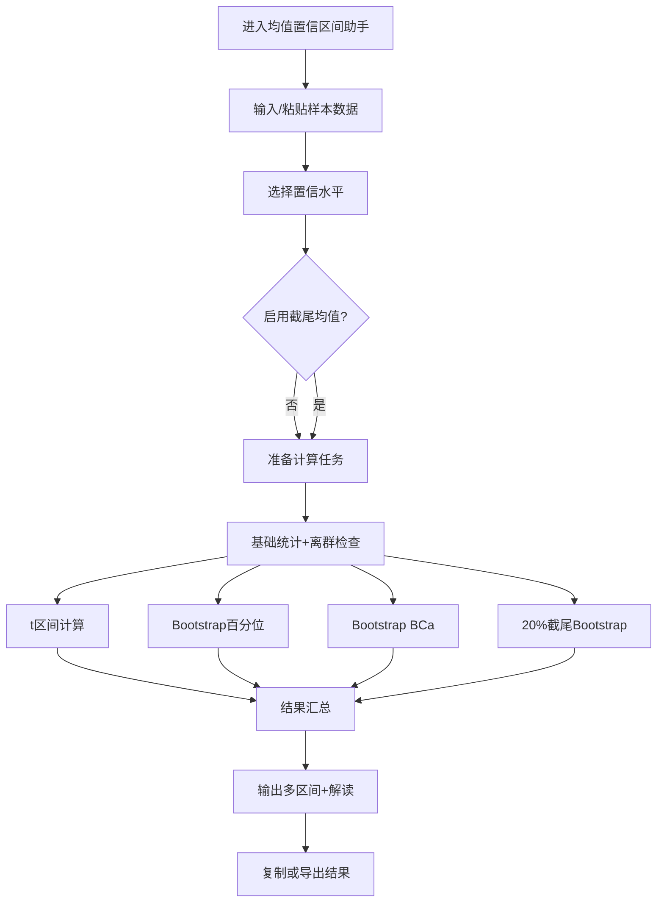

# US-025: 多方法均值置信区间助手

id: US-025
---
id: US-025  
feature: Mean CI Multi-Estimator
priority: High
owner: @product-owner
assignee: TBD
version: 0.1
created: 2025-09-05
status: Draft
reviewers: []
---

## 1. **功能概述**
- **一句话定位**：为不确定分布或样本量有限的用户提供一次性对比多种均值置信区间的计算助手，兼顾经典统计与稳健估计
- **解决的核心痛点**：传统工具仅给出单一方法的区间估计，用户难以评估分布假设影响，也缺乏对异常值与稳健估计的对比参考

## 2. **用户故事（User Stories）**
| 角色 | 场景 | 期望 | 价值 |
| ---- | ---- | ---- | ---- |
| 数据分析师 | 评估业务实验的均值变化，但数据分布未知 | 输入样本数组后获得多种置信区间及解释 | 判断分布假设敏感性，提升决策信心 |
| 质量工程师 | 生产抽样数据规模有限，有潜在离群值 | 默认得到95%区间，同时可切换90%/99%与稳健截尾估计 | 识别离群影响，出具更稳健的质量报告 |
| 统计顾问 | 为客户整理报告，需要对比t区间与Bootstrap结果 | 生成含样本统计量、Bootstrap次数、简短解读的汇总 | 高效准备专业级别的分析文档 |

**用户故事描述**：
> 作为一名统计顾问，当我拿到客户提供的一组样本数据且无法确认分布时，我希望粘贴数据并一键获得t区间、Bootstrap百分位区间、BCa区间，以及可选的20%截尾均值Bootstrap区间，同时看到样本量、均值、标准差、标准误和所用置信水平，并附带一段比较解释，这样我可以向客户展示不同方法的一致性或差异，评估分布假设风险，并给出稳妥的建议。

## 3. **业务流程**
- **流程步骤列表**：
  - Step 1 → 用户访问`/mean-confidence-intervals`页面
  - Step 2 → 粘贴或输入样本数据列表（支持 `[12.3, 11.8, ...]` 格式）
  - Step 3 → 选择置信水平（默认勾选95%，可追加90%、99%）
  - Step 4 → 选择是否启用20%截尾均值稳健选项
  - Step 5 → 点击“开始估计”，系统计算基础统计量并执行IQR/MAD离群检查
  - Step 6 → 并行计算t区间、Bootstrap百分位区间、Bootstrap BCa区间，按需计算截尾均值Bootstrap区间（B=10,000）
  - Step 7 → 展示多区间结果、样本统计量、Bootstrap参数与简短解读
  - Step 8 → 用户复制结果、下载报告或调整参数再次计算

- **Mermaid 流程图**：

## 4. **数据设计**
- **关键数据实体及字段**：

| 实体名称 | 主要字段 | 类型 | 说明 |
|---------|---------|------|------|
| **用户输入** | data_points | number[] | 样本数据数组，支持粘贴格式解析 |
|  | confidence_levels | number[] | 置信水平列表（默认[0.95]，可含0.90、0.99） |
|  | include_trimmed_bootstrap | boolean | 是否计算20%截尾均值Bootstrap区间 |
|  | trim_ratio | number | 截尾比例（默认0.2，可隐藏设置） |
|  | bootstrap_iterations | integer | Bootstrap重复次数（默认10,000，可调范围1,000-20,000） |
|  | random_seed | number | 随机种子，保证结果复现 |
| **计算结果** | sample_size | integer | 样本量n |
|  | sample_mean | number | 样本均值 x_bar |
|  | sample_std | number | 样本标准差 s |
|  | standard_error | number | 标准误差 s/sqrt(n) |
|  | outlier_flags | object | 基于IQR与MAD的异常值检测信息 |
|  | intervals | Interval[] | 区间数组；字段见下 |
| **Interval** | method | string | `t`, `bootstrap_percentile`, `bootstrap_bca`, `bootstrap_trimmed` |
|  | confidence_level | number | 区间置信水平 |
|  | lower | number | 下界 |
|  | upper | number | 上界 |
|  | notes | string | 该方法的额外说明 |
| **解读摘要** | narrative | string | 对比分析（如“t与BCa差异<5%”） |
|  | recommendations | string[] | 后续建议或警告 |
|  | diagnostics | object | 计算耗时、Bootstrap覆盖率估计 |

- **接口/事件触发点**：
  - `POST /api/mean-ci` — 统一计算接口，支持原始数据与参数
  - `calc_bootstrap_progress` — 前端事件，用于显示Bootstrap进度
  - `ci_results_ready` — 数据层事件，记录区间生成完成
  - `export_mean_ci_report` — 报告导出事件

## 5. **功能性需求（FRs）**
- **FR-25.1**：支持粘贴式样本数据输入，自动去除空格、逗号、换行并验证数值合法性
- **FR-25.2**：默认生成95%置信区间，并允许用户追加90%、99%或自定义置信水平
- **FR-25.3**：实现经典t区间计算，自动根据样本量切换t分布临界值
- **FR-25.4**：执行B=10,000次有放回Bootstrap，输出百分位置信区间，可自定义B范围
- **FR-25.5**：基于Bootstrap结果计算BCa区间，处理偏态与小样本情形
- **FR-25.6**：当启用稳健选项时，计算20%截尾均值并基于截尾样本运行Bootstrap区间
- **FR-25.7**：在结果面板展示样本量、均值、标准差、标准误、置信水平、Bootstrap次数
- **FR-25.8**：提供IQR与MAD离群值检测结果，突出提示潜在异常值
- **FR-25.9**：生成自动化解读文字，比较各区间差异并给出“分布假设影响”提示
- **FR-25.10**：允许用户复制所有结果或导出结构化报告（JSON/Markdown）

## 6. **非功能性需求（NFRs）**
- **性能**：10,000次Bootstrap在桌面端<2秒（Web Worker），移动端提供进度提示与超时保护
- **准确性**：数值结果与R (boot包) / Python (scipy + scikits.bootstrap)比对误差<1e-6
- **可复现性**：随机种子可选，默认启用以便输出可重现
- **可用性**：步骤提示与默认设置降低统计门槛，提供结果解释示例
- **可靠性**：Bootstrap计算过程中发生异常时自动回退并显示错误信息

## 7. **边界条件与异常场景**
- 样本量<3 → 禁止Bootstrap并提示“样本过小，建议收集更多数据”
- 数据存在非数值或缺失 → 阻止计算并在输入框高亮错误位置
- 数据极端集中（方差≈0）→ 提示“所有区间收缩至均值”，避免除零错误
- 置信水平输入非法 → 自动回退到最近的有效值并提示原因
- Bootstrap耗时过长或失败 → 提供“降低B值重试”的快速操作

## 8. **验收标准（DoD）**
- **功能测试**：
  - [ ] t区间计算与教材示例一致
  - [ ] Bootstrap百分位与BCa结果与R/boot对照通过10组单元测试
  - [ ] 20%截尾均值Bootstrap在含离群值数据上提供更窄区间
  - [ ] 多置信水平结果在同一次计算中同步生成

- **稳健性测试**：
  - [ ] 离群值检测在含极端值样本中正确提示
  - [ ] Bootstrap迭代进度在桌面与移动端均正常显示
  - [ ] 样本量不足或数据非法时阻止计算并提示

- **用户体验**：
  - [ ] 解读文字覆盖“区间一致/差异显著”的两种情况
  - [ ] 结果区域支持一键复制与Markdown导出
  - [ ] 默认95%置信区间与选项状态在刷新后仍保持

- **UAT条件**：
  - [ ] 5名统计顾问试用，任务完成率100%
  - [ ] 结果对比满意度≥4.5/5
  - [ ] 所有方法的引用说明与帮助文案审校通过

## 9. **风险与依赖**
- **计算性能风险**：Bootstrap在低端设备上耗时 → 需使用Web Worker并允许降级B值
- **统计解释风险**：用户可能误读多区间 → 提供明确的差异说明与使用建议
- **数据隐私风险**：用户数据敏感 → 默认在本地浏览器计算，不上传服务器
- **技术依赖**：需要可靠的伪随机数生成器与数值库（如`d3-random`或`mathjs`）

## 10. **交互与原型要点**
- **关键界面组件**：
  - 数据粘贴输入框，支持格式自动清洗
  - 置信水平选择器（复选+自定义输入）
  - “启用稳健截尾”切换与说明Tooltip
  - Bootstrap执行进度条与预计耗时提示
  - 结果对比表格（列表按方法/置信水平排列）与样本统计卡片
  - 解读说明区块，突出关键建议

- **页面布局要点**：
  - 左侧输入与配置，右侧实时结果；移动端采用分步滑动面板
  - 各区间以颜色标签区分，便于视觉对比
  - 输出支持复制Markdown/JSON按钮，置于结果顶部
  - 提供“如何选择置信水平”和“何时使用截尾均值”的帮助链接

---

**验收负责人**: 产品经理 + 统计咨询用户代表  
**开发预估**: 8-10个开发日  
**测试预估**: 4-5个测试日  
**上线目标**: Sprint 4 高级统计功能
