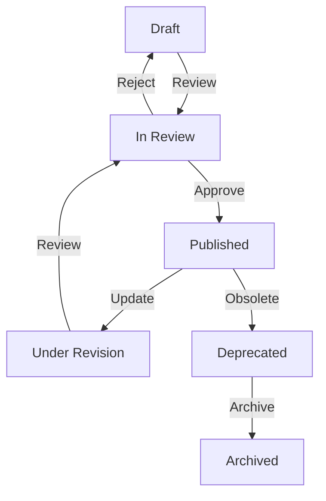
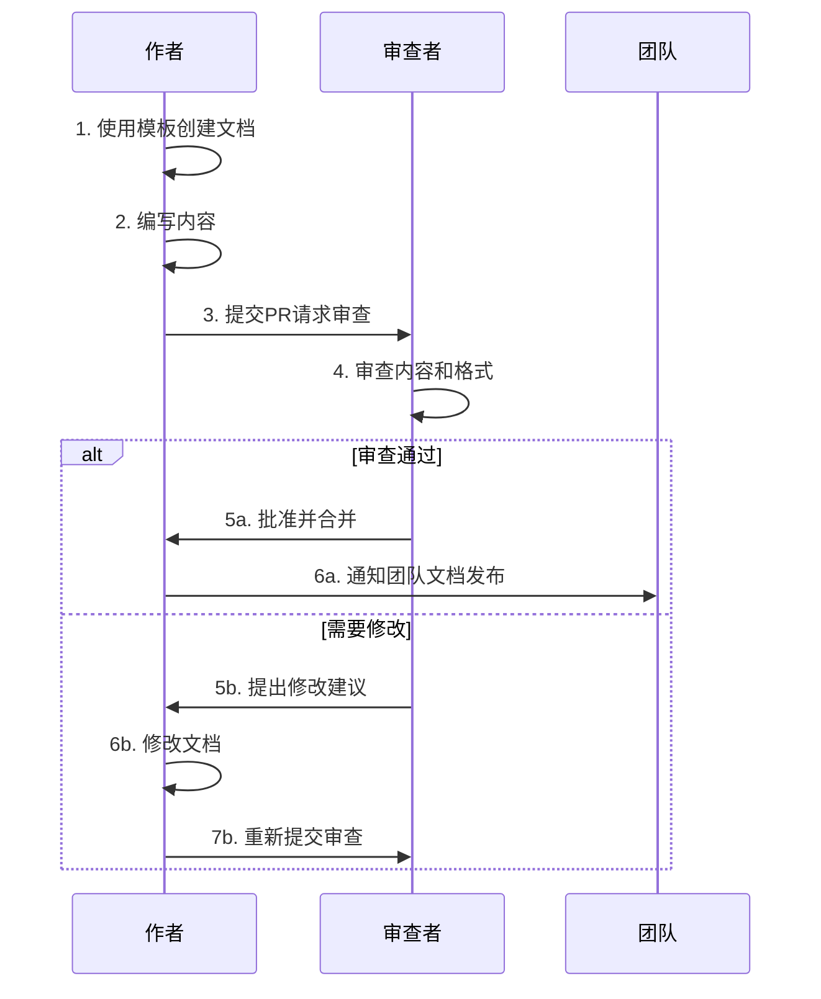
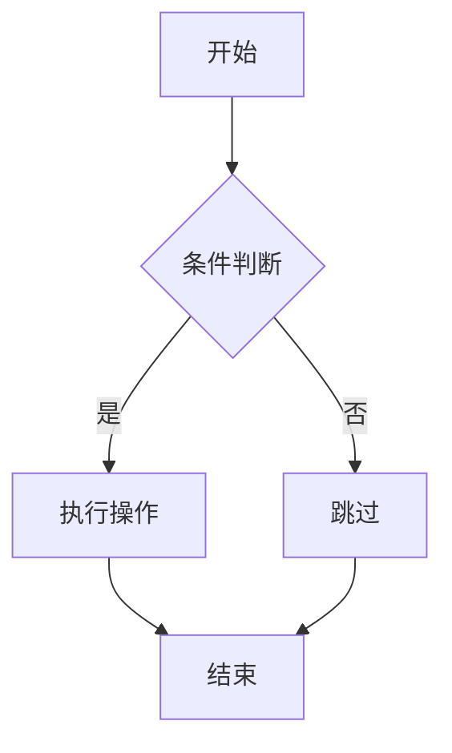
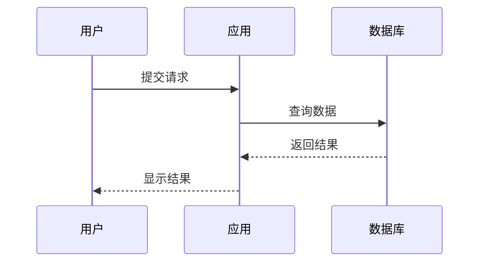

# 文档维护工作流

id: DEV-DOC-WORKFLOW-001
---
id: DEV-DOC-WORKFLOW-001
owner: @documentation-team
acceptance: docs/03-acceptance/05-development.feature
version: 1.0
created: 2025-09-05
status: Draft
reviewers: []
---

## 目的

建立Stat Tools项目的文档维护工作流，确保文档的准确性、及时性和一致性，为团队协作和知识管理提供有效支撑。

## 文档治理原则

### 1. 文档即代码 (Docs as Code)
- 文档与代码同仓库管理
- 使用Git进行版本控制
- 通过PR流程进行文档评审
- CI/CD自动化检查和部署

### 2. 持续更新
- 功能开发时同步更新文档
- 定期审查和维护文档
- 过期文档及时归档或删除

### 3. 用户导向
- 面向不同角色提供合适的文档
- 重视文档的可读性和实用性
- 收集用户反馈持续改进

### 4. 标准化
- 统一的文档模板和格式
- 一致的命名规范
- 标准化的元数据和标签

## 文档分类和责任

### 文档类型矩阵

| 文档类型 | 责任人 | 更新频率 | 审查周期 |
|----------|--------|----------|----------|
| **需求规范** | 产品经理 | 功能变更时 | 每月 |
| **技术架构** | 架构师 | 架构调整时 | 季度 |
| **API文档** | 后端开发 | API变更时 | 每周 |
| **开发指南** | 技术主管 | 工具链变更时 | 季度 |
| **部署运维** | DevOps工程师 | 环境变更时 | 月度 |
| **用户手册** | 产品经理+UX | 功能发布时 | 月度 |
| **ADR记录** | 架构师 | 重大决策时 | - |

### 角色职责

#### 📋 产品经理
- 维护需求规范和功能文档
- 协调跨部门文档需求
- 确保业务文档的准确性

#### 🏗️ 架构师
- 维护技术架构文档
- 撰写和更新ADR
- 技术方案的文档化

#### 💻 开发人员
- 维护API文档和代码注释
- 更新开发相关文档
- 撰写技术实现细节

#### 🚀 DevOps工程师
- 维护部署和运维文档
- 更新CI/CD流程文档
- 监控和告警相关文档

#### 🎨 设计师
- 维护设计规范文档
- 用户界面设计文档
- 可访问性指南

## 文档生命周期管理

### 文档状态



#### 状态说明

- **Draft**: 草稿状态，正在编写中
- **In Review**: 提交审查，等待批准
- **Published**: 已发布，正在使用
- **Under Revision**: 修订中，基于反馈更新
- **Deprecated**: 已弃用，计划删除
- **Archived**: 已归档，仅作历史参考

### 文档元数据标准

```yaml
---
id: DOC-ID-001                    # 唯一标识符
title: "文档标题"                  # 文档标题
owner: @username                   # 负责人
reviewers: [@user1, @user2]       # 审查者列表
version: 1.0                       # 版本号
created: 2025-09-05               # 创建日期
updated: 2025-09-05               # 最后更新日期
status: Published                  # 文档状态
tags: [architecture, api]         # 标签
related: [DOC-ID-002]             # 相关文档
---
```

## 工作流程

### 1. 文档创建流程



#### 具体步骤

1. **准备阶段**
```bash
# 创建功能分支
git checkout -b docs/update-api-guide

# 使用文档模板
cp docs/08-templates/01-frs-template.md docs/new-document.md
```

2. **编写阶段**
- 按照模板填写内容
- 遵循风格指南
- 添加必要的图表和示例

3. **自检阶段**
```bash
# 运行文档检查
npm run docs-check

# 检查拼写和语法
npm run lint-md

# 更新文档索引
npm run update-docs-index
```

4. **提交审查**
```bash
# 提交变更
git add docs/
git commit -m "docs: update API design guide"
git push origin docs/update-api-guide

# 创建PR并指定审查者
gh pr create --title "Update API Design Guide" \
  --body "Updated API design patterns and examples" \
  --reviewer @architect,@tech-lead
```

### 2. 文档审查清单

#### 内容质量检查
- [ ] **准确性**: 信息是否正确和最新
- [ ] **完整性**: 是否覆盖所有必要内容
- [ ] **清晰性**: 表达是否清楚易懂
- [ ] **结构性**: 组织是否逻辑清晰
- [ ] **实用性**: 是否对读者有实际帮助

#### 格式规范检查
- [ ] **元数据**: 是否包含完整的文档头部信息
- [ ] **链接**: 内部链接是否有效
- [ ] **图片**: 图片是否显示正常，alt文本是否合适
- [ ] **代码**: 代码示例是否可执行和正确
- [ ] **格式**: 是否符合Markdown规范

#### 一致性检查
- [ ] **术语**: 是否使用统一的术语
- [ ] **风格**: 是否遵循写作风格指南
- [ ] **模板**: 是否使用标准模板
- [ ] **命名**: 文件和标题命名是否规范

### 3. 自动化工作流

#### GitHub Actions集成

```yaml
# .github/workflows/docs.yml
name: Documentation CI

on:
  pull_request:
    paths:
      - 'docs/**'
      - '*.md'

jobs:
  docs-check:
    runs-on: ubuntu-latest
    steps:
      - uses: actions/checkout@v4
      
      - name: Setup Node.js
        uses: actions/setup-node@v4
        with:
          node-version: '20'
          cache: 'npm'
      
      - name: Install dependencies
        run: npm ci
      
      - name: Check documentation
        run: |
          npm run check-docs      # 检查文档结构
          npm run lint-md         # Markdown格式检查
          npm run lint-gh         # Gherkin语法检查
      
      - name: Update docs index
        run: |
          npm run update-docs-index
          if [[ `git status --porcelain docs/file-index.md` ]]; then
            echo "文档索引需要更新"
            git diff docs/file-index.md
            exit 1
          fi
      
      - name: Check links
        run: npm run check-links  # 检查内外链有效性
      
      - name: Accessibility check
        run: npm run check-a11y   # 检查文档可访问性
```

#### 自动化脚本

```javascript
// scripts/check-docs-quality.js
const fs = require('fs')
const path = require('path')
const glob = require('glob')

class DocsQualityChecker {
  constructor() {
    this.errors = []
    this.warnings = []
  }
  
  // 检查文档元数据
  checkMetadata(filePath, content) {
    const frontMatterRegex = /^---\n([\s\S]*?)\n---/
    const match = content.match(frontMatterRegex)
    
    if (!match) {
      this.errors.push(`${filePath}: 缺少文档元数据`)
      return
    }
    
    const metadata = match[1]
    const requiredFields = ['id', 'owner', 'version', 'created', 'status']
    
    requiredFields.forEach(field => {
      if (!metadata.includes(`${field}:`)) {
        this.errors.push(`${filePath}: 缺少必需字段 ${field}`)
      }
    })
  }
  
  // 检查内部链接
  checkInternalLinks(filePath, content) {
    const linkRegex = /\[([^\]]+)\]\(([^)]+)\)/g
    let match
    
    while ((match = linkRegex.exec(content)) !== null) {
      const linkText = match[1]
      const linkUrl = match[2]
      
      // 检查内部链接
      if (!linkUrl.startsWith('http') && !linkUrl.startsWith('#')) {
        const targetPath = path.resolve(path.dirname(filePath), linkUrl)
        if (!fs.existsSync(targetPath)) {
          this.errors.push(`${filePath}: 无效的内部链接 ${linkUrl}`)
        }
      }
    }
  }
  
  // 检查文档结构
  checkStructure(filePath, content) {
    const lines = content.split('\n')
    let hasH1 = false
    let hasPurpose = false
    
    lines.forEach((line, index) => {
      if (line.startsWith('# ')) {
        hasH1 = true
      }
      if (line.includes('## 目的') || line.includes('## Purpose')) {
        hasPurpose = true
      }
    })
    
    if (!hasH1) {
      this.warnings.push(`${filePath}: 建议包含主标题 (H1)`)
    }
    
    if (!hasPurpose && filePath.includes('/02-requirements/')) {
      this.warnings.push(`${filePath}: 需求文档建议包含目的说明`)
    }
  }
  
  // 运行所有检查
  async run() {
    const docFiles = glob.sync('docs/**/*.md', { 
      ignore: ['docs/file-index.md', 'docs/**/node_modules/**'] 
    })
    
    for (const filePath of docFiles) {
      const content = fs.readFileSync(filePath, 'utf8')
      
      this.checkMetadata(filePath, content)
      this.checkInternalLinks(filePath, content)
      this.checkStructure(filePath, content)
    }
    
    // 输出结果
    if (this.errors.length > 0) {
      console.error('❌ 文档错误:')
      this.errors.forEach(error => console.error(`  ${error}`))
    }
    
    if (this.warnings.length > 0) {
      console.warn('⚠️  文档警告:')
      this.warnings.forEach(warning => console.warn(`  ${warning}`))
    }
    
    if (this.errors.length === 0 && this.warnings.length === 0) {
      console.log('✅ 文档质量检查通过')
    }
    
    return this.errors.length === 0
  }
}

// 运行检查
const checker = new DocsQualityChecker()
checker.run().then(success => {
  process.exit(success ? 0 : 1)
})
```

## 工具和模板

### 文档模板库

```
docs/08-templates/
├── 01-frs-template.md           # 功能需求规范模板
├── 02-adr-template.md           # 架构决策记录模板
├── 03-api-doc-template.md       # API文档模板
├── 04-user-guide-template.md    # 用户指南模板
├── 05-troubleshooting-template.md # 故障排除模板
└── 06-changelog-template.md     # 变更日志模板
```

### 写作风格指南

#### 语言规范
- **简洁明了**: 使用简短、清晰的句子
- **主动语态**: 优先使用主动语态而非被动语态
- **统一术语**: 维护项目术语词汇表
- **避免歧义**: 确保表达准确，避免模糊用词

#### 格式规范
```markdown
# 主标题使用H1，每个文档只有一个

## 二级标题用于主要章节

### 三级标题用于子章节

- 使用无序列表表示并列项目
1. 使用有序列表表示步骤

`内联代码`使用反引号

```语言标识
代码块使用三个反引号，并指定语言
```

**重要内容**使用粗体强调
*次要强调*使用斜体

> 引用使用大于号

| 表格 | 列对齐 |
|------|--------|
| 左对齐 | 数据 |
```

### 可视化工具

#### Mermaid图表示例

```markdown
<!-- 流程图 -->


<!-- 时序图 -->

```

## 文档度量和改进

### 关键指标 (KPIs)

#### 质量指标
- **文档覆盖率**: 有文档的功能占总功能的比例
- **更新及时性**: 平均文档滞后时间
- **错误密度**: 每千字错误数量
- **链接有效性**: 有效链接占总链接的比例

#### 使用指标
- **访问频率**: 各文档的访问次数
- **用户满意度**: 文档有用性评分
- **搜索成功率**: 用户能找到所需信息的比例
- **反馈响应**: 平均反馈处理时间

### 持续改进流程

#### 月度评估
```bash
# 生成文档质量报告
npm run docs-metrics

# 分析用户反馈
npm run analyze-feedback

# 更新文档路线图
npm run update-docs-roadmap
```

#### 季度回顾
1. **团队回顾会议**
   - 讨论文档使用情况
   - 收集改进建议
   - 规划下季度工作

2. **工具和流程优化**
   - 评估现有工具效果
   - 引入新工具或流程
   - 更新模板和标准

3. **培训计划**
   - 新员工文档培训
   - 写作技能提升
   - 工具使用培训

## 应急响应

### 紧急文档更新流程

当出现影响生产环境的问题时：

1. **立即响应** (0-30分钟)
```bash
# 创建紧急更新分支
git checkout -b hotfix/urgent-doc-update

# 快速更新相关文档
# 提交并推送
git add . && git commit -m "docs: emergency update for production issue"
git push origin hotfix/urgent-doc-update

# 创建紧急PR
gh pr create --title "URGENT: Documentation Fix" --reviewer @team-lead
```

2. **快速审查** (30-60分钟)
   - 团队负责人优先审查
   - 重点检查准确性
   - 快速合并并部署

3. **事后完善** (1-24小时内)
   - 补充详细说明
   - 添加相关链接
   - 更新相关文档

### 文档危机管理

#### 常见危机场景
- **大量过期信息**: 重大架构变更导致文档失效
- **关键文档丢失**: 意外删除或损坏
- **知识断层**: 关键人员离职带走隐性知识

#### 预防措施
- **定期备份**: 文档版本控制和异地备份
- **知识传承**: 关键知识多人掌握
- **文档冗余**: 重要信息在多处记录
- **恢复演练**: 定期测试恢复流程

## 团队协作

### 沟通渠道

#### Slack集成
```yaml
# .github/workflows/docs-notification.yml
- name: Notify team of docs changes
  uses: 8398a7/action-slack@v3
  with:
    status: success
    text: |
      📚 文档更新通知
      文档: ${{ github.event.pull_request.title }}
      作者: ${{ github.actor }}
      变更: ${{ github.event.pull_request.html_url }}
  env:
    SLACK_WEBHOOK_URL: ${{ secrets.SLACK_WEBHOOK }}
```

#### 定期会议
- **文档同步会**: 双周例会，同步文档状态
- **写作工坊**: 月度培训，提升写作技能  
- **工具分享**: 季度分享，介绍新工具和最佳实践

### 激励机制

#### 文档贡献认可
- **月度文档之星**: 表彰优秀文档贡献者
- **质量改进奖**: 奖励显著提升文档质量的改进
- **用户好评奖**: 基于用户反馈的文档质量奖励

#### 绩效考核
- 将文档维护纳入工作考核
- 设置合理的文档贡献目标
- 平衡文档工作与开发工作的时间分配

---

**文档治理委员会**：产品经理 + 技术主管 + 文档专员  
**审查周期**：月度流程评估，季度策略调整  
**工具维护**：持续优化自动化工具和模板