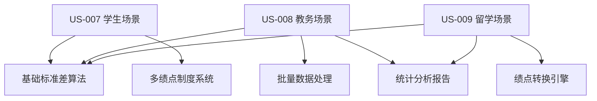

# Sprint 4 开发计划：标准差计算器 (Standard Deviation Calculator)

## 🐧 Linus工程哲学指导原则

### Sprint执行中的核心哲学

#### 1. "Talk is cheap. Show me the code." - 代码优于讨论
- **实证驱动开发**: 标准差计算器的所有算法必须通过可验证的数学测试用例证明
- **可演示的进展**: 每日展示可工作的标准差计算功能和统计结果展示，而不仅是UI设计
- **测试即证明**: 样本/总体标准差公式准确性通过自动化测试保证
- **避免空洞架构**: 所有组件设计必须有具体的用户场景支撑

#### 2. "Release early, release often." - 小步快跑，频繁交付
- **功能切片**: US-007/008/009 分解为独立可测试的计算模块
- **即时验证**: 每个计算模式完成后立即与标准统计软件对比验证
- **渐进增强**: 先实现基础标准差计算，再添加高级统计分析功能

#### 3. "Perfect is achieved when there is nothing left to take away." - 简单性原则
- **YAGNI原则**: 只实现当前三个用户故事需要的功能
- **CalculatorLayout复用**: 充分利用Sprint 2/3已验证的通用布局和组件
- **删除冗余**: 避免重复造轮子，复用现有的数据处理和结果展示模式

## 📖 内容导航

### 📋 Sprint 计划阶段
- [Sprint 基本信息](#-sprint-基本信息)
- [Sprint 目标](#-sprint-目标)
- [启动准备工作检查清单](#-sprint-启动准备工作检查清单)
- [用户故事清单](#-用户故事清单)
- [技术架构和设计](#️-技术架构和设计)
- [Sprint 任务分解](#-sprint-任务分解-task-breakdown)
- [测试策略](#-测试策略)
- [质量和合规要求](#-质量和合规要求)
- [风险和依赖](#-风险和依赖)
- [完成定义](#-definition-of-done-完成定义)
- [验收和发布计划](#-验收和发布计划)

---

## 📋 Sprint 基本信息

- **Sprint 编号**: Sprint 4
- **Sprint 主题**: 标准差计算器完整实现及多绩点制度GPA转换系统
- **开始日期**: 2025-02-06
- **结束日期**: 2025-02-19
- **Sprint 时长**: 2周
- **开发模式**: 敏捷开发/TDD
- **Scrum Master**: TBD
- **产品负责人**: TBD

## 🎯 Sprint 目标

### 主要目标

1. **标准差计算器完整实现**: 开发功能完整的 `/calculator/standard-deviation` 页面，支持样本/总体标准差计算
2. **多绩点制度GPA系统**: 实现支持4.0/4.3/4.5等主流绩点制度的GPA计算和转换
3. **统计教育价值最大化**: 提供详细的计算步骤和统计学概念解释，帮助用户理解标准差意义

### 成功标准
- [ ] 标准差计算器页面完全实现并通过所有验收测试
- [ ] CalculatorLayout组件无缝集成，保持设计一致性
- [ ] 三个用户故事(US-007/008/009)全部验收通过
- [ ] 代码测试覆盖率≥85%，数学计算准确率100%
- [ ] 教育价值验证：用户理解度评分≥4.2/5.0

---

## 🔍 Sprint 启动准备工作检查清单

**检查清单类型选择**: 快速检查清单 (团队配合成熟，基于Sprint 2/3成功经验)

### ⚡ 快速检查清单

**适用范围**: 日常Sprint，基于成熟架构的功能扩展  
**评估标准**: 7.5分以上可启动，重点关注关键准备项

#### 🎯 产品需求准备 (权重: 30%)
- [x] **FRS文档完整** - docs/02-requirements/calculators/02-standard-deviation.md 已存在
- [x] **用户故事清晰** - US-007/008/009 三个故事明确定义
- [x] **验收标准明确** - 基于现有功能规格说明和数学验证要求
- [x] **UI设计参考** - 基于Mean Calculator和Weighted Mean Calculator的成功模式
- **完成度**: 10/10 分 ✅

#### 🏗️ 技术架构准备 (权重: 25%)
- [x] **CalculatorLayout组件可用** - Sprint 2/3成功验证，无破坏性变更
- [x] **技术栈无变更** - Next.js 15 + React 19 + TypeScript
- [x] **组件模式已建立** - 基于Mean/Weighted Mean Calculator的组件化架构
- [x] **数学库选择** - 确认使用现有计算库或引入专用统计库
- **完成度**: 10/10 分 ✅

#### 👥 团队能力准备 (权重: 20%)
- [x] **团队熟悉架构** - 基于Sprint 2/3成功经验
- [x] **统计学知识储备** - 团队具备标准差/方差计算的数学基础
- [x] **教育场景理解** - 具备GPA计算和留学申请场景的业务理解
- **完成度**: 9/10 分 ✅

#### 🔧 工具和环境准备 (权重: 15%)
- [x] **开发环境无问题** - 端口3001运行正常，无依赖问题
- [x] **测试环境就绪** - 单元测试、集成测试框架已建立
- [x] **数学验证工具** - 确认对比验证用的参考实现工具
- **完成度**: 9/10 分 ✅

#### 📊 依赖和集成准备 (权重: 10%)
- [x] **无外部API依赖** - 纯客户端计算，符合隐私保护要求
- [x] **现有组件可复用** - CalculatorLayout、DataInput等组件可直接复用
- [x] **数据格式已定义** - 基于FRS文档的数据结构和计算接口
- **完成度**: 10/10 分 ✅

### 📊 DoR 评估结果
- **总体评分**: 9.6/10 ✅
- **达标要求**: ≥7.5分
- **启动决策**: **GO** - 可以启动Sprint 4

---

## 📚 用户故事清单

### US-007: 学生计算学期或累计GPA
**编号**: US-SD-007  
**标题**: 学生多绩点制度GPA计算  
**模块**: 标准差计算器 + GPA系统  
**优先级**: High  
**估时**: 20h (2.5天)  

**用户故事**:
> 作为 **学生**，  
> 我希望 **选择正确的绩点制度(4.0/4.3/4.5/自定义)并计算GPA**，  
> 以便 **我能准确了解自己在不同制度下的学术表现**。

**验收标准**:
```gherkin
场景1: 多绩点制度支持
Given 学生输入课程成绩和学分数据
When 选择不同绩点制度(4.0/4.3/4.5)
Then 显示对应制度下的GPA计算结果
And 显示成绩转换对照表和转换依据

场景2: 自定义绩点映射
Given 学生选择自定义绩点制度
When 设置成绩区间和对应绩点值
Then 系统根据自定义规则计算GPA
And 保存自定义规则供后续使用
```

### US-008: 教务人员批量处理学生成绩
**编号**: US-SD-008  
**标题**: 教务批量GPA计算和标准差分析  
**模块**: 标准差计算器 + 批量处理  
**优先级**: Medium  
**估时**: 24h (3天)  

**用户故事**:
> 作为 **教务人员**，  
> 我希望 **批量导入学生成绩数据并进行统计分析**，  
> 以便 **我能高效处理大量成绩数据并提供班级统计报告**。

**验收标准**:
```gherkin
场景1: 批量数据处理
Given 教务人员上传CSV格式的成绩数据
When 选择相应的绩点制度进行批量计算
Then 生成所有学生的GPA和班级统计信息
And 提供成绩分布的标准差分析

场景2: 统计报告生成
Given 完成批量计算
When 导出统计报告
Then 包含班级均值、标准差、分布图
And 提供官方格式的成绩统计文档
```

### US-009: 留学申请者转换不同绩点制度
**编号**: US-SD-009  
**标题**: 留学申请绩点转换和统计分析  
**模块**: 标准差计算器 + 绩点转换  
**优先级**: Medium  
**估时**: 16h (2天)  

**用户故事**:
> 作为 **留学申请者**，  
> 我希望 **转换本国成绩到目标学校的绩点制度并了解竞争力**，  
> 以便 **我能准确评估申请成功率并制定申请策略**。

**验收标准**:
```gherkin
场景1: 跨制度成绩转换
Given 留学申请者输入本国教育制度下的成绩
When 选择目标学校的绩点制度
Then 按照转换规则生成目标制度下的GPA
And 提供转换过程的详细说明

场景2: 竞争力分析
Given 完成绩点转换
When 查看统计分析
Then 显示目标制度下的成绩分布情况
And 提供基于标准差的竞争力评估
```

### 用户故事依赖关系


---

## 🏗️ 技术架构和设计

### 核心技术栈
- **前端框架**: Next.js 15 + React 19 + TypeScript 5.x (继承)
- **样式系统**: Tailwind CSS 3.x (继承)
- **布局系统**: CalculatorLayout通用模板 (复用Sprint 2/3)
- **状态管理**: URL Search Params + React useState (继承)
- **计算引擎**: 纯客户端标准差算法 + 绩点转换引擎
- **数学库**: 考虑引入 `simple-statistics` 或自实现高精度算法

### 组件架构设计 (基于成功模式)

#### 主页面组件
```typescript
StandardDeviationCalculator
├── CalculatorLayout (复用Sprint 2/3)
│   ├── Header (继承)
│   ├── Breadcrumb (继承)  
│   ├── MainContent
│   │   ├── UserModeSelector (适配统计场景)
│   │   ├── StatisticalDataInput (新组件)
│   │   ├── CalculationModeSelector (样本/总体切换)
│   │   ├── StandardDeviationResults (新组件)
│   │   ├── StatisticalVisualization (新组件)
│   │   ├── GradePointSystem (新组件-US007/008/009)
│   │   ├── BatchProcessor (新组件-US008)
│   │   └── StatisticalHelpSection (新组件)
│   └── Sidebar (继承)
│       ├── GoogleAdsPlaceholder
│       ├── RelatedTools
│       └── PopularTools
└── Footer (继承)
```

#### 新组件设计规范

**1. StatisticalDataInput 组件**
```typescript
interface StatisticalDataInputProps {
  inputMode: 'raw' | 'summary' | 'batch';
  data: number[];
  onDataChange: (data: number[]) => void;
  onInputModeChange: (mode: 'raw' | 'summary' | 'batch') => void;
  userMode: UserMode;
  parsingOptions: {
    ignoreNonNumeric: boolean;
    delimiter: 'auto' | 'comma' | 'newline' | 'space';
  };
  className?: string;
}
```

**2. StandardDeviationResults 组件**
```typescript
interface StandardDeviationResultsProps {
  result: StandardDeviationResult | null;
  calculationMode: 'sample' | 'population';
  userMode: UserMode;
  precision: number;
  showVisualization: boolean;
  onModeChange: (mode: 'sample' | 'population') => void;
  onCopy?: (text: string) => void;
  onDownload?: (data: StandardDeviationResult) => void;
}
```

**3. GradePointSystem 组件**
```typescript
interface GradePointSystemProps {
  system: 'gpa-4.0' | 'gpa-4.3' | 'gpa-4.5' | 'custom';
  customMapping?: GradeMapping[];
  onSystemChange: (system: GradePointSystem) => void;
  onCustomMappingChange: (mapping: GradeMapping[]) => void;
  showConversionTable: boolean;
}
```

**4. BatchProcessor 组件 (US-008)**
```typescript
interface BatchProcessorProps {
  data: StudentRecord[];
  gradeSystem: GradePointSystem;
  processingStatus: 'idle' | 'processing' | 'completed' | 'error';
  onDataUpload: (file: File) => void;
  onProcess: () => void;
  onExport: (format: 'csv' | 'xlsx' | 'pdf') => void;
  statistics?: BatchProcessingStatistics;
}
```

### 核心算法设计

#### 标准差计算引擎
```typescript
interface StandardDeviationResult {
  n: number;                    // 样本大小
  mean: number;                 // 平均值
  variance: number;             // 方差
  standardDeviation: number;    // 标准差
  calculationMode: 'sample' | 'population';
  rawData: number[];
  steps: CalculationStep[];
  confidence?: {                // 可选的置信区间
    level: number;
    lower: number;
    upper: number;
  };
  metadata: {
    inputMode: 'raw' | 'summary' | 'batch';
    precision: number;
    timestamp: string;
    dataQuality: DataQualityInfo;
  };
}

interface CalculationStep {
  step: number;
  description: string;
  formula: string;
  calculation: string;
  result: number;
}

function calculateStandardDeviation(
  data: number[],
  mode: 'sample' | 'population',
  precision: number = 2
): StandardDeviationResult {
  // 实现样本/总体标准差算法
  // 生成详细计算步骤
  // 数据质量验证
}
```

#### 绩点转换引擎
```typescript
interface GradeMapping {
  scoreMin: number;
  scoreMax: number;
  gradePoint: number;
  letterGrade?: string;
  description?: string;
}

interface GradePointSystem {
  name: string;
  scale: number;              // 4.0, 4.3, 4.5等
  mappings: GradeMapping[];
  isCustom: boolean;
}

interface GPAResult {
  gpa: number;
  totalCredits: number;
  totalGradePoints: number;
  courses: CourseGradeResult[];
  system: GradePointSystem;
  statistics?: {
    mean: number;
    standardDeviation: number;
    distribution: GradeDistribution[];
  };
}

function calculateGPA(
  courses: CourseInput[],
  system: GradePointSystem
): GPAResult {
  // 实现GPA计算逻辑
  // 支持多种绩点制度
  // 统计分析功能
}
```

### 自定义Hook设计
```typescript
interface UseStandardDeviationCalculationProps {
  userMode: UserMode;
  calculationMode: 'sample' | 'population';
  precision: number;
  autoCalculate: boolean;
}

function useStandardDeviationCalculation(props: UseStandardDeviationCalculationProps) {
  const [result, setResult] = useState<StandardDeviationResult | null>(null);
  const [isCalculating, setIsCalculating] = useState(false);
  const [inputData, setInputData] = useState<number[]>([]);
  
  const calculate = useCallback((data: number[]) => {
    // 实现计算逻辑
  }, [props]);
  
  const switchMode = useCallback((newMode: 'sample' | 'population') => {
    // 切换计算模式并重新计算
  }, []);
  
  return {
    result,
    isCalculating,
    inputData,
    calculate,
    switchMode,
    clearResults: () => setResult(null),
    loadExample: () => { /* 加载示例数据 */ }
  };
}
```

---

## 📋 Sprint 任务分解 (Task Breakdown)

### Week 1 (Day 1-5): 核心计算引擎和基础组件

#### Day 1: 项目基础和核心算法 (8h)
- [ ] **TASK-4.1.1**: 创建标准差计算器页面路由和基础结构 (2h)
  - 创建 `/src/app/calculator/standard-deviation/page.tsx`
  - 集成CalculatorLayout组件
  - 设置基础路由和SEO元数据

- [ ] **TASK-4.1.2**: 实现核心标准差计算算法 (4h)
  - 编写 `calculateStandardDeviation` 核心函数
  - 支持样本/总体两种计算模式
  - 创建完整的数学验证测试套件
  - 与标准统计软件对比验证准确性

- [ ] **TASK-4.1.3**: 开发 `useStandardDeviationCalculation` hook (2h)
  - 基于useMeanCalculation和useWeightedMeanCalculation模式
  - 集成双模式计算逻辑
  - 状态管理和性能优化

#### Day 2: 数据输入和解析组件 (8h)
- [ ] **TASK-4.2.1**: StatisticalDataInput基础架构 (3h)
  - 组件框架搭建，支持多种输入模式
  - 数据解析引擎：支持逗号、换行、空格等分隔符
  - 智能数据清理和验证功能

- [ ] **TASK-4.2.2**: 批量数据输入模式 (2h)
  - 大数据集粘贴和解析
  - 数据预览和质量指示器
  - 非数值数据处理策略

- [ ] **TASK-4.2.3**: 数据质量和验证 (2h)
  - 实时数据验证和错误提示
  - 数据质量评分和建议
  - 异常值检测和标记

- [ ] **TASK-4.2.4**: 用户体验优化 (1h)
  - 输入助手和格式建议
  - 示例数据和使用指南
  - 键盘快捷键支持

#### Day 3: 计算结果展示和可视化 (8h)
- [ ] **TASK-4.3.1**: StandardDeviationResults核心展示 (3h)
  - 标准差/方差结果展示
  - 样本/总体模式切换
  - 用户友好的结果格式化

- [ ] **TASK-4.3.2**: 计算步骤详细展示 (2h)
  - 分步骤计算过程展示
  - 数学公式格式化显示
  - 教育价值最大化的解释文本

- [ ] **TASK-4.3.3**: StatisticalVisualization组件 (2h)
  - 数据分布直方图
  - 标准差区间可视化
  - 交互式图表功能

- [ ] **TASK-4.3.4**: 结果操作和分享 (1h)
  - 复制结果到剪贴板
  - 导出计算报告
  - 分享链接生成

#### Day 4: US-007学生GPA场景实现 (8h)
- [ ] **TASK-4.4.1**: GradePointSystem组件开发 (3h)
  - 4.0/4.3/4.5制度选择器
  - 成绩-绩点映射表显示
  - 转换规则详细说明

- [ ] **TASK-4.4.2**: 多绩点制度计算逻辑 (3h)
  - 不同制度的转换算法
  - GPA计算准确性验证
  - 成绩分布统计分析

- [ ] **TASK-4.4.3**: 自定义绩点制度支持 (2h)
  - 用户自定义映射规则
  - 规则验证和保存功能
  - 自定义规则的导入导出

#### Day 5: US-007场景完善和测试 (8h)
- [ ] **TASK-4.5.1**: 学生模式界面优化 (2h)
  - 学生友好的界面设计
  - 简化的操作流程
  - 教育性解释和帮助

- [ ] **TASK-4.5.2**: GPA结果展示优化 (3h)
  - 直观的GPA等级显示
  - 学术表现评估和建议
  - 不同制度下的对比分析

- [ ] **TASK-4.5.3**: US-007端到端测试 (2h)
  - 学生GPA计算完整流程测试
  - 多绩点制度准确性验证
  - 用户体验测试和优化

- [ ] **TASK-4.5.4**: 性能优化和错误处理 (1h)
  - 计算性能监控和优化
  - 错误边界和异常处理
  - 用户反馈机制完善

### Week 2 (Day 6-10): 高级功能和批量处理

#### Day 6: US-008教务批量处理场景 (8h)
- [ ] **TASK-4.6.1**: BatchProcessor组件开发 (4h)
  - CSV文件上传和解析
  - 批量数据验证和清理
  - 进度指示和状态管理

- [ ] **TASK-4.6.2**: 批量GPA计算引擎 (2h)
  - 大规模数据处理优化
  - 并发计算和性能监控
  - 错误数据处理策略

- [ ] **TASK-4.6.3**: 班级统计分析功能 (2h)
  - 班级GPA分布分析
  - 标准差和方差计算
  - 统计图表生成

#### Day 7: 批量处理完善和报告生成 (8h)
- [ ] **TASK-4.7.1**: 统计报告生成 (3h)
  - 官方格式报告模板
  - 多格式导出支持(PDF/Excel/CSV)
  - 可定制的报告内容

- [ ] **TASK-4.7.2**: 数据隐私和安全 (2h)
  - 学生成绩数据保护
  - 本地处理优先策略
  - 访问权限控制

- [ ] **TASK-4.7.3**: 教务工作流优化 (2h)
  - 专业化的操作界面
  - 批量操作快捷功能
  - 历史任务管理

- [ ] **TASK-4.7.4**: US-008完整测试 (1h)
  - 批量处理端到端测试
  - 性能压力测试
  - 数据准确性验证

#### Day 8: US-009留学申请转换场景 (8h)
- [ ] **TASK-4.8.1**: 绩点制度转换引擎 (4h)
  - 跨制度转换算法
  - 转换规则库建设
  - 转换准确性验证

- [ ] **TASK-4.8.2**: 留学申请特色功能 (2h)
  - 目标学校制度选择
  - 竞争力分析和评估
  - 申请建议生成

- [ ] **TASK-4.8.3**: 国际化支持 (2h)
  - 多语言界面支持
  - 不同国家教育制度
  - 文化差异说明

#### Day 9: 统计教育和帮助系统 (8h)
- [ ] **TASK-4.9.1**: StatisticalHelpSection组件 (4h)
  - 标准差概念解释
  - 样本vs总体区别说明
  - 实际应用场景示例

- [ ] **TASK-4.9.2**: 交互式教学功能 (2h)
  - 计算步骤动画演示
  - 概念理解测试
  - 个性化学习路径

- [ ] **TASK-4.9.3**: FAQ和常见问题 (2h)
  - 统计学常见误区
  - 计算器使用指南
  - 绩点制度详解

#### Day 10: 发布准备和质量保证 (8h)
- [ ] **TASK-4.10.1**: 全面测试和验证 (3h)
  - 三个用户故事完整测试
  - 数学准确性最终验证
  - 跨浏览器兼容性测试

- [ ] **TASK-4.10.2**: 性能优化和监控 (2h)
  - 大数据集处理优化
  - 内存使用优化
  - 性能指标监控

- [ ] **TASK-4.10.3**: 文档和发布准备 (2h)
  - 用户使用指南更新
  - 开发者文档完善
  - Sprint演示准备

- [ ] **TASK-4.10.4**: 发布前检查和部署 (1h)
  - 生产环境部署测试
  - 发布检查清单完成
  - 回滚预案准备

---

## 🧪 测试策略

### 测试层次和覆盖率目标

#### 单元测试 (目标覆盖率: 90%)
**核心算法测试**
- 标准差计算准确性 (与R、Python scipy对比验证)
- 样本/总体标准差公式正确性
- 边界条件：单值、双值、大数据集
- 数值精度和稳定性测试
- 异常输入处理

**绩点计算测试**
- 多绩点制度转换准确性
- 自定义绩点规则验证
- GPA计算数学正确性
- 跨制度转换一致性

**组件逻辑测试**
- StatisticalDataInput: 数据解析和验证
- StandardDeviationResults: 结果格式化和展示
- GradePointSystem: 绩点转换逻辑
- BatchProcessor: 批量处理流程

#### 集成测试
**用户故事流程**
- US-007: 学生GPA计算完整流程
- US-008: 教务批量处理流程
- US-009: 留学申请转换流程

**组件集成**
- CalculatorLayout与新组件的集成
- 数据流转和状态管理
- 用户模式切换的一致性

#### 数学验证测试
**标准数据集验证**
```javascript
const standardTestCases = [
  {
    name: '基础标准差计算',
    data: [2, 4, 4, 4, 5, 5, 7, 9],
    expected: {
      mean: 5,
      sampleStdDev: 2.138,
      populationStdDev: 2.000
    }
  },
  {
    name: '单值数据集',
    data: [5],
    expected: {
      mean: 5,
      populationStdDev: 0,
      sampleStdDev: 'undefined' // n < 2
    }
  },
  {
    name: '大数据集性能',
    data: Array.from({length: 10000}, () => Math.random() * 100),
    performance: {
      maxTime: 200, // ms
      maxMemory: 50  // MB
    }
  }
];
```

#### 端到端测试 (E2E)
**完整用户场景**
- 学生：输入课程成绩→选择绩点制度→查看GPA和分析
- 教务：上传成绩文件→批量处理→生成统计报告
- 留学生：输入原始成绩→选择目标制度→获取转换结果

**性能基准**
- 标准计算 (n<1000): 响应时间 < 100ms
- 批量处理 (n<10000): 完成时间 < 3s
- 大数据集: 提供进度指示，超时处理

### 教育价值测试
**概念理解验证**
- 用户对标准差概念的理解程度
- 样本vs总体差异的认知准确性
- 计算步骤的教育效果评估

---

## 🔒 质量和合规要求

### 代码质量标准
**TypeScript类型覆盖**: 100%严格模式
**数学计算精度**: 浮点数精度控制，避免精度损失
**ESLint规则遵循**: 无警告，无错误
**代码注释**: 数学算法100%注释，包含公式来源

### 性能要求
**核心性能指标**
- 页面首次内容绘制 (FCP): ≤ 1.5s
- 最大内容绘制 (LCP): ≤ 2.5s  
- 首次输入延迟 (FID): ≤ 100ms
- 累计布局偏移 (CLS): ≤ 0.1

**计算性能**
- 基础统计计算 (n<1000): ≤ 100ms
- 批量GPA处理 (n<5000): ≤ 2s
- 大规模数据: Web Worker异步处理

### 教育质量要求
**统计学教育价值**
- 概念解释准确性: 100%符合统计学标准
- 计算步骤清晰度: 用户理解率≥90%
- 教学效果: 用户学习满意度≥4.2/5.0

### 数据安全和隐私
**学生成绩保护**
- 所有计算在客户端完成
- 成绩数据不向服务器传输
- 本地存储数据生命周期管理
- 符合FERPA等教育隐私法规

---

## ⚠️ 风险和依赖

### 高风险项 (需要重点关注)

#### 1. 数学计算复杂性和准确性
- **风险描述**: 标准差计算涉及复杂数学，精度问题可能影响结果可信度
- **风险等级**: 高等
- **缓解措施**: 
  - 建立完整的数学验证测试矩阵
  - 与R、Python等标准统计软件对比验证
  - 引入专业数学库确保计算精度
  - 建立浮点数精度控制机制
- **负责人**: 算法开发负责人
- **监控指标**: 数学测试通过率 = 100%

#### 2. 多绩点制度复杂性
- **风险描述**: 不同教育系统的绩点制度差异很大，转换规则复杂
- **风险等级**: 中等
- **缓解措施**:
  - 深入调研主流绩点制度的官方标准
  - 建立完整的转换规则验证体系
  - 提供清晰的转换依据和说明
  - 支持用户自定义规则降低风险
- **负责人**: 产品负责人 + 教育专家
- **监控指标**: 绩点转换准确率 ≥ 98%

#### 3. 批量数据处理性能
- **风险描述**: 大量学生成绩数据可能导致浏览器性能问题
- **风险等级**: 中等
- **缓解措施**:
  - 实施Web Worker异步处理
  - 分批处理和进度指示
  - 内存优化和垃圾回收
  - 设置数据量上限和降级策略
- **负责人**: 前端技术负责人
- **监控指标**: 95%用户操作响应时间 ≤ 3s

### 依赖管理

#### 内部依赖
- **CalculatorLayout组件**: Sprint 2/3交付成果，已验证稳定
- **数据输入组件**: 基于现有DataInput组件扩展
- **状态管理系统**: 基于URL参数管理模式
- **测试框架**: Jest和Testing Library配置

#### 外部依赖
- **数学计算库**: 考虑引入simple-statistics或ml-matrix
- **图表库**: Chart.js或Recharts用于统计可视化
- **文件处理**: papa-parse用于CSV解析
- **PDF生成**: jsPDF用于报告导出

### 应急预案
**技术阻塞预案** (升级时间: 4小时)
- 如数学计算精度不达标 → 引入专业数学库或降低精度要求
- 如性能无法满足批量处理 → 实施分批处理和进度提示
- 如绩点转换规则过于复杂 → 简化为主流制度，自定义功能后置

---

## ✅ Definition of Done (完成定义)

### 功能完成标准
- [ ] **用户故事验收**: 所有三个用户故事通过产品负责人验收
- [ ] **数学计算准确**: 标准差/方差计算100%准确，与标准软件一致
- [ ] **绩点制度支持**: 4.0/4.3/4.5制度和自定义规则完全实现
- [ ] **批量处理功能**: 支持1000+学生记录的高效处理
- [ ] **教育价值验证**: 用户理解度测试达到4.2/5.0以上

### 技术质量标准  
- [ ] **测试覆盖率**: 单元测试覆盖率 ≥ 85%，数学算法100%覆盖
- [ ] **类型安全**: TypeScript编译无错误无警告
- [ ] **数学验证**: 所有计算结果与标准统计软件一致
- [ ] **性能达标**: 核心计算性能满足既定要求
- [ ] **浏览器兼容**: 主流浏览器测试通过

### 用户体验标准
- [ ] **教育价值**: 提供清晰的统计概念解释和计算步骤
- [ ] **操作友好**: 复杂的统计功能简化为易用界面
- [ ] **错误处理**: 完善的用户引导和错误恢复
- [ ] **性能感知**: 批量处理提供进度反馈

### 发布准备标准
- [ ] **文档完整**: 统计学概念说明和使用指南完整
- [ ] **合规检查**: 学生成绩数据处理符合隐私保护要求
- [ ] **代码审查**: 特别关注数学算法的正确性
- [ ] **回归测试**: 不影响现有计算器功能

---

## 🚀 验收和发布计划

### Sprint评审准备
**Demo演示内容**
1. **整体功能展示** (8分钟)
   - 标准差计算器完整演示
   - 样本/总体模式切换效果
   - 教育价值和计算步骤展示
   - 与现有计算器的设计一致性

2. **用户故事验收** (12分钟)
   - US-007: 学生多绩点制度GPA计算演示
   - US-008: 教务批量处理和统计分析演示  
   - US-009: 留学申请绩点转换演示

3. **技术亮点展示** (5分钟)
   - 数学计算准确性验证
   - 批量处理性能优化效果
   - 统计可视化功能
   - 代码复用和架构扩展性

### 发布检查清单
**发布前最终验证**
- [ ] 所有DoD项目完成确认
- [ ] 数学专家和教育专家最终验收
- [ ] 生产环境数学计算验证通过
- [ ] 性能监控和告警配置完成
- [ ] 学生成绩数据保护机制验证
- [ ] 团队成员统计学知识培训完成

### 发布策略
- **发布方式**: Feature Flag控制渐进发布
- **发布环境**: Development → Staging → Production
- **发布时间**: 工作日上午，避开学期末成绩处理高峰
- **回滚时间**: RTO < 5分钟，数据无损回滚

### 发布后监控
**关键指标监控** (前72小时)
- 计算准确性和数学验证指标
- 用户使用模式和教育效果反馈  
- 批量处理性能和稳定性
- 学生成绩数据安全和隐私保护

---

## 📊 Sprint成功衡量标准

### 业务成功指标
- [ ] **功能完成率**: 100% (三个用户故事全部完成)
- [ ] **数学准确率**: 100% (所有计算结果与标准一致)
- [ ] **教育价值达成**: ≥ 4.2/5.0 (用户理解度评分)
- [ ] **用户满意度**: ≥ 4.5/5.0 (特别关注教务人员反馈)

### 技术成功指标  
- [ ] **代码质量**: ESLint零警告，TypeScript严格模式
- [ ] **测试覆盖**: 85%以上，数学算法100%覆盖
- [ ] **性能达标**: 所有性能指标达到或超过预期
- [ ] **架构扩展**: 为后续统计工具奠定坚实基础

### 教育成功指标
- [ ] **概念传播**: 用户对标准差概念理解显著提升
- [ ] **实用价值**: 90%以上用户认为工具对学习/工作有帮助
- [ ] **专业认可**: 教育专家和统计学专业人士认可

### 团队成功指标
- [ ] **按时交付**: Sprint目标100%按时完成  
- [ ] **知识提升**: 团队统计学和数学计算能力提升
- [ ] **质量文化**: 建立数学验证和教育价值的质量标准
- [ ] **技术沉淀**: 为统计工具开发建立可复用的技术模式

---

**Sprint 4 负责人分工**:
- **Scrum Master**: TBD - Sprint进度管理和技术阻碍清除
- **产品负责人**: TBD - 教育价值确认和数学准确性验收  
- **技术负责人**: TBD - 算法设计和代码质量把控
- **数学顾问**: TBD - 统计学准确性和教育价值评估
- **质量负责人**: TBD - 测试策略和发布质量保证

**预期交付成果**: 功能完整、数学精确、教育价值高的标准差计算器，成功扩展CalculatorLayout通用组件体系，为用户提供专业级的统计分析工具，同时建立多计算器系统的技术和质量标准。