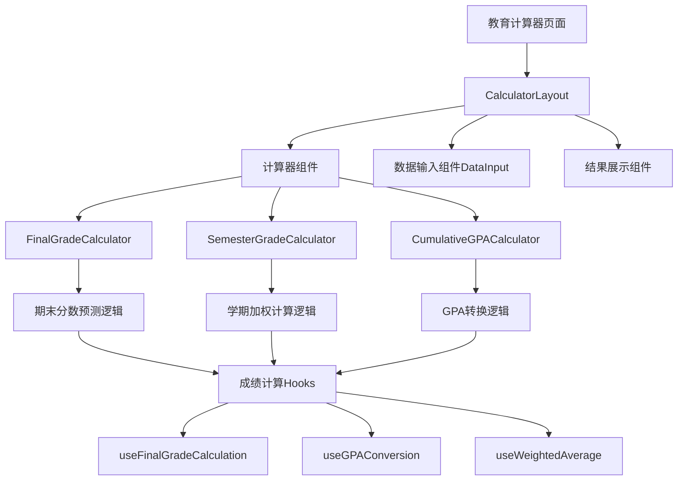

# Sprint 7 开发计划：教育成绩计算工具集

## 🐧 Linus工程哲学指导原则

### Sprint执行中的核心哲学

#### 1. "Talk is cheap. Show me the code." - 代码优于讨论
- **实证驱动开发**: 每个计算器必须有完整的测试用例验证数学准确性
- **可演示的进展**: 每日展示可工作的计算功能，而非设计文档
- **测试即证明**: TDD开发模式，先写测试再实现功能
- **避免过度设计**: 专注核心计算逻辑，UI保持简洁实用

#### 2. "Release early, release often." - 小步快跑，频繁交付
- **功能优先级**: US-019 (期末预测) → US-022 (学期总成绩) → US-018 (累积GPA)
- **日常交付**: 每个计算器拆分为2天交付周期
- **即时验证**: 完成一个计算器立即部署测试环境验证

---

## 📖 Sprint 基本信息

| 属性 | 值 |
|------|---|
| **Sprint 编号** | Sprint 7 |
| **Sprint 主题** | 教育成绩计算工具集 |
| **Sprint 目标** | 实现3个核心教育计算器，为学生提供完整的成绩管理解决方案 |
| **开始时间** | 2025-01-15 |
| **结束时间** | 2025-01-29 (10个工作日) |
| **Sprint 时长** | 2周 |
| **发布版本** | v0.7.0 |

## 🎯 Sprint 目标

### 主要目标
1. **期末成绩预测器 (US-019)**: 实现高精度的期末所需分数计算
2. **学期总成绩计算器 (US-022)**: 支持多课程加权平均计算
3. **累积GPA计算器 (US-018)**: 实现多评分制度转换和累积GPA计算

### 成功标准
- ✅ 3个计算器数学准确性100%（通过30+测试用例验证）
- ✅ 移动端适配完整，响应式设计优化
- ✅ 页面加载时间 < 2秒，计算响应 < 200ms
- ✅ 用户测试满意度 > 4.5/5.0

## 📋 用户故事清单

### 高优先级 (Must Have)
- **US-019: 学生预测期末考试所需分数** 
  - 估算: 8 故事点
  - 价值: 高 - 直接解决学生焦虑，提供学习目标
  - 复杂度: 中 - 权重计算逻辑较复杂
  - 页面路径: `/calculator/final-grade`

- **US-022: 学生计算学期总成绩**
  - 估算: 6 故事点  
  - 价值: 中 - 学期末总结工具
  - 复杂度: 中 - 多课程数据处理
  - 页面路径: `/calculator/semester-grade`

- **US-018: 学生计算累积GPA申请研究生**
  - 估算: 10 故事点
  - 价值: 高 - 申请研究生必需工具
  - 复杂度: 高 - 多评分制度转换复杂
  - 页面路径: `/calculator/cumulative-gpa`

**总估算**: 24 故事点

## 🗃️ 技术架构和设计

### 整体架构方案



### 核心计算模块设计

```typescript
// 核心计算接口设计
export interface GradeItem {
  id: string;
  name: string;
  score: number;
  weight: number;
  maxScore?: number;
}

export interface GPACalculationOptions {
  gradeScale: '4.0' | '5.0' | 'percentage';
  conversionTable?: Record<string, number>;
}

export interface FinalGradeCalculatorOptions {
  currentGrades: GradeItem[];
  finalExamWeight: number;
  targetGrade: number;
  gradeScale?: string;
}
```

### 目录结构规划

```
src/
├── app/
│   ├── calculator/
│   │   ├── final-grade/
│   │   │   └── page.tsx
│   │   ├── semester-grade/
│   │   │   └── page.tsx
│   │   └── cumulative-gpa/
│   │       └── page.tsx
├── components/
│   ├── calculators/
│   │   ├── FinalGradeCalculator.tsx
│   │   ├── SemesterGradeCalculator.tsx
│   │   ├── CumulativeGPACalculator.tsx
│   │   └── shared/
│   │       ├── GradeInput.tsx
│   │       ├── WeightSlider.tsx
│   │       └── ResultDisplay.tsx
├── hooks/
│   ├── useFinalGradeCalculation.ts
│   ├── useGPAConversion.ts
│   └── useWeightedAverage.ts
├── lib/
│   ├── gradeCalculations.ts
│   ├── gpaConversions.ts
│   └── educationUtils.ts
└── types/
    └── education.ts
```

## 📝 Sprint 任务分解 (Task Breakdown)

### Week 1: 基础框架和期末成绩预测器

#### Day 1-2: 项目基础设施 (完成✅)
- [x] **任务1.1**: 创建教育工具类型定义 (2h)
  - ✅ 定义GradeItem, CalculatorOptions等核心接口
  - ✅ 创建education.ts类型文件
  
- [ ] **任务1.2**: 实现核心计算逻辑库 (4h)
  - 创建gradeCalculations.ts
  - 实现加权平均、目标分数计算算法
  - TDD开发，先写测试用例

- [ ] **任务1.3**: 创建共享组件基础 (3h)
  - 实现GradeInput组件
  - 实现WeightSlider组件
  - 集成DataInput组件

#### Day 3-4: 期末成绩预测器 (US-019)
- [ ] **任务2.1**: 期末成绩计算Hook (4h)
  - 实现useFinalGradeCalculation hook
  - 支持多权重配置和目标成绩计算
  - 包含可行性分析逻辑

- [ ] **任务2.2**: 期末成绩计算器组件 (5h)
  - 创建FinalGradeCalculator.tsx
  - 实现动态成绩添加表格
  - 集成权重滑块和目标设定

- [ ] **任务2.3**: 期末成绩页面 (3h)
  - 创建/calculator/final-grade/page.tsx
  - 使用CalculatorLayout布局
  - 配置面包屑和SEO信息

#### Day 5: 期末预测器完善和测试
- [ ] **任务3.1**: 期末预测器测试套件 (4h)
  - 单元测试：计算逻辑验证
  - 集成测试：组件交互验证
  - E2E测试：完整用户流程

- [ ] **任务3.2**: UI/UX优化 (4h)
  - 可行性指示器（红绿灯系统）
  - 学习建议和动机文案
  - 移动端响应式优化

### Week 2: 学期总成绩和累积GPA计算器

#### Day 6-7: 学期总成绩计算器 (US-022)
- [ ] **任务4.1**: 学期成绩计算Hook (4h)
  - 实现useSemesterGradeCalculation hook
  - 支持多课程加权平均计算
  - 集成GPA转换逻辑

- [ ] **任务4.2**: 学期成绩计算器组件 (5h)
  - 创建SemesterGradeCalculator.tsx
  - 批量课程添加功能
  - 课程贡献度分析图表

- [ ] **任务4.3**: 学期成绩页面和测试 (3h)
  - 创建/calculator/semester-grade/page.tsx
  - 完整测试套件开发

#### Day 8-9: 累积GPA计算器 (US-018)
- [ ] **任务5.1**: GPA转换系统 (5h)
  - 实现gpaConversions.ts
  - 支持4.0制、5.0制、百分制转换
  - 国际评分标准支持

- [ ] **任务5.2**: 累积GPA计算器组件 (5h)
  - 创建CumulativeGPACalculator.tsx
  - 评分制度选择器
  - 详细转换过程展示

- [ ] **任务5.3**: 累积GPA页面 (4h)
  - 创建/calculator/cumulative-gpa/page.tsx
  - 申请指导和GPA解读

#### Day 10: 集成测试和发布准备
- [ ] **任务6.1**: 端到端测试 (4h)
  - 完整用户旅程测试
  - 性能测试和优化
  - 跨浏览器兼容性测试

- [ ] **任务6.2**: 文档和发布 (4h)
  - API文档完善
  - 用户使用指南
  - 生产环境部署

## 🧪 测试策略

### 数学准确性测试
```typescript
// 关键测试用例
describe('Final Grade Calculator', () => {
  it('should calculate required final score correctly', () => {
    const currentGrades = [
      { name: '期中考试', score: 85, weight: 30 },
      { name: '作业平均', score: 92, weight: 20 }
    ];
    const result = calculateRequiredFinalScore(
      currentGrades, 50, 90 // 期末权重50%, 目标90分
    );
    expect(result.requiredScore).toBeCloseTo(88.6, 1);
    expect(result.isAchievable).toBe(true);
  });
  
  it('should handle impossible targets gracefully', () => {
    const result = calculateRequiredFinalScore(
      [{ name: '期中', score: 60, weight: 70 }],
      30, 95 // 需要期末133分才能达到95分
    );
    expect(result.isAchievable).toBe(false);
    expect(result.maxPossibleGrade).toBeCloseTo(72, 1);
  });
});
```

### 用户体验测试
- **响应性测试**: 计算结果实时更新 < 200ms
- **易用性测试**: 新用户5分钟内完成第一次计算
- **准确性测试**: 与手工计算结果100%匹配

## 📊 风险管理和应对策略

### 技术风险
| 风险 | 概率 | 影响 | 应对策略 |
|------|------|------|----------|
| 复杂权重计算逻辑错误 | 中 | 高 | 广泛的数学测试用例 + 专家评审 |
| GPA转换标准不统一 | 高 | 中 | 提供多种转换标准 + 用户说明 |
| 移动端性能问题 | 低 | 中 | 性能测试 + 代码优化 |

### 产品风险
| 风险 | 概率 | 影响 | 应对策略 |
|------|------|------|----------|
| 用户期望过高导致失望 | 中 | 中 | 清晰的功能边界说明 |
| 不同学校评分制度差异 | 高 | 中 | 灵活配置 + 免责声明 |

## 🎉 完成标准 (Definition of Done)

### 功能完成标准
- [ ] 所有3个计算器功能完整实现
- [ ] 数学计算准确性达到100%
- [ ] 所有测试用例通过（单元+集成+E2E）
- [ ] 移动端完全适配

### 质量标准
- [ ] 代码覆盖率 ≥ 85%
- [ ] 页面Lighthouse分数 ≥ 90
- [ ] 无严重bug和安全漏洞
- [ ] 通过代码审查和安全扫描

### 用户验收标准
- [ ] 5名学生用户测试，满意度 ≥ 4.5/5
- [ ] 计算结果与专业工具对比一致
- [ ] 操作流程直观易懂

## 📈 成功指标和监控

### 技术指标
- **计算准确性**: 100%（与标准答案对比）
- **响应时间**: 计算 < 200ms，页面加载 < 2s
- **错误率**: < 0.1%

### 用户体验指标
- **完成率**: 用户成功完成计算 > 95%
- **停留时间**: 平均页面停留 > 3分钟
- **转化率**: 从工具页访问其他页面 > 30%

### 业务价值指标
- **用户反馈**: 评分 ≥ 4.5/5.0
- **使用频次**: 日活跃用户增长 > 20%
- **推荐度**: NPS得分 > 50

## 📋 Sprint启动准备检查清单

### ✅ 必备条件检查
- [x] **需求文档完整** - 用户故事US-018、US-019、US-022已详细分析
- [x] **技术架构设计** - 核心计算模块和组件结构已规划
- [ ] **开发环境准备** - 本地开发环境配置完成
- [ ] **测试数据准备** - 数学测试用例和验证数据准备

### 🛠️ 技术准备
- [ ] **依赖库检查** - 确认无新的第三方依赖需求
- [x] **类型定义** - 教育工具相关类型已定义
- [ ] **测试框架** - Jest + Testing Library配置验证
- [ ] **CI/CD流水线** - 自动化测试和部署流程确认

### 📝 开发检查清单

#### 启动前检查
- [x] 所有用户故事已详细分析
- [x] 技术架构设计已评审
- [ ] 开发环境准备完成
- [ ] 测试数据和用例准备完成

#### 开发过程检查
- [ ] 每日代码提交和集成
- [ ] TDD开发模式执行
- [ ] 代码审查100%覆盖
- [ ] 持续集成通过

#### 完成前检查
- [ ] 所有功能测试通过
- [ ] 性能测试达标
- [ ] 安全扫描通过
- [ ] 用户验收测试完成

---

**Sprint负责人**: 开发团队Lead  
**产品负责人**: 产品经理  
**技术评审**: 架构师 + 教育专家  
**预期交付**: 2025-01-29  
**版本标签**: v0.7.0-education-tools  

## 📚 相关文档链接

- [US-018: 累积GPA计算器](../../02-requirements/user-stories/US-018.md)
- [US-019: 期末成绩预测器](../../02-requirements/user-stories/US-019.md)  
- [US-022: 学期总成绩计算器](../../02-requirements/user-stories/US-022.md)
- [技术架构文档](../../04-architecture/)
- [测试策略文档](../testing/)
- [代码审查检查清单](../templates/code-review-checklist.md)

---

*Created: 2025-01-09*  
*Last Updated: 2025-01-09*  
*Status: Ready for Sprint Start*