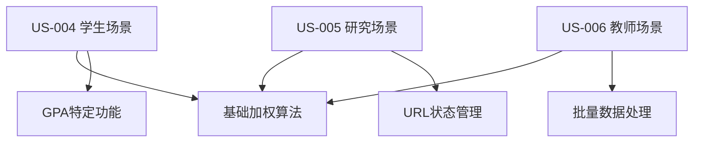

# Sprint 3 开发计划：加权平均计算器 (Weighted Mean Calculator)

## 🐧 Linus工程哲学指导原则

### Sprint执行中的核心哲学

#### 1. "Talk is cheap. Show me the code." - 代码优于讨论
- **实证驱动开发**: 加权平均计算器的所有算法必须通过可验证的测试用例证明
- **可演示的进展**: 每日展示可工作的计算功能和组件集成，而不仅是接口设计
- **测试即证明**: 权重策略和数学计算准确性通过自动化测试保证
- **避免空洞架构**: 所有组件设计必须有具体的用户场景支撑

#### 2. "Release early, release often." - 小步快跑，频繁交付
- **功能切片**: US-004/005/006 分解为独立可测试的计算模块
- **即时验证**: 每个输入模式完成后立即与标准答案对比
- **渐进增强**: 先实现基础加权计算，再添加高级权重策略

#### 3. "Perfect is achieved when there is nothing left to take away." - 简单性原则
- **YAGNI原则**: 只实现当前三个用户故事需要的功能
- **CalculatorLayout复用**: 充分利用Sprint 2已验证的通用布局
- **删除冗余**: 避免重复造轮子，复用现有组件模式

## 📖 内容导航

### 📋 Sprint 计划阶段
- [Sprint 基本信息](#-sprint-基本信息)
- [Sprint 目标](#-sprint-目标)
- [启动准备工作检查清单](#-sprint-启动准备工作检查清单)
- [用户故事清单](#-用户故事清单)
- [技术架构和设计](#️-技术架构和设计)
- [Sprint 任务分解](#-sprint-任务分解-task-breakdown)
- [测试策略](#-测试策略)
- [质量和合规要求](#-质量和合规要求)
- [风险和依赖](#-风险和依赖)
- [完成定义](#-definition-of-done-完成定义)
- [验收和发布计划](#-验收和发布计划)

---

## 📋 Sprint 基本信息

- **Sprint 编号**: Sprint 3
- **Sprint 主题**: 加权平均计算器完整实现及CalculatorLayout复用验证
- **开始日期**: 2025-01-23
- **结束日期**: 2025-02-05
- **Sprint 时长**: 2周
- **开发模式**: 敏捷开发/TDD
- **Scrum Master**: TBD
- **产品负责人**: TBD

## 🎯 Sprint 目标

### 主要目标

1. **加权平均计算器完整实现**: 开发功能完整的 `/calculator/weighted-mean` 页面，支持三种输入模式
2. **CalculatorLayout通用性验证**: 成功集成Sprint 2的通用布局，验证组件复用价值
3. **三种用户场景差异化**: 实现学生GPA、研究样本权重、教师课程权重的专门优化

### 成功标准
- [ ] 加权平均计算器页面完全实现并通过所有验收测试
- [ ] CalculatorLayout组件无缝集成，布局一致性100%
- [ ] 三个用户故事(US-004/005/006)全部验收通过
- [ ] 代码测试覆盖率≥80%，性能指标达标

---

## 🔍 Sprint 启动准备工作检查清单

**检查清单类型选择**: 快速检查清单 (团队配合成熟，基于Sprint 2成功经验)

### ⚡ 快速检查清单

**适用范围**: 日常Sprint，基于成熟架构的功能扩展  
**评估标准**: 7.5分以上可启动，重点关注关键准备项

#### 🎯 产品需求准备 (权重: 30%)
- [x] **FRS文档完整** - docs/02-requirements/calculators/03-weighted-mean.md 已存在
- [x] **用户故事清晰** - US-004/005/006 三个故事明确定义
- [x] **验收标准明确** - 基于现有功能规格说明
- [x] **UI设计存在** - docs/05-development/UI/sprint2/ 包含WeightedGPACalculator实现
- **完成度**: 10/10 分 ✅

#### 🏗️ 技术架构准备 (权重: 25%)
- [x] **CalculatorLayout组件可用** - Sprint 2成功验证
- [x] **技术栈无变更** - Next.js 15 + React 19 + TypeScript
- [x] **组件模式已建立** - 基于Mean Calculator的组件化架构
- [x] **开发环境就绪** - 开发服务器运行正常
- **完成度**: 10/10 分 ✅

#### 👥 团队能力准备 (权重: 20%)
- [x] **团队熟悉架构** - 基于Sprint 2成功经验
- [x] **组件开发模式明确** - 模块化组件开发流程已建立
- [x] **测试策略一致** - 延续Sprint 2的测试标准
- **完成度**: 9/10 分 ✅

#### 🔧 工具和环境准备 (权重: 15%)
- [x] **开发环境无问题** - 端口3001运行正常
- [x] **CI/CD流水线可用** - 基于现有配置
- [x] **代码审查流程就绪** - 团队已建立标准
- **完成度**: 9/10 分 ✅

#### 📊 依赖和集成准备 (权重: 10%)
- [x] **无外部API依赖** - 纯客户端计算
- [x] **现有组件可复用** - CalculatorLayout及相关组件
- [x] **数据格式已定义** - 基于FRS文档的数据结构
- **完成度**: 10/10 分 ✅

### 📊 DoR 评估结果
- **总体评分**: 9.6/10 ✅
- **达标要求**: ≥7.5分
- **启动决策**: **GO** - 可以启动Sprint 3

---

## 📚 用户故事清单

### US-004: 学生GPA计算场景
**编号**: US-WM-004  
**标题**: 学生计算加权GPA  
**模块**: 加权平均计算器  
**优先级**: High  
**估时**: 16h (2天)  

**用户故事**:
> 作为 **学生**，  
> 我希望 **输入课程成绩和学分，计算加权GPA并查看详细步骤**，  
> 以便 **我能准确了解自己的学术表现和各课程对总GPA的贡献度**。

**验收标准**:
```gherkin
场景1: 基础GPA计算
Given 学生输入grade:credit格式的课程数据
When 点击计算按钮
Then 显示加权GPA结果和详细计算步骤
And 显示每门课程的贡献度百分比
And 提供GPA等级解释(A/B/C/D)

场景2: 零学分课程处理
Given 输入包含Pass/Fail课程(0学分)
When 启用"忽略零学分课程"选项
Then 计算时排除零学分课程
And 在步骤说明中显示排除的课程数量
```

### US-005: 研究人员样本权重场景
**编号**: US-WM-005  
**标题**: 研究样本加权平均计算  
**模块**: 加权平均计算器  
**优先级**: High  
**估时**: 20h (2.5天)  

**用户故事**:
> 作为 **研究人员**，  
> 我希望 **计算样本的加权平均值并能够保存/分享计算配置**，  
> 以便 **我能在研究论文中引用准确的统计结果，并与同事分享计算过程**。

**验收标准**:
```gherkin
场景1: 高精度计算
Given 研究人员输入value:weight格式的样本数据
When 设置精度为4位小数
Then 显示高精度的加权平均结果
And 支持科学记数法输入

场景2: URL状态保存
Given 完成加权平均计算
When 生成分享链接
Then URL包含所有计算参数
And 其他人访问链接能重现完全相同的计算
```

### US-006: 教师课程权重场景
**编号**: US-WM-006  
**标题**: 教师批量成绩权重计算  
**模块**: 加权平均计算器  
**优先级**: High  
**估时**: 16h (2天)  

**用户故事**:
> 作为 **教师**，  
> 我希望 **批量处理学生成绩的权重计算，支持多种数据输入方式**，  
> 以便 **我能高效计算期末综合成绩，并保护学生隐私**。

**验收标准**:
```gherkin
场景1: 批量数据处理
Given 教师粘贴Excel格式的成绩和权重数据
When 使用双列输入模式
Then 自动解析并计算所有学生的加权成绩
And 显示班级统计信息(最高/最低/平均分)

场景2: 数据隐私保护
Given 输入包含学生成绩数据
When 进行本地计算
Then 所有数据仅在浏览器中处理
And 不向服务器发送任何原始成绩数据
```

### 用户故事依赖关系


---

## 🏗️ 技术架构和设计

### 核心技术栈
- **前端框架**: Next.js 15 + React 19 + TypeScript 5.x (继承)
- **样式系统**: Tailwind CSS 3.x (继承)
- **布局系统**: CalculatorLayout通用模板 (复用)
- **状态管理**: URL Search Params + React useState (继承)
- **计算引擎**: 纯客户端加权平均算法

### 组件架构设计 (基于Sprint 2成功模式)

#### 主页面组件
```typescript
WeightedMeanCalculator
├── CalculatorLayout (复用Sprint 2)
│   ├── Header (继承)
│   ├── Breadcrumb (继承)  
│   ├── MainContent
│   │   ├── UserModeSelector (适配加权场景)
│   │   ├── WeightedDataInput (新组件)
│   │   ├── WeightingOptions (新组件)
│   │   ├── WeightedResults (新组件)
│   │   ├── WeightedCalculationSteps (新组件)
│   │   └── WeightedHelpSection (新组件)
│   └── Sidebar (继承)
│       ├── GoogleAdsPlaceholder
│       ├── RelatedTools
│       └── PopularTools
├── Footer (继承)
```

#### 新组件设计规范

**1. WeightedDataInput 组件**
```typescript
interface WeightedDataInputProps {
  inputMode: 'pairs' | 'columns' | 'manual';
  onModeChange: (mode: 'pairs' | 'columns' | 'manual') => void;
  onDataChange: (data: WeightedPair[]) => void;
  userMode: UserMode;
  className?: string;
}

interface WeightedPair {
  value: number;
  weight: number;
  id?: string;
}
```

**2. WeightingOptions 组件**
```typescript
interface WeightingOptionsProps {
  zeroWeightStrategy: 'ignore' | 'error' | 'include';
  missingWeightStrategy: 'zero' | 'ignore' | 'error';
  normalizeWeights: boolean;
  precision: number;
  onStrategyChange: (options: WeightingStrategy) => void;
  userMode: UserMode;
}
```

**3. WeightedResults 组件**
```typescript
interface WeightedResultsProps {
  result: WeightedMeanResult | null;
  userMode: UserMode;
  precision: number;
  onCopy?: (text: string) => void;
  onDownload?: (data: WeightedMeanResult, format: 'csv' | 'json') => void;
}
```

### 核心算法设计
```typescript
interface WeightedMeanResult {
  weightedMean: number;
  totalWeights: number;
  totalWeightedValue: number;
  validPairs: number;
  excludedPairs: number;
  pairs: Array<{
    value: number;
    weight: number;
    contribution: number; // 贡献度百分比
    normalizedWeight: number;
  }>;
  steps: string[];
  metadata: {
    inputMode: 'pairs' | 'columns' | 'manual';
    strategy: WeightingStrategy;
    precision: number;
    timestamp: string;
  };
}

function calculateWeightedMean(
  pairs: WeightedPair[],
  strategy: WeightingStrategy
): WeightedMeanResult {
  // 实现加权平均算法
  // 支持多种权重策略
  // 生成详细计算步骤
}
```

### 自定义Hook设计
```typescript
interface UseWeightedMeanCalculationProps {
  userMode: UserMode;
  precision: number;
  zeroWeightStrategy: 'ignore' | 'error' | 'include';
  missingWeightStrategy: 'zero' | 'ignore' | 'error';
  normalizeWeights: boolean;
}

function useWeightedMeanCalculation(props: UseWeightedMeanCalculationProps) {
  const [result, setResult] = useState<WeightedMeanResult | null>(null);
  const [isCalculating, setIsCalculating] = useState(false);
  
  const calculateWeighted = useCallback((pairs: WeightedPair[]) => {
    // 实现计算逻辑
  }, [props]);
  
  const clearResults = useCallback(() => {
    setResult(null);
  }, []);
  
  return {
    result,
    isCalculating,
    calculateWeighted,
    clearResults,
    loadExample: () => { /* 示例数据加载 */ }
  };
}
```

---

## 📋 Sprint 任务分解 (Task Breakdown)

### Week 1 (Day 1-5): 基础架构和核心组件

#### Day 1: 项目基础和算法核心 (8h)
- [ ] **TASK-3.1.1**: 创建加权平均计算器页面路由和基础结构 (2h)
  - 创建 `/src/app/calculator/weighted-mean/page.tsx`
  - 集成CalculatorLayout组件
  - 设置基础路由和导航

- [ ] **TASK-3.1.2**: 实现核心加权平均算法 (4h)
  - 编写 `calculateWeightedMean` 核心函数
  - 支持多种权重策略处理
  - 创建完整的单元测试套件
  - 验证数学计算准确性

- [ ] **TASK-3.1.3**: 开发 `useWeightedMeanCalculation` hook (2h)
  - 基于useMeanCalculation模式
  - 集成权重策略逻辑
  - 状态管理和性能优化

#### Day 2: 数据输入组件开发 (8h)
- [ ] **TASK-3.2.1**: WeightedDataInput基础结构 (2h)
  - 组件框架搭建
  - 三种输入模式界面布局
  - 模式切换逻辑实现

- [ ] **TASK-3.2.2**: Pairs输入模式实现 (2h)
  - value:weight格式解析
  - 实时数据验证
  - 错误提示和用户引导

- [ ] **TASK-3.2.3**: Columns输入模式实现 (2h)
  - 双列文本框输入
  - 数据长度匹配验证
  - Excel粘贴格式支持

- [ ] **TASK-3.2.4**: Manual输入模式实现 (2h)
  - 动态表单行管理
  - 添加/删除操作
  - 数据持久化处理

#### Day 3: 权重策略和选项控制 (8h)
- [ ] **TASK-3.3.1**: WeightingOptions组件开发 (3h)
  - 权重策略选择界面
  - 用户友好的选项说明
  - 不同用户模式的策略推荐

- [ ] **TASK-3.3.2**: 零权重处理策略实现 (2h)
  - ignore策略: 排除零权重项
  - include策略: 保留零权重项
  - error策略: 显示错误提示

- [ ] **TASK-3.3.3**: 缺失权重处理逻辑 (2h)
  - 自动补零策略
  - 忽略缺失项策略
  - 错误中断策略

- [ ] **TASK-3.3.4**: 精度控制和权重归一化 (1h)
  - 0-10位小数精度控制
  - 可选的权重归一化功能
  - 实时预览效果

#### Day 4: 结果展示和可视化 (8h)
- [ ] **TASK-3.4.1**: WeightedResults核心展示 (3h)
  - 加权平均值显示
  - 总权重和加权值汇总
  - 用户模式特定的结果格式

- [ ] **TASK-3.4.2**: 贡献度分析功能 (2h)
  - 每个数据点的贡献度计算
  - 可视化权重分布图表
  - 交互式数据表格

- [ ] **TASK-3.4.3**: 统计信息和元数据 (2h)
  - 有效/无效数据点统计
  - 权重范围和分布信息
  - 计算配置元数据展示

- [ ] **TASK-3.4.4**: 操作功能实现 (1h)
  - 复制结果到剪贴板
  - 导出CSV/JSON格式
  - 分享链接生成

#### Day 5: US-004学生场景实现 (8h)
- [ ] **TASK-3.5.1**: 学生模式界面优化 (2h)
  - GPA特定的输入提示
  - 简化的权重策略选项
  - 教育友好的错误信息

- [ ] **TASK-3.5.2**: GPA等级和解释系统 (3h)
  - 4.0制GPA等级计算
  - 等级颜色编码(A/B/C/D/F)
  - 学术表现解释文本

- [ ] **TASK-3.5.3**: 课程贡献度详细展示 (2h)
  - 每门课程的GPA贡献
  - 学分权重可视化
  - 改进建议提示

- [ ] **TASK-3.5.4**: US-004端到端测试 (1h)
  - 学生场景完整流程测试
  - 边界条件和异常处理
  - 用户体验优化验证

### Week 2 (Day 6-10): 高级功能和优化

#### Day 6: US-005研究人员场景 (8h)
- [ ] **TASK-3.6.1**: URL参数状态管理 (3h)
  - 计算配置URL编码
  - 参数解析和状态重建
  - 浏览器历史管理

- [ ] **TASK-3.6.2**: 高精度计算支持 (2h)
  - 精度可达10位小数
  - 科学记数法输入支持
  - 精度损失检测和警告

- [ ] **TASK-3.6.3**: 分享和协作功能 (2h)
  - 一键分享链接生成
  - QR码生成(移动端)
  - 配置导入导出

- [ ] **TASK-3.6.4**: 研究模式高级功能 (1h)
  - 权重分布分析图表
  - 统计显著性信息
  - 结果可信度评估

#### Day 7: US-006教师场景实现 (8h)
- [ ] **TASK-3.7.1**: 批量数据处理优化 (3h)
  - 大数据集性能优化
  - 进度指示和用户反馈
  - 内存使用优化

- [ ] **TASK-3.7.2**: CSV/Excel格式支持 (3h)
  - 多种文件格式解析
  - 智能列映射检测
  - 格式错误恢复建议

- [ ] **TASK-3.7.3**: 教育场景优化 (2h)
  - 班级统计信息
  - 成绩分布分析
  - 隐私保护提示和确认

#### Day 8: 计算步骤和帮助系统 (8h)
- [ ] **TASK-3.8.1**: WeightedCalculationSteps组件 (4h)
  - 分步骤计算过程展示
  - 数学公式格式化显示
  - 可折叠的详细解释

- [ ] **TASK-3.8.2**: 动态步骤生成逻辑 (2h)
  - 根据权重策略生成步骤
  - 异常处理步骤说明
  - 用户模式自适应内容

- [ ] **TASK-3.8.3**: WeightedHelpSection组件 (2h)
  - 上下文敏感帮助内容
  - 输入格式示例和指南
  - 常见问题和解决方案

#### Day 9: 性能优化和测试 (8h)
- [ ] **TASK-3.9.1**: 性能优化和监控 (3h)
  - 大数据集处理优化
  - 计算缓存策略
  - 性能监控和报告

- [ ] **TASK-3.9.2**: 组件单元测试完善 (3h)
  - 所有新组件单元测试
  - 边界条件测试覆盖
  - Mock数据和测试用例

- [ ] **TASK-3.9.3**: 集成测试和E2E测试 (2h)
  - 三个用户故事端到端测试
  - 跨组件交互测试
  - CalculatorLayout集成验证

#### Day 10: 发布准备和文档 (8h)
- [ ] **TASK-3.10.1**: 移动端和无障碍优化 (2h)
  - 响应式布局验证
  - 触摸操作优化
  - 键盘导航支持

- [ ] **TASK-3.10.2**: 代码质量和重构 (2h)
  - 代码审查和优化
  - TypeScript类型完善
  - 性能瓶颈优化

- [ ] **TASK-3.10.3**: 文档和用户指南 (2h)
  - 组件API文档
  - 用户使用指南
  - 开发者文档更新

- [ ] **TASK-3.10.4**: Sprint Demo和发布准备 (2h)
  - Demo演示准备
  - 生产环境部署测试
  - 发布检查清单完成

---

## 🧪 测试策略

### 测试层次和覆盖率目标

#### 单元测试 (目标覆盖率: 85%)
**核心算法测试**
- 加权平均计算准确性 (与标准数学库对比)
- 权重策略逻辑 (零权重、缺失权重处理)
- 精度控制和数值稳定性
- 边界条件和异常输入处理

**组件逻辑测试**
- WeightedDataInput: 多种输入格式解析
- WeightingOptions: 策略选择和参数验证
- WeightedResults: 结果展示和格式化
- WeightedCalculationSteps: 步骤生成和展示
- useWeightedMeanCalculation: Hook状态管理

#### 集成测试
**用户故事流程**
- US-004: 学生GPA计算完整流程
- US-005: 研究人员分享链接流程
- US-006: 教师批量处理流程

**组件集成**
- CalculatorLayout与新组件的集成
- 用户模式切换的状态传递
- URL参数与组件状态同步

#### 端到端测试 (E2E)
**浏览器兼容性**
- Chrome, Firefox, Safari, Edge最新版本
- 移动端Safari和Chrome测试

**性能测试**
- 小数据集 (n<100): 响应时间 < 50ms
- 中数据集 (100≤n<1000): 响应时间 < 200ms  
- 大数据集 (n≥1000): 提供进度指示，总时间 < 2s

### 测试数据和基准
**标准测试用例**
```javascript
const testCases = [
  {
    name: '基础GPA计算',
    input: [[90, 3], [85, 4], [92, 2], [88, 3]],
    expected: 87.83,
    precision: 2
  },
  {
    name: '含零权重处理',
    input: [[95, 0], [85, 4], [90, 3]], 
    strategy: 'ignore',
    expected: 87.14,
    precision: 2
  },
  {
    name: '高精度科学计算',
    input: [[1.2345e2, 0.001], [2.3456e1, 0.999]],
    expected: 23.579,
    precision: 3
  }
];
```

---

## 🔒 质量和合规要求

### 代码质量标准
**TypeScript类型覆盖**: 100%严格模式
**ESLint规则遵循**: 无警告，无错误
**代码格式化**: Prettier自动格式化
**注释覆盖**: 公共API和复杂逻辑100%注释

### 性能要求
**核心性能指标**
- 页面首次内容绘制 (FCP): ≤ 1.5s
- 最大内容绘制 (LCP): ≤ 2.5s  
- 首次输入延迟 (FID): ≤ 100ms
- 累计布局偏移 (CLS): ≤ 0.1

**计算性能**
- 基础计算 (n<100): ≤ 50ms
- 中等规模 (n<1000): ≤ 200ms
- 大规模计算 (n≥1000): 提供降级策略

### 可访问性要求
**WCAG 2.1 AA标准**
- 键盘导航完整支持
- 屏幕阅读器兼容性
- 色彩对比度比例≥4.5:1
- ARIA标签和语义HTML

### 安全和隐私
**数据隐私保护**
- 所有计算在客户端完成
- 不向服务器传输原始数据
- URL参数不包含敏感信息
- 本地存储数据加密

**输入安全**
- XSS攻击防护
- 输入验证和清理
- 数值溢出保护
- 恶意输入检测

---

## ⚠️ 风险和依赖

### 高风险项 (需要重点关注)

#### 1. CalculatorLayout集成复杂性
- **风险描述**: CalculatorLayout可能需要修改以适配加权计算器特定需求
- **风险等级**: 中等
- **缓解措施**: 
  - Day 1优先验证Layout集成
  - 如需修改，确保不破坏Mean Calculator
  - 建立Layout版本兼容性测试
- **负责人**: 技术负责人
- **监控指标**: Layout集成测试通过率

#### 2. 复杂权重策略处理
- **风险描述**: 多种权重策略的组合可能产生意外的计算结果
- **风险等级**: 中等  
- **缓解措施**:
  - 建立完整的数学测试用例矩阵
  - 与标准统计软件对比验证
  - 边界条件和异常处理测试
- **负责人**: 算法开发人员
- **监控指标**: 单元测试覆盖率 ≥ 90%

#### 3. 性能优化挑战
- **风险描述**: 大数据集处理可能影响用户体验
- **风险等级**: 低等
- **缓解措施**:
  - Web Worker异步计算
  - 分批处理和进度指示
  - 设置数据量上限和降级策略
- **负责人**: 前端开发团队
- **监控指标**: 95%用户操作响应时间 ≤ 2s

### 依赖管理

#### 内部依赖
- **CalculatorLayout组件**: Sprint 2交付成果
- **现有组件库**: UserModeSelector等通用组件
- **设计系统**: Tailwind配置和主题
- **测试框架**: Jest和Testing Library配置

#### 外部依赖
- **数学计算库**: 考虑引入decimal.js解决精度问题
- **图表库**: 权重分布可视化可能需要轻量图表库
- **文件处理**: CSV解析可能需要专用库

### 应急预案
**技术阻塞预案** (升级时间: 4小时)
- 如CalculatorLayout不兼容 → 创建轻量适配层
- 如性能无法满足 → 实施数据量限制和分批处理
- 如算法准确性有问题 → 回退到简化版本，后续迭代优化

---

## ✅ Definition of Done (完成定义)

### 功能完成标准
- [ ] **用户故事验收**: 所有三个用户故事通过产品负责人验收
- [ ] **核心功能正常**: 加权平均计算结果100%准确
- [ ] **多输入模式**: pairs/columns/manual三种模式完全实现
- [ ] **权重策略**: 零权重和缺失权重处理策略正常工作
- [ ] **CalculatorLayout集成**: 布局一致性和功能完整性验证通过

### 技术质量标准  
- [ ] **测试覆盖率**: 单元测试覆盖率 ≥ 80%
- [ ] **类型安全**: TypeScript编译无错误无警告
- [ ] **代码规范**: ESLint检查通过，代码格式化完成
- [ ] **性能达标**: 核心性能指标满足要求
- [ ] **浏览器兼容**: 主流浏览器测试通过

### 用户体验标准
- [ ] **响应式设计**: 移动端和桌面端完美适配
- [ ] **无障碍访问**: WCAG 2.1 AA标准符合
- [ ] **用户友好**: 错误处理和用户引导完善
- [ ] **操作流畅**: 无明显卡顿，交互反馈及时

### 发布准备标准
- [ ] **文档完整**: 用户指南和技术文档更新
- [ ] **部署测试**: 生产环境部署测试成功
- [ ] **代码审查**: 所有代码通过同行评审
- [ ] **回归测试**: 现有功能无破坏性影响

---

## 🚀 验收和发布计划

### Sprint评审准备
**Demo演示内容**
1. **整体功能展示** (5分钟)
   - 加权平均计算器完整演示
   - CalculatorLayout一致性展示
   - 三种用户模式切换演示

2. **用户故事验收** (10分钟)
   - US-004: 学生GPA计算场景演示
   - US-005: 研究人员分享链接演示  
   - US-006: 教师批量处理演示

3. **技术亮点展示** (5分钟)
   - 权重策略功能演示
   - 性能优化效果展示
   - 代码复用价值说明

### 发布检查清单
**发布前最终验证**
- [ ] 所有DoD项目完成确认
- [ ] 产品负责人最终验收签字
- [ ] 生产环境冒烟测试通过
- [ ] 监控和告警配置完成
- [ ] 回滚方案准备并验证
- [ ] 团队成员发布培训完成

### 发布策略
- **发布方式**: Feature Flag控制渐进发布
- **发布环境**: Development → Staging → Production
- **发布时间**: 工作日上午，避开业务高峰
- **回滚时间**: RTO < 5分钟，自动化回滚

### 发布后监控
**关键指标监控** (前48小时)
- 页面访问量和用户行为
- 计算准确性和性能指标  
- 错误率和用户反馈
- CalculatorLayout稳定性

---

## 📊 Sprint成功衡量标准

### 业务成功指标
- [ ] **功能完成率**: 100% (三个用户故事全部完成)
- [ ] **质量达标率**: ≥ 95% (测试通过率)
- [ ] **用户满意度**: ≥ 4.5/5.0 (如有用户测试)
- [ ] **性能达标**: 100% (所有性能指标达标)

### 技术成功指标  
- [ ] **代码复用率**: ≥ 70% (CalculatorLayout和现有组件复用)
- [ ] **测试覆盖率**: ≥ 80% (自动化测试覆盖)
- [ ] **零生产故障**: 发布后48小时内无严重问题
- [ ] **架构验证**: CalculatorLayout通用性得到验证

### 团队成功指标
- [ ] **按时交付**: Sprint目标100%按时完成  
- [ ] **团队协作**: 无阻塞问题，沟通顺畅
- [ ] **技能提升**: 团队掌握加权计算和组件复用模式
- [ ] **知识沉淀**: 文档和最佳实践更新完成

---

**Sprint 3 负责人分工**:
- **Scrum Master**: TBD - Sprint进度管理和阻碍清除
- **产品负责人**: TBD - 需求确认和验收标准制定  
- **技术负责人**: TBD - 架构设计和代码质量把控
- **质量负责人**: TBD - 测试策略和质量标准执行

**预期交付成果**: 功能完整、性能优秀的加权平均计算器，成功验证CalculatorLayout通用组件的复用价值，为后续计算器开发建立标准化模式。