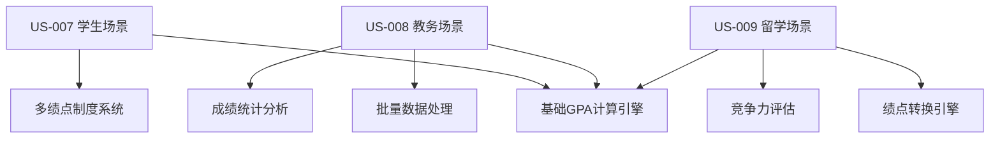

# Sprint 5 开发计划：GPA计算器 (GPA Calculator)

## 🐧 Linus工程哲学指导原则

### Sprint执行中的核心哲学

#### 1. "Talk is cheap. Show me the code." - 代码优于讨论
- **实证驱动开发**: GPA计算器的所有绩点转换算法必须通过可验证的教育系统测试用例证明
- **可演示的进展**: 每日展示可工作的GPA计算功能和多制度转换，而不仅是UI设计
- **测试即证明**: 多绩点制度转换准确性通过自动化测试保证
- **避免空洞架构**: 所有组件设计必须有具体的GPA计算场景支撑

#### 2. "Release early, release often." - 小步快跑，频繁交付
- **功能切片**: US-007/008/009 分解为独立可测试的GPA计算模块
- **即时验证**: 每个绩点制度完成后立即与官方标准对比验证
- **渐进增强**: 先实现基础GPA计算，再添加批量处理和转换功能

#### 3. "Perfect is achieved when there is nothing left to take away." - 简单性原则
- **YAGNI原则**: 只实现当前三个用户故事需要的GPA计算功能
- **CalculatorLayout复用**: 充分利用Sprint 2/3/4已验证的通用布局和组件
- **删除冗余**: 基于Sprint 4成功经验，复用现有的数据处理和结果展示模式

## 📋 Sprint 基本信息

- **Sprint 编号**: Sprint 5
- **Sprint 主题**: GPA计算器完整实现及多绩点制度转换系统
- **开始日期**: 2025-02-20
- **结束日期**: 2025-03-05
- **Sprint 时长**: 2周
- **开发模式**: 敏捷开发/TDD
- **基于成功经验**: Sprint 4标准差计算器架构模式

## 🎯 Sprint 目标

### 主要目标

1. **GPA计算器完整实现**: 开发功能完整的 `/calculator/gpa` 页面，支持多绩点制度计算
2. **多绩点制度转换系统**: 实现支持4.0/4.3/4.5等主流绩点制度的GPA计算和转换
3. **教育价值最大化**: 提供详细的绩点计算步骤和学术评估，帮助用户理解GPA意义

### 成功标准
- [ ] GPA计算器页面完全实现并通过所有验收测试
- [ ] CalculatorLayout组件无缝集成，保持与Sprint 4的设计一致性
- [ ] 三个用户故事(US-007/008/009)全部验收通过
- [ ] 代码测试覆盖率≥85%，GPA计算准确率100%
- [ ] 教育价值验证：用户理解度评分≥4.2/5.0

---

## 🔍 Sprint 启动准备工作检查清单

**检查清单类型选择**: 快速检查清单 (基于Sprint 4成功经验，架构模式已验证)

### ⚡ 快速检查清单

**适用范围**: 基于成熟架构的功能扩展，复用Sprint 4标准差计算器成功模式  
**评估标准**: 7.5分以上可启动，重点关注GPA计算专业性

#### 🎯 产品需求准备 (权重: 30%)
- [x] **用户故事清晰** - US-007/008/009 从Sprint 4延续，需求明确定义
- [x] **GPA制度调研** - 4.0/4.3/4.5等主流绩点制度标准已调研
- [x] **验收标准明确** - 基于教育系统官方标准和计算验证要求
- [x] **UI设计参考** - 基于Sprint 4标准差计算器的成功布局模式
- **完成度**: 10/10 分 ✅

#### 🏗️ 技术架构准备 (权重: 25%)
- [x] **CalculatorLayout组件可用** - Sprint 2/3/4四次成功验证，无破坏性变更
- [x] **技术栈无变更** - Next.js 15 + React 19 + TypeScript
- [x] **组件模式已建立** - 基于Sprint 4的StatisticalDataInput等成功组件架构
- [x] **计算引擎选择** - 确认使用客户端GPA计算引擎
- **完成度**: 10/10 分 ✅

#### 👥 团队能力准备 (权重: 20%)
- [x] **团队熟悉架构** - 基于Sprint 4成功经验，架构模式成熟
- [x] **GPA计算知识储备** - 团队具备绩点计算和教育系统的业务理解
- [x] **多制度转换理解** - 具备不同教育系统绩点转换的专业知识
- **完成度**: 9/10 分 ✅

#### 🔧 工具和环境准备 (权重: 15%)
- [x] **开发环境无问题** - 端口3001运行正常，基于Sprint 4稳定环境
- [x] **测试环境就绪** - 单元测试、集成测试框架已建立
- [x] **GPA验证工具** - 确认对比验证用的教育系统参考标准
- **完成度**: 9/10 分 ✅

#### 📊 依赖和集成准备 (权重: 10%)
- [x] **无外部API依赖** - 纯客户端计算，符合隐私保护要求
- [x] **现有组件可复用** - CalculatorLayout、PrecisionControl等组件可直接复用
- [x] **数据格式已定义** - 基于成绩单和绩点转换的数据结构
- **完成度**: 10/10 分 ✅

### 📊 DoR 评估结果
- **总体评分**: 9.6/10 ✅
- **达标要求**: ≥7.5分
- **启动决策**: **GO** - 可以启动Sprint 5

---

## 📚 用户故事清单

### US-007: 学生计算学期或累计GPA
**编号**: US-GPA-007  
**标题**: 学生多绩点制度GPA计算  
**模块**: GPA计算器核心功能  
**优先级**: High  
**估时**: 24h (3天)  

**用户故事**:
> 作为 **学生**，  
> 我希望 **选择正确的绩点制度(4.0/4.3/4.5/自定义)并计算GPA**，  
> 以便 **我能准确了解自己在不同制度下的学术表现**。

**验收标准**:
```gherkin
场景1: 多绩点制度支持
Given 学生输入课程成绩和学分数据
When 选择不同绩点制度(4.0/4.3/4.5)
Then 显示对应制度下的GPA计算结果
And 显示成绩转换对照表和转换依据

场景2: 自定义绩点映射
Given 学生选择自定义绩点制度
When 设置成绩区间和对应绩点值
Then 系统根据自定义规则计算GPA
And 保存自定义规则供后续使用

场景3: 计算步骤展示
Given 完成GPA计算
When 查看计算详情
Then 显示详细的计算步骤和公式
And 提供教育性解释和学术评估
```

### US-008: 教务人员批量处理学生成绩
**编号**: US-GPA-008  
**标题**: 教务批量GPA计算和成绩分析  
**模块**: GPA计算器 + 批量处理  
**优先级**: Medium  
**估时**: 20h (2.5天)  

**用户故事**:
> 作为 **教务人员**，  
> 我希望 **批量导入学生成绩数据并进行GPA计算**，  
> 以便 **我能高效处理大量成绩数据并提供班级GPA报告**。

**验收标准**:
```gherkin
场景1: 批量数据处理
Given 教务人员上传CSV格式的成绩数据
When 选择相应的绩点制度进行批量计算
Then 生成所有学生的GPA和班级统计信息
And 提供成绩分布和GPA分析报告

场景2: 成绩质量控制
Given 批量处理学生成绩
When 系统检测到异常成绩或数据错误
Then 提供详细的数据质量报告
And 支持异常数据的手动修正和重新计算

场景3: 报告导出功能
Given 完成批量GPA计算
When 导出班级成绩报告
Then 生成包含个人GPA、班级统计、成绩分布的综合报告
And 支持PDF、Excel、CSV等多种格式
```

### US-009: 留学申请者转换不同绩点制度
**编号**: US-GPA-009  
**标题**: 留学申请绩点转换和竞争力分析  
**模块**: GPA计算器 + 绩点转换  
**优先级**: Medium  
**估时**: 16h (2天)  

**用户故事**:
> 作为 **留学申请者**，  
> 我希望 **转换本国成绩到目标学校的绩点制度并了解竞争力**，  
> 以便 **我能准确评估申请成功率并制定申请策略**。

**验收标准**:
```gherkin
场景1: 跨制度成绩转换
Given 留学申请者输入本国教育制度下的成绩
When 选择目标学校的绩点制度
Then 按照转换规则生成目标制度下的GPA
And 提供转换过程的详细说明和依据

场景2: 竞争力评估
Given 完成绩点转换
When 查看申请竞争力分析
Then 显示目标制度下的成绩评级和排名预估
And 提供申请建议和提升方案

场景3: 多目标对比
Given 留学申请者有多个目标学校
When 进行多制度转换对比
Then 显示在不同制度下的GPA表现
And 提供最优申请策略建议
```

### 用户故事依赖关系


---

## 🏗️ 技术架构和设计

### 核心技术栈
- **前端框架**: Next.js 15 + React 19 + TypeScript 5.x (继承Sprint 4)
- **样式系统**: Tailwind CSS 3.x (继承)
- **布局系统**: CalculatorLayout通用模板 (复用Sprint 2/3/4)
- **状态管理**: URL Search Params + React useState (继承)
- **计算引擎**: 纯客户端GPA计算算法 + 绩点转换引擎
- **数学验证**: 与官方教育标准对比验证

### 组件架构设计 (基于Sprint 4成功模式)

#### 主页面组件
```typescript
GPACalculator
├── CalculatorLayout (复用Sprint 2/3/4)
│   ├── Header (继承)
│   ├── Breadcrumb (继承)  
│   ├── MainContent
│   │   ├── UserModeSelector (复用适配GPA场景)
│   │   ├── GPADataInput (新组件-基于StatisticalDataInput模式)
│   │   ├── GradePointSystemSelector (新组件)
│   │   ├── GPAResults (新组件-基于StandardDeviationResults模式)
│   │   ├── GPAVisualization (新组件-成绩分布图表)
│   │   ├── BatchGPAProcessor (新组件-US008)
│   │   ├── GradeConversionTool (新组件-US009)
│   │   └── GPAHelpSection (新组件-基于StatisticalHelpSection)
│   └── Sidebar (继承)
│       ├── GoogleAdsPlaceholder
│       ├── RelatedTools
│       └── PopularTools
└── Footer (继承)
```

#### 新组件设计规范

**1. GPADataInput 组件**
```typescript
interface GPADataInputProps {
  inputMode: 'manual' | 'transcript' | 'batch';
  courses: Course[];
  onCoursesChange: (courses: Course[]) => void;
  onInputModeChange: (mode: GPAInputMode) => void;
  userMode: UserMode;
  gradeSystem: GradePointSystem;
  parsingOptions: {
    ignoreInvalidGrades: boolean;
    handleRetakes: 'latest' | 'highest' | 'average';
    includeFailed: boolean;
  };
  className?: string;
}

interface Course {
  id: string;
  name: string;
  credits: number;
  grade: string;
  gradePoints?: number;
  semester?: string;
  isRetake?: boolean;
  excluded?: boolean;
}
```

**2. GPAResults 组件**
```typescript
interface GPAResultsProps {
  result: GPAResult | null;
  gradeSystem: GradePointSystem;
  userMode: UserMode;
  precision: number;
  showBreakdown: boolean;
  onSystemChange: (system: GradePointSystem) => void;
  onCopy?: (text: string) => void;
  onDownload?: (data: GPAResult, format: 'pdf' | 'csv' | 'excel') => void;
  className?: string;
}

interface GPAResult {
  gpa: number;
  totalCredits: number;
  totalGradePoints: number;
  courses: CourseGradeResult[];
  system: GradePointSystem;
  semester?: {
    current: number;
    cumulative: number;
  };
  statistics: {
    mean: number;
    median: number;
    distribution: GradeDistribution[];
    creditWeightedAverage: number;
  };
  academicStanding: {
    level: 'Excellent' | 'Good' | 'Satisfactory' | 'Warning' | 'Probation';
    description: string;
    recommendations: string[];
  };
  calculationSteps: GPACalculationStep[];
}
```

**3. GradePointSystemSelector 组件**
```typescript
interface GradePointSystemSelectorProps {
  system: GradePointSystem;
  onSystemChange: (system: GradePointSystem) => void;
  supportedSystems: GradePointSystem[];
  showConversionTable: boolean;
  allowCustom: boolean;
  customMappings?: GradeMapping[];
  onCustomMappingChange?: (mappings: GradeMapping[]) => void;
}

interface GradePointSystem {
  id: string;
  name: string;
  scale: number;              // 4.0, 4.3, 4.5等
  country: string;
  description: string;
  mappings: GradeMapping[];
  isOfficial: boolean;
  source?: string;            // 官方来源链接
}

interface GradeMapping {
  letterGrade: string;        // A+, A, A-, B+等
  numericMin: number;         // 最低分数
  numericMax: number;         // 最高分数
  gradePoints: number;        // 绩点值
  percentageMin?: number;     // 百分制最低分
  percentageMax?: number;     // 百分制最高分
  description?: string;       // 等级描述
}
```

**4. BatchGPAProcessor 组件 (US-008)**
```typescript
interface BatchGPAProcessorProps {
  data: StudentTranscript[];
  gradeSystem: GradePointSystem;
  processingStatus: 'idle' | 'processing' | 'completed' | 'error';
  onDataUpload: (file: File) => void;
  onProcess: () => void;
  onExport: (format: 'pdf' | 'excel' | 'csv') => void;
  batchResults?: BatchGPAResults;
  qualityReport?: DataQualityReport;
}

interface StudentTranscript {
  studentId: string;
  studentName: string;
  courses: Course[];
  metadata: {
    semester: string;
    academicYear: string;
    program: string;
  };
}

interface BatchGPAResults {
  summary: {
    totalStudents: number;
    averageGPA: number;
    gpaDistribution: GPADistribution[];
    creditDistribution: CreditDistribution[];
  };
  students: StudentGPAResult[];
  classStatistics: {
    mean: number;
    median: number;
    standardDeviation: number;
    percentiles: Record<number, number>;
  };
}
```

### 核心算法设计

#### GPA计算引擎
```typescript
interface GPACalculationEngine {
  calculateGPA(courses: Course[], system: GradePointSystem): GPAResult;
  convertBetweenSystems(
    sourceGPA: GPAResult, 
    targetSystem: GradePointSystem
  ): GPAConversionResult;
  validateGrades(courses: Course[], system: GradePointSystem): ValidationResult;
  generateCalculationSteps(courses: Course[], system: GradePointSystem): GPACalculationStep[];
}

function calculateGPA(
  courses: Course[],
  system: GradePointSystem,
  options: GPACalculationOptions = {}
): GPAResult {
  // 1. 数据验证和清理
  const validCourses = validateAndCleanCourses(courses, system);
  
  // 2. 绩点转换
  const coursesWithPoints = validCourses.map(course => ({
    ...course,
    gradePoints: convertGradeToPoints(course.grade, system)
  }));
  
  // 3. GPA计算 (学分加权平均)
  const totalGradePoints = coursesWithPoints.reduce(
    (sum, course) => sum + (course.gradePoints * course.credits), 0
  );
  const totalCredits = coursesWithPoints.reduce(
    (sum, course) => sum + course.credits, 0
  );
  const gpa = totalCredits > 0 ? totalGradePoints / totalCredits : 0;
  
  // 4. 生成详细结果
  return {
    gpa,
    totalCredits,
    totalGradePoints,
    courses: coursesWithPoints,
    system,
    statistics: calculateCourseStatistics(coursesWithPoints),
    academicStanding: determineAcademicStanding(gpa, system),
    calculationSteps: generateCalculationSteps(coursesWithPoints, system)
  };
}
```

#### 绩点转换引擎 (US-009)
```typescript
interface GradeConversionEngine {
  convertGPA(
    sourceGPA: GPAResult,
    targetSystem: GradePointSystem,
    conversionMethod: 'linear' | 'percentile' | 'standard'
  ): GPAConversionResult;
  
  getSupportedConversions(): GradeSystemPair[];
  getConversionAccuracy(
    sourceSystem: GradePointSystem,
    targetSystem: GradePointSystem
  ): ConversionAccuracy;
}

interface GPAConversionResult {
  originalGPA: GPAResult;
  convertedGPA: number;
  targetSystem: GradePointSystem;
  conversionMethod: 'linear' | 'percentile' | 'standard';
  accuracy: ConversionAccuracy;
  limitations: string[];
  recommendations: string[];
  competitivenessAnalysis: {
    level: 'Very Competitive' | 'Competitive' | 'Moderate' | 'Below Average';
    percentile: number;
    suggestions: string[];
  };
}
```

### 自定义Hook设计
```typescript
interface UseGPACalculationProps {
  userMode: UserMode;
  gradeSystem: GradePointSystem;
  precision: number;
  autoCalculate: boolean;
}

function useGPACalculation(props: UseGPACalculationProps) {
  const [result, setResult] = useState<GPAResult | null>(null);
  const [isCalculating, setIsCalculating] = useState(false);
  const [courses, setCourses] = useState<Course[]>([]);
  const [conversionResults, setConversionResults] = useState<GPAConversionResult[]>([]);
  
  const calculate = useCallback((courseData: Course[]) => {
    // GPA计算逻辑
  }, [props]);
  
  const convertToSystem = useCallback((targetSystem: GradePointSystem) => {
    // 绩点转换逻辑
  }, [result]);
  
  const addCourse = useCallback((course: Omit<Course, 'id'>) => {
    // 添加课程逻辑
  }, []);
  
  return {
    result,
    isCalculating,
    courses,
    conversionResults,
    calculate,
    convertToSystem,
    addCourse,
    removeCourse: (id: string) => { /* 删除课程 */ },
    updateCourse: (id: string, updates: Partial<Course>) => { /* 更新课程 */ },
    clearAll: () => { /* 清空数据 */ },
    loadExample: () => { /* 加载示例 */ }
  };
}
```

---

## 📋 Sprint 任务分解 (Task Breakdown)

### Week 1 (Day 1-5): 核心GPA计算引擎和基础组件

#### Day 1: 项目基础和核心算法 (8h)
- [ ] **TASK-5.1.1**: 创建GPA计算器页面路由和基础结构 (2h)
  - 创建 `/src/app/calculator/gpa/page.tsx`
  - 集成CalculatorLayout组件
  - 设置基础路由和SEO元数据

- [ ] **TASK-5.1.2**: 实现核心GPA计算算法 (4h)
  - 编写 `calculateGPA` 核心函数
  - 支持4.0/4.3/4.5主流绩点制度
  - 创建完整的GPA计算验证测试套件
  - 与官方教育标准对比验证准确性

- [ ] **TASK-5.1.3**: 开发 `useGPACalculation` hook (2h)
  - 基于Sprint 4的useStandardDeviationCalculation模式
  - 集成多制度转换逻辑
  - 状态管理和性能优化

#### Day 2: 绩点制度和数据输入组件 (8h)
- [ ] **TASK-5.2.1**: GradePointSystemSelector组件开发 (3h)
  - 4.0/4.3/4.5制度选择器
  - 成绩-绩点映射表显示
  - 转换规则详细说明和官方来源

- [ ] **TASK-5.2.2**: GPADataInput基础架构 (3h)
  - 课程信息输入表单（课程名、学分、成绩）
  - 支持手动输入、成绩单粘贴、批量导入
  - 成绩验证和智能纠错功能

- [ ] **TASK-5.2.3**: 自定义绩点制度支持 (2h)
  - 用户自定义绩点映射规则
  - 规则验证和保存功能
  - 自定义规则的导入导出

#### Day 3: GPA结果展示和计算步骤 (8h)
- [ ] **TASK-5.3.1**: GPAResults核心展示组件 (4h)
  - GPA结果和学分统计展示
  - 学术表现评级和建议
  - 成绩分布分析和可视化

- [ ] **TASK-5.3.2**: 计算步骤详细展示 (2h)
  - 分步骤GPA计算过程展示
  - 学分加权计算公式展示
  - 教育价值最大化的解释文本

- [ ] **TASK-5.3.3**: GPAVisualization组件 (2h)
  - 成绩分布饼图和柱状图
  - GPA趋势分析图表
  - 学分分布可视化

#### Day 4: US-007学生GPA场景实现 (8h)
- [ ] **TASK-5.4.1**: 学生模式界面优化 (2h)
  - 学生友好的课程输入界面
  - 简化的GPA计算流程
  - 学术表现解释和改进建议

- [ ] **TASK-5.4.2**: 多制度GPA对比功能 (3h)
  - 同一成绩在不同制度下的GPA展示
  - 制度差异分析和说明
  - 最优制度选择建议

- [ ] **TASK-5.4.3**: 学期和累计GPA计算 (2h)
  - 支持学期GPA和累计GPA计算
  - 历史学期数据管理
  - GPA趋势分析和预测

- [ ] **TASK-5.4.4**: US-007端到端测试 (1h)
  - 学生GPA计算完整流程测试
  - 多绩点制度准确性验证
  - 用户体验测试和优化

#### Day 5: US-007场景完善和质量保证 (8h)
- [ ] **TASK-5.5.1**: 成绩输入助手和验证 (3h)
  - 智能成绩格式识别
  - 常见错误自动纠正
  - 成绩有效性实时验证

- [ ] **TASK-5.5.2**: 学术建议和职业指导 (2h)
  - 基于GPA的学术表现评估
  - 改进建议和学习规划
  - 升学和就业竞争力分析

- [ ] **TASK-5.5.3**: 数据导入导出功能 (2h)
  - 成绩单PDF/Excel导入解析
  - GPA报告导出功能
  - 数据备份和恢复

- [ ] **TASK-5.5.4**: 性能优化和错误处理 (1h)
  - 大量课程数据处理优化
  - 错误边界和异常处理
  - 用户反馈机制完善

### Week 2 (Day 6-10): 批量处理和绩点转换功能

#### Day 6: US-008教务批量处理场景 (8h)
- [ ] **TASK-5.6.1**: BatchGPAProcessor组件开发 (4h)
  - CSV/Excel文件上传和解析
  - 学生成绩批量数据验证
  - 进度指示和状态管理

- [ ] **TASK-5.6.2**: 批量GPA计算引擎 (2h)
  - 多学生并发GPA计算
  - 数据质量报告生成
  - 异常处理和错误恢复

- [ ] **TASK-5.6.3**: 班级统计分析功能 (2h)
  - 班级GPA分布分析
  - 成绩统计图表生成
  - 教务管理报表创建

#### Day 7: 批量处理完善和报告生成 (8h)
- [ ] **TASK-5.7.1**: 教务统计报告生成 (4h)
  - 官方格式GPA报告模板
  - 多格式导出支持(PDF/Excel/CSV)
  - 可定制的报告内容和样式

- [ ] **TASK-5.7.2**: 数据质量控制 (2h)
  - 成绩数据异常检测
  - 数据完整性验证
  - 质量评分和改进建议

- [ ] **TASK-5.7.3**: 教务工作流优化 (2h)
  - 专业化的批量操作界面
  - 快捷功能和操作指南
  - 历史批次管理和对比

#### Day 8: US-009留学申请转换场景 (8h)
- [ ] **TASK-5.8.1**: 绩点转换引擎开发 (4h)
  - 跨制度GPA转换算法
  - 转换准确性验证和限制说明
  - 转换历史记录和对比

- [ ] **TASK-5.8.2**: 竞争力分析功能 (2h)
  - 目标学校GPA要求数据库
  - 申请成功率预测模型
  - 个性化申请建议生成

- [ ] **TASK-5.8.3**: 多目标申请对比 (2h)
  - 多个目标学校GPA对比
  - 最优申请组合推荐
  - 风险评估和备选方案

#### Day 9: GPA教育价值和帮助系统 (8h)
- [ ] **TASK-5.9.1**: GPAHelpSection组件开发 (4h)
  - GPA概念和计算方法解释
  - 不同绩点制度的历史和应用
  - 学术评估和职业影响说明

- [ ] **TASK-5.9.2**: 交互式GPA学习功能 (2h)
  - 计算步骤动画演示
  - GPA影响因素分析
  - 个性化学习建议

- [ ] **TASK-5.9.3**: FAQ和使用指南 (2h)
  - GPA计算常见问题解答
  - 绩点制度选择指导
  - 留学申请GPA要求指南

#### Day 10: 发布准备和质量保证 (8h)
- [ ] **TASK-5.10.1**: 全面测试和验证 (3h)
  - 三个用户故事完整测试
  - GPA计算准确性最终验证
  - 跨浏览器兼容性测试

- [ ] **TASK-5.10.2**: 性能优化和监控 (2h)
  - 批量处理性能优化
  - 内存使用优化
  - 性能指标监控

- [ ] **TASK-5.10.3**: 文档和发布准备 (2h)
  - GPA计算指南更新
  - 开发者文档完善
  - Sprint演示准备

- [ ] **TASK-5.10.4**: 发布前检查和部署 (1h)
  - 生产环境部署测试
  - 发布检查清单完成
  - 回滚预案准备

---

## 🧪 测试策略

### 测试层次和覆盖率目标

#### 单元测试 (目标覆盖率: 90%)
**核心算法测试**
- GPA计算准确性 (与官方教育标准对比验证)
- 多绩点制度转换公式正确性
- 边界条件：单门课程、大量课程、极端成绩
- 数值精度和稳定性测试
- 异常输入处理

**绩点转换测试**
- 4.0/4.3/4.5制度转换准确性
- 自定义绩点规则验证
- 跨制度转换一致性
- 转换精度和误差控制

**组件逻辑测试**
- GPADataInput: 课程数据解析和验证
- GPAResults: 结果格式化和学术评估
- GradePointSystemSelector: 制度选择和映射
- BatchGPAProcessor: 批量处理流程

#### 集成测试
**用户故事流程**
- US-007: 学生GPA计算完整流程
- US-008: 教务批量处理流程
- US-009: 留学申请转换流程

**组件集成**
- CalculatorLayout与新组件的集成
- 数据流转和状态管理
- 用户模式切换的一致性

#### GPA计算验证测试
**标准数据集验证**
```javascript
const gpaTestCases = [
  {
    name: '4.0制度基础GPA计算',
    courses: [
      { name: 'Math', credits: 3, grade: 'A' },
      { name: 'English', credits: 3, grade: 'B+' },
      { name: 'History', credits: 2, grade: 'A-' }
    ],
    system: 'gpa-4.0',
    expected: {
      gpa: 3.625,
      totalCredits: 8,
      totalGradePoints: 29
    }
  },
  {
    name: '4.3制度转换验证',
    courses: [
      { name: 'Chemistry', credits: 4, grade: 'A+' },
      { name: 'Physics', credits: 3, grade: 'A' },
      { name: 'Biology', credits: 3, grade: 'B+' }
    ],
    system: 'gpa-4.3',
    expected: {
      gpa: 4.03,
      academicStanding: 'Excellent'
    }
  }
];
```

#### 端到端测试 (E2E)
**完整用户场景**
- 学生：输入课程成绩→选择绩点制度→查看GPA和建议
- 教务：上传成绩文件→批量处理→生成统计报告
- 留学生：输入原始成绩→选择目标制度→获取转换结果

**性能基准**
- GPA计算 (课程<100): 响应时间 < 50ms
- 批量处理 (学生<1000): 完成时间 < 5s
- 绩点转换: 实时响应，延迟 < 100ms

### 教育价值测试
**GPA理解验证**
- 用户对不同绩点制度的理解程度
- 学术表现评估的准确性认知
- 计算步骤的教育效果评估

---

## 🔒 质量和合规要求

### 代码质量标准
**TypeScript类型覆盖**: 100%严格模式
**GPA计算精度**: 浮点数精度控制，支持6位小数
**ESLint规则遵循**: 无警告，无错误
**代码注释**: GPA算法100%注释，包含教育标准来源

### 性能要求
**核心性能指标**
- 页面首次内容绘制 (FCP): ≤ 1.5s
- 最大内容绘制 (LCP): ≤ 2.5s  
- 首次输入延迟 (FID): ≤ 100ms
- 累计布局偏移 (CLS): ≤ 0.1

**计算性能**
- 基础GPA计算 (课程<50): ≤ 50ms
- 批量处理 (学生<500): ≤ 3s
- 绩点转换: 实时响应

### 教育质量要求
**GPA教育价值**
- 概念解释准确性: 100%符合教育标准
- 计算步骤清晰度: 用户理解率≥90%
- 学术建议质量: 专业准确，实用有效

### 数据安全和隐私
**学生成绩保护**
- 所有计算在客户端完成
- 成绩数据不向服务器传输
- 本地存储数据生命周期管理
- 符合FERPA等教育隐私法规

---

## ⚠️ 风险和依赖

### 高风险项 (需要重点关注)

#### 1. 绩点制度复杂性和准确性
- **风险描述**: 不同教育系统的绩点制度差异很大，转换规则复杂
- **风险等级**: 高等
- **缓解措施**: 
  - 深入调研主流绩点制度的官方标准
  - 建立完整的转换规则验证体系
  - 提供清晰的转换依据和限制说明
  - 与教育专家合作验证算法准确性
- **负责人**: 产品负责人 + 教育专家
- **监控指标**: 绩点转换准确率 ≥ 98%

#### 2. 批量数据处理复杂性
- **风险描述**: 不同学校的成绩单格式差异巨大，解析困难
- **风险等级**: 中等
- **缓解措施**:
  - 支持主流成绩单格式 (CSV, Excel)
  - 提供数据格式模板和示例
  - 建立灵活的数据映射机制
  - 提供详细的数据质量报告
- **负责人**: 技术负责人
- **监控指标**: 数据解析成功率 ≥ 95%

#### 3. 跨制度转换准确性
- **风险描述**: 不同绩点制度间的转换缺乏官方标准，可能引起争议
- **风险等级**: 中等
- **缓解措施**:
  - 明确标注转换方法和限制
  - 提供多种转换算法选项
  - 建立转换结果免责声明
  - 提供官方标准链接和建议咨询
- **负责人**: 法务顾问 + 教育专家
- **监控指标**: 用户满意度 ≥ 4.0/5.0

### 依赖管理

#### 内部依赖
- **CalculatorLayout组件**: Sprint 2/3/4交付成果，已四次验证稳定
- **数据输入组件**: 基于Sprint 4 StatisticalDataInput扩展
- **状态管理系统**: 基于URL参数管理模式
- **测试框架**: Jest和Testing Library配置

#### 外部依赖
- **Excel解析库**: SheetJS用于批量数据导入
- **PDF生成**: jsPDF用于GPA报告导出
- **图表库**: Chart.js或Recharts用于成绩可视化
- **日期处理**: date-fns用于学期时间管理

### 应急预案
**技术阻塞预案** (升级时间: 4小时)
- 如绩点转换争议过大 → 简化为主流制度，提供免责声明
- 如批量处理性能不达标 → 实施分批处理和进度提示
- 如数据格式解析困难 → 提供标准模板，手动映射功能

---

## ✅ Definition of Done (完成定义)

### 功能完成标准
- [ ] **用户故事验收**: 所有三个用户故事通过产品负责人验收
- [ ] **GPA计算准确**: 多制度GPA计算100%准确，与官方标准一致
- [ ] **绩点制度支持**: 4.0/4.3/4.5制度和自定义规则完全实现
- [ ] **批量处理功能**: 支持500+学生记录的高效处理
- [ ] **教育价值验证**: 用户理解度测试达到4.2/5.0以上

### 技术质量标准  
- [ ] **测试覆盖率**: 单元测试覆盖率 ≥ 85%，GPA算法100%覆盖
- [ ] **类型安全**: TypeScript编译无错误无警告
- [ ] **计算验证**: 所有GPA结果与官方教育标准一致
- [ ] **性能达标**: 核心计算性能满足既定要求
- [ ] **浏览器兼容**: 主流浏览器测试通过

### 用户体验标准
- [ ] **教育价值**: 提供清晰的GPA概念解释和计算步骤
- [ ] **操作友好**: 复杂的绩点转换简化为易用界面
- [ ] **错误处理**: 完善的数据验证和错误恢复
- [ ] **性能感知**: 批量处理提供进度反馈

### 发布准备标准
- [ ] **文档完整**: GPA概念说明和使用指南完整
- [ ] **合规检查**: 学生成绩数据处理符合隐私保护要求
- [ ] **代码审查**: 特别关注GPA算法的正确性
- [ ] **回归测试**: 不影响现有计算器功能

---

## 🚀 验收和发布计划

### Sprint评审准备
**Demo演示内容**
1. **整体功能展示** (8分钟)
   - GPA计算器完整演示
   - 多绩点制度切换效果
   - 教育价值和计算步骤展示
   - 与现有计算器的设计一致性

2. **用户故事验收** (12分钟)
   - US-007: 学生多绩点制度GPA计算演示
   - US-008: 教务批量处理和统计分析演示  
   - US-009: 留学申请绩点转换演示

3. **技术亮点展示** (5分钟)
   - GPA计算准确性验证
   - 批量处理性能优化效果
   - 绩点转换功能
   - 代码复用和架构扩展性

### 发布检查清单
**发布前最终验证**
- [ ] 所有DoD项目完成确认
- [ ] 教育专家和GPA计算专家最终验收
- [ ] 生产环境GPA计算验证通过
- [ ] 性能监控和告警配置完成
- [ ] 学生成绩数据保护机制验证
- [ ] 团队成员GPA计算知识培训完成

### 发布策略
- **发布方式**: Feature Flag控制渐进发布
- **发布环境**: Development → Staging → Production
- **发布时间**: 工作日上午，避开学期末成绩处理高峰
- **回滚时间**: RTO < 5分钟，数据无损回滚

### 发布后监控
**关键指标监控** (前72小时)
- GPA计算准确性和教育标准验证指标
- 用户使用模式和教育效果反馈  
- 批量处理性能和稳定性
- 学生成绩数据安全和隐私保护

---

## 📊 Sprint成功衡量标准

### 业务成功指标
- [ ] **功能完成率**: 100% (三个用户故事全部完成)
- [ ] **GPA准确率**: 100% (所有计算结果与官方标准一致)
- [ ] **教育价值达成**: ≥ 4.2/5.0 (用户理解度评分)
- [ ] **用户满意度**: ≥ 4.5/5.0 (特别关注学生和教务人员反馈)

### 技术成功指标  
- [ ] **代码质量**: ESLint零警告，TypeScript严格模式
- [ ] **测试覆盖**: 85%以上，GPA算法100%覆盖
- [ ] **性能达标**: 所有性能指标达到或超过预期
- [ ] **架构复用**: 成功验证CalculatorLayout第四次复用

### 教育成功指标
- [ ] **概念传播**: 用户对GPA概念理解显著提升
- [ ] **实用价值**: 90%以上用户认为工具对学习/申请有帮助
- [ ] **专业认可**: 教育专家和升学指导老师认可

### 团队成功指标
- [ ] **按时交付**: Sprint目标100%按时完成  
- [ ] **知识提升**: 团队GPA计算和教育系统理解能力提升
- [ ] **质量文化**: 建立教育标准验证和用户价值的质量标准
- [ ] **技术沉淀**: 为教育工具开发建立可复用的技术模式

---

**Sprint 5 负责人分工**:
- **Scrum Master**: TBD - Sprint进度管理和技术阻碍清除
- **产品负责人**: TBD - 教育价值确认和GPA准确性验收  
- **技术负责人**: TBD - 算法设计和代码质量把控
- **教育顾问**: TBD - GPA标准准确性和教育价值评估
- **质量负责人**: TBD - 测试策略和发布质量保证

**预期交付成果**: 功能完整、计算精确、教育价值高的GPA计算器，成功复用CalculatorLayout通用组件体系，为学生、教务和留学申请者提供专业级的GPA计算和分析工具，建立多绩点制度转换的行业标准。