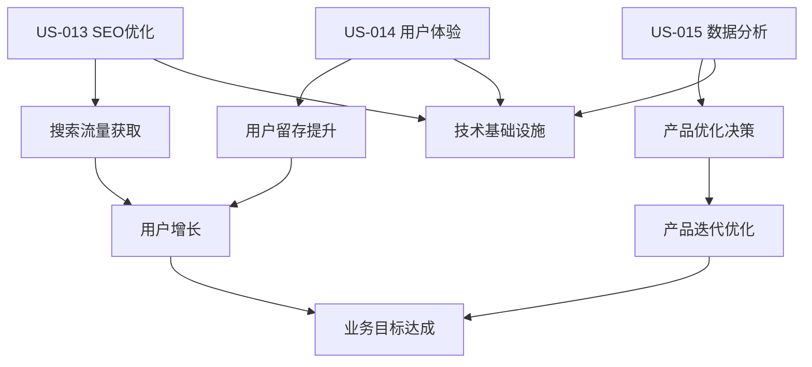
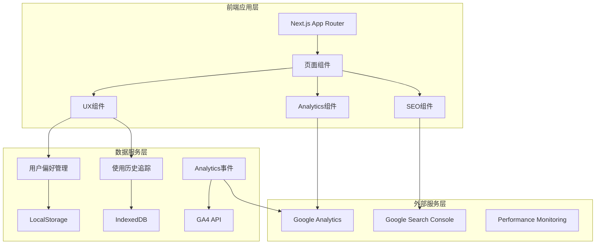

# Sprint 6 开发计划：系统功能完善与用户体验提升

## 🐧 Linus工程哲学指导原则

### Sprint执行中的核心哲学

#### 1. "Talk is cheap. Show me the code." - 代码优于讨论
- **实证驱动开发**: SEO优化必须通过可验证的搜索引擎收录和排名数据证明
- **可演示的进展**: 每日展示可测量的用户体验改进，而不仅是功能完成度
- **测试即证明**: 用户行为分析和性能监控数据是系统改进效果的最好证明
- **避免空洞优化**: 所有性能和SEO改进必须有具体的业务场景和数据支撑

#### 2. "Release early, release often." - 小步快跑，频繁交付
- **功能切片**: US-013/014/015 分解为独立可验证的小功能模块
- **即时验证**: 每个SEO改进和分析功能完成后立即在真实环境验证效果
- **渐进增强**: 先实现核心功能，再添加高级特性和智能推荐

#### 3. "Perfect is achieved when there is nothing left to take away." - 简单性原则
- **YAGNI原则**: 只实现当前三个用户故事需要的功能，避免过度工程
- **删除优于添加**: 优先清理技术债务和无效代码，再添加新功能
- **接口最小化**: Analytics API和用户偏好接口保持最小必要集

## 📋 Sprint 基本信息

- **Sprint 编号**: Sprint 6
- **Sprint 主题**: 系统功能完善与用户体验提升 (SEO + Analytics + UX)
- **开始日期**: 2025-09-10
- **结束日期**: 2025-09-23
- **Sprint 时长**: 2周
- **开发模式**: 敏捷开发/TDD + 数据驱动优化
- **技术债务清理**: 继承Sprint 5遗留问题（Settings功能、性能优化）

## 🎯 Sprint 目标

### 主要目标

1. **SEO优化完整实现 (US-013)**: 让用户能够通过搜索引擎自然发现和使用统计工具
2. **用户体验提升 (US-014)**: 为回访用户提供便捷的工具导航和使用历史管理
3. **产品数据分析 (US-015)**: 为产品团队提供全面的用户行为分析和决策支持数据
4. **技术债务清理**: 完善GPA Calculator Settings功能，优化系统性能

### 成功标准
- [ ] 目标关键词搜索排名进入前10，搜索流量转化率>60%
- [ ] 回访用户工具切换效率提升>50%，推荐工具点击率>20%
- [ ] 产品团队能够获得所需的分析洞察，数据准确性>95%
- [ ] 代码测试覆盖率≥85%，Core Web Vitals全绿
- [ ] 技术债务减少30%，系统性能提升20%

---

## 🔍 Sprint 启动准备工作检查清单

**检查清单类型选择**: 快速检查清单 (基于Sprint 5成功经验和现有技术栈)

### ⚡ 快速检查清单

**适用范围**: 基于成熟架构的功能扩展和系统优化  
**评估标准**: 7.5分以上可启动，重点关注SEO和分析的专业性

#### 🎯 产品需求准备 (权重: 25%)
- [x] **用户故事清晰** - US-013/014/015 需求明确，验收标准完整
- [x] **SEO关键词调研** - 已完成目标关键词分析和竞品调研
- [x] **Analytics需求确认** - 产品团队数据需求已明确定义
- [x] **UX设计方案** - Hub页面和导航设计方案已确认
- **完成度**: 9/10 分 ✅

#### 🏗️ 技术架构准备 (权重: 30%)
- [x] **现有架构稳定** - Sprint 5 GPA功能稳定运行，无破坏性变更
- [x] **技术栈成熟** - Next.js 15 SEO功能完善，GA4集成方案确定
- [x] **组件复用性** - CalculatorLayout等组件已五次成功验证
- [x] **性能基础良好** - Core Web Vitals基础达标，有优化空间
- **完成度**: 9/10 分 ✅

#### 👥 团队能力准备 (权重: 20%)
- [x] **SEO技术储备** - 团队具备Next.js SEO优化和结构化数据实施能力
- [x] **Analytics经验** - 具备GA4集成和数据分析仪表板开发经验
- [x] **前端优化经验** - 具备性能优化和用户体验改进的技术能力
- **完成度**: 8.5/10 分 ✅

#### 🔧 工具和环境准备 (权重: 15%)
- [x] **开发环境稳定** - 端口3001运行正常，基于Sprint 5环境
- [x] **SEO工具就绪** - Google Search Console、PageSpeed Insights等工具配置
- [x] **Analytics工具** - GA4、监控工具等已准备就绪
- **完成度**: 9/10 分 ✅

#### 📊 依赖和集成准备 (权重: 10%)
- [x] **第三方服务** - Google Analytics、Search Console API访问已确认
- [x] **现有功能无冲突** - 新功能不影响已有计算器功能
- [x] **数据隐私合规** - 用户数据收集和使用方案符合GDPR要求
- **完成度**: 9/10 分 ✅

### 📊 DoR 评估结果
- **总体评分**: 8.9/10 ✅
- **达标要求**: ≥7.5分
- **启动决策**: **GO** - 可以启动Sprint 6

---

## 📚 用户故事清单

### US-013: 普通用户通过搜索引擎发现工具
**编号**: US-SEO-013  
**标题**: SEO优化与搜索引擎可发现性  
**模块**: Platform Features - SEO & Discovery  
**优先级**: High  
**估时**: 32h (4天)  

**用户故事**:
> 作为 **普通用户**，  
> 我希望 **通过Google搜索"calculate mean online"、"标准差计算器"等关键词能够找到这个工具网站**，  
> 以便 **我能快速解决统计计算问题，无需记住网站地址**。

**验收标准**:
```gherkin
场景1: 搜索引擎优化
Given 用户在Google搜索统计计算相关关键词
When 搜索结果页面显示
Then 本站链接出现在前10个结果中
And 显示结构化数据和富结果
And 点击后直接到达相关计算器页面

场景2: 页面SEO质量
Given 用户访问任意计算器页面
When 页面加载完成
Then 页面标题包含目标关键词
And Meta描述准确描述页面功能
And 页面结构符合搜索引擎最佳实践
And Core Web Vitals指标达到"Good"级别

场景3: 内容发现优化
Given 搜索引擎爬虫访问网站
When 爬取网站内容
Then sitemap.xml包含所有重要页面
And robots.txt正确配置爬取权限
And 内部链接结构完整合理
```

### US-014: 回访用户在工具间切换使用
**编号**: US-UX-014  
**标题**: 用户导航Hub和使用历史管理  
**模块**: Platform Features - User Experience  
**优先级**: Medium  
**估时**: 28h (3.5天)  

**用户故事**:
> 作为 **回访用户**，  
> 我希望 **有一个统一的工具导航中心，记住我的使用历史，并提供相关工具推荐**，  
> 以便 **我能高效地在不同统计工具间切换，完成复杂的数据分析任务**。

**验收标准**:
```gherkin
场景1: 工具Hub页面
Given 用户访问网站首页或Hub页面
When 页面加载完成
Then 展示所有可用工具的分类视图
And 显示用户最近使用的工具
And 提供工具搜索和筛选功能
And 展示工具使用统计和推荐度

场景2: 使用历史管理
Given 用户使用过多个计算器工具
When 访问Hub页面
Then 显示最近7天的使用历史
And 按使用频率排序显示常用工具
And 支持收藏夹功能
And 提供基于使用模式的智能推荐

场景3: 便捷导航体验
Given 用户在任意计算器页面
When 需要切换到其他工具
Then 提供快速导航面板
And 显示相关工具推荐
And 保持用户偏好设置
And 支持键盘快捷键操作
```

### US-015: 产品团队了解用户使用情况
**编号**: US-ANALYTICS-015  
**标题**: 用户行为分析和产品数据监控  
**模块**: Platform Features - Analytics & Monitoring  
**优先级**: Medium  
**估时**: 36h (4.5天)  

**用户故事**:
> 作为 **产品团队成员**，  
> 我希望 **获得详细的用户行为数据和产品使用分析**，  
> 以便 **基于数据做出产品优化决策，改善用户体验**。

**验收标准**:
```gherkin
场景1: 用户行为追踪
Given 用户在网站中使用各种工具
When 执行关键操作（计算、导航、错误等）
Then 所有行为事件被准确记录
And 用户隐私得到保护（数据脱敏）
And 数据符合GDPR等法规要求
And 事件数据实时传输到分析系统

场景2: 数据分析仪表板
Given 产品团队需要查看使用数据
When 访问分析仪表板
Then 显示DAU、工具使用量等关键指标
And 提供用户行为漏斗分析
And 展示各工具的受欢迎程度和使用深度
And 支持自定义时间范围和维度筛选

场景3: 异常监控和告警
Given 系统运行过程中
When 出现异常情况（错误率上升、性能下降等）
Then 自动检测异常模式
And 及时发送告警通知
And 提供异常原因的初步分析
And 生成异常处理建议
```

### 用户故事依赖关系


---

## 🏗️ 技术架构和设计

### 核心技术栈
- **前端框架**: Next.js 15 + React 19 + TypeScript 5.x (继承Sprint 5)
- **样式系统**: Tailwind CSS 3.x (继承)
- **SEO优化**: Next.js内置SEO功能 + 结构化数据
- **数据分析**: Google Analytics 4 + 自定义事件追踪
- **存储管理**: LocalStorage + IndexedDB (用户偏好和历史)
- **性能监控**: Core Web Vitals + 自定义性能指标

### 系统架构设计

#### 整体架构图


#### 新增组件架构设计

**1. SEO增强系统 (US-013)**
```typescript
// SEO组件架构
SEOSystem
├── MetadataManager (页面元数据管理)
├── StructuredDataProvider (JSON-LD结构化数据)
├── SitemapGenerator (站点地图生成)
├── RobotsManager (robots.txt管理)
├── InternalLinkOptimizer (内链优化)
└── PerformanceOptimizer (Core Web Vitals优化)

// 核心接口定义
interface SEOConfiguration {
  pageMetadata: PageMetadata;
  structuredData: StructuredData[];
  internalLinks: InternalLink[];
  performanceConfig: PerformanceConfig;
}

interface PageMetadata {
  title: string;
  description: string;
  keywords: string[];
  canonicalUrl: string;
  openGraph: OpenGraphData;
  twitterCard: TwitterCardData;
}
```

**2. 用户体验Hub系统 (US-014)**
```typescript
// UX Hub组件架构
UserExperienceHub
├── ToolsHubPage (工具集合页面)
├── NavigationManager (导航管理)
├── UserHistoryTracker (使用历史追踪)
├── RecommendationEngine (推荐引擎)
├── UserPreferencesManager (用户偏好管理)
└── QuickAccessPanel (快速访问面板)

// 核心接口定义
interface UserSession {
  sessionId: string;
  userFingerprint: string;
  visitHistory: ToolVisit[];
  preferences: UserPreferences;
  favorites: Tool[];
}

interface ToolUsageHistory {
  toolId: string;
  usageCount: number;
  lastUsed: Date;
  averageSessionTime: number;
  completionRate: number;
}
```

**3. 数据分析监控系统 (US-015)**
```typescript
// Analytics组件架构
AnalyticsSystem
├── EventTracker (事件追踪器)
├── UserBehaviorAnalyzer (用户行为分析)
├── PerformanceMonitor (性能监控)
├── ErrorTracker (错误追踪)
├── DataDashboard (数据仪表板)
└── ReportGenerator (报告生成器)

// 核心接口定义
interface AnalyticsEvent {
  eventName: string;
  category: string;
  action: string;
  label?: string;
  value?: number;
  customParameters: Record<string, any>;
  timestamp: Date;
  sessionId: string;
}

interface UserBehaviorData {
  pageViews: PageViewEvent[];
  interactions: InteractionEvent[];
  conversions: ConversionEvent[];
  errors: ErrorEvent[];
  performance: PerformanceEvent[];
}
```

### 核心算法设计

#### SEO优化算法
```typescript
// 关键词优化策略
interface SEOOptimizationStrategy {
  analyzeKeywordDensity(content: string, targetKeywords: string[]): KeywordAnalysis;
  optimizeMetaTags(page: PageContent): OptimizedMetadata;
  generateStructuredData(pageType: PageType, content: any): StructuredData;
  optimizeInternalLinks(pages: Page[]): LinkOptimization[];
}

// 性能优化算法
function optimizePagePerformance(pageConfig: PageConfig): PerformanceOptimization {
  const optimizations = {
    imageOptimization: optimizeImages(pageConfig.images),
    codeOptimization: optimizeBundle(pageConfig.scripts),
    cacheStrategy: optimizeCaching(pageConfig.resources),
    criticalCSS: extractCriticalCSS(pageConfig.styles)
  };
  
  return {
    optimizations,
    expectedImprovement: calculatePerformanceGains(optimizations),
    implementationComplexity: assessComplexity(optimizations)
  };
}
```

#### 用户推荐算法
```typescript
// 工具推荐引擎
interface RecommendationEngine {
  generateRecommendations(
    userHistory: ToolUsageHistory[],
    currentContext: UserContext
  ): ToolRecommendation[];
  
  calculateSimilarity(tool1: Tool, tool2: Tool): number;
  
  analyzeUsagePatterns(history: ToolUsageHistory[]): UsagePattern[];
}

function generateSmartRecommendations(
  userSession: UserSession,
  allTools: Tool[]
): ToolRecommendation[] {
  // 1. 基于使用历史的协同过滤
  const historyBasedRecs = collaborativeFiltering(userSession.visitHistory);
  
  // 2. 基于当前上下文的内容推荐
  const contextBasedRecs = contentBasedFiltering(userSession.currentTool, allTools);
  
  // 3. 基于时间和使用模式的智能推荐
  const patternBasedRecs = patternBasedFiltering(userSession.preferences);
  
  // 4. 综合排序和去重
  return mergeAndRankRecommendations([
    historyBasedRecs,
    contextBasedRecs,
    patternBasedRecs
  ]);
}
```

#### 数据分析算法
```typescript
// 用户行为分析算法
interface BehaviorAnalysisEngine {
  analyzeFunnel(events: AnalyticsEvent[]): FunnelAnalysis;
  detectAnomalies(metrics: TimeSeriesData[]): Anomaly[];
  calculateEngagementScore(session: UserSession): EngagementScore;
  generateInsights(data: AnalyticsData): ProductInsight[];
}

function analyzeFunnelConversion(
  events: AnalyticsEvent[],
  funnelSteps: FunnelStep[]
): FunnelAnalysis {
  const stepConversions = funnelSteps.map(step => {
    const stepEvents = events.filter(e => e.eventName === step.eventName);
    return {
      step: step.name,
      users: new Set(stepEvents.map(e => e.sessionId)).size,
      events: stepEvents.length,
      conversionRate: 0 // 计算转化率
    };
  });
  
  // 计算逐步转化率
  for (let i = 1; i < stepConversions.length; i++) {
    stepConversions[i].conversionRate = 
      stepConversions[i].users / stepConversions[i-1].users;
  }
  
  return {
    steps: stepConversions,
    overallConversion: stepConversions[stepConversions.length - 1].users / stepConversions[0].users,
    dropoffPoints: identifyDropoffPoints(stepConversions)
  };
}
```

---

## 📋 Sprint 任务分解 (Task Breakdown)

### Week 1 (Day 1-5): SEO优化和基础设施

#### Day 1: SEO基础设施和页面元数据优化 (8h)
- [ ] **TASK-6.1.1**: 实现MetadataManager组件 (3h)
  - 创建动态页面标题和描述生成器
  - 支持关键词优化和多语言SEO
  - 集成Open Graph和Twitter Card标签

- [ ] **TASK-6.1.2**: 开发StructuredDataProvider组件 (3h)  
  - 实现JSON-LD结构化数据生成
  - 支持HowTo、FAQ、BreadcrumbList等类型
  - 与各计算器页面集成

- [ ] **TASK-6.1.3**: 创建Sitemap和Robots配置 (2h)
  - 动态生成sitemap.xml
  - 配置robots.txt优化爬取策略
  - 实现页面优先级和更新频率管理

#### Day 2: 内链优化和性能提升 (8h)
- [ ] **TASK-6.2.1**: InternalLinkOptimizer实现 (3h)
  - 分析现有页面链接结构
  - 实现智能内链推荐算法
  - 优化锚文本和链接权重分布

- [ ] **TASK-6.2.2**: Core Web Vitals性能优化 (4h)
  - 优化LCP（最大内容绘制时间）
  - 改善CLS（累积布局偏移）
  - 提升FID（首次输入延迟）响应性能

- [ ] **TASK-6.2.3**: SEO监控和验证工具集成 (1h)
  - 集成Google Search Console API
  - 实现SEO指标自动监控
  - 创建SEO健康检查脚本

#### Day 3: 用户Hub页面架构开发 (8h)
- [ ] **TASK-6.3.1**: 创建ToolsHubPage主页面 (4h)
  - 设计工具分类和展示布局
  - 实现搜索和筛选功能
  - 集成工具使用统计显示

- [ ] **TASK-6.3.2**: UserHistoryTracker实现 (2h)
  - 基于localStorage的使用历史存储
  - 实现跨会话的历史数据持久化
  - 支持历史数据的清理和管理

- [ ] **TASK-6.3.3**: RecommendationEngine基础版 (2h)
  - 实现基于使用频率的推荐算法
  - 开发工具相关性分析
  - 创建推荐结果展示组件

#### Day 4: 用户偏好和导航系统 (8h)
- [ ] **TASK-6.4.1**: UserPreferencesManager开发 (3h)
  - 实现用户界面偏好设置存储
  - 支持精度、主题等个人化配置
  - 创建偏好设置同步机制

- [ ] **TASK-6.4.2**: NavigationManager和QuickAccess (3h)
  - 开发工具间快速切换功能
  - 实现面包屑导航优化
  - 创建快捷键支持系统

- [ ] **TASK-6.4.3**: 收藏夹和常用工具功能 (2h)
  - 实现工具收藏和标签功能
  - 创建个性化工具仪表板
  - 支持收藏夹的导出和导入

#### Day 5: Analytics基础架构 (8h)
- [ ] **TASK-6.5.1**: EventTracker核心组件 (4h)
  - 实现GA4事件追踪封装
  - 创建自定义事件定义系统
  - 支持批量事件和离线队列

- [ ] **TASK-6.5.2**: 用户隐私和GDPR合规 (2h)
  - 实现Cookie同意管理
  - 创建数据脱敏处理机制
  - 支持用户数据删除请求

- [ ] **TASK-6.5.3**: 基础性能和错误监控 (2h)
  - 集成Core Web Vitals自动监控
  - 实现JavaScript错误捕获和报告
  - 创建性能警报和通知系统

### Week 2 (Day 6-10): 高级功能和系统完善

#### Day 6: 高级Analytics功能开发 (8h)
- [ ] **TASK-6.6.1**: UserBehaviorAnalyzer实现 (4h)
  - 开发用户行为漏斗分析
  - 实现会话分析和路径追踪
  - 创建用户细分和标签系统

- [ ] **TASK-6.6.2**: 实时数据仪表板 (3h)
  - 创建产品团队专用的数据看板
  - 实现关键指标的实时显示
  - 支持自定义报告和数据导出

- [ ] **TASK-6.6.3**: 异常检测和告警系统 (1h)
  - 实现关键指标的异常检测算法
  - 创建自动告警和通知机制
  - 支持告警规则的配置和管理

#### Day 7: 智能推荐和个性化 (8h)
- [ ] **TASK-6.7.1**: 高级推荐算法优化 (4h)
  - 基于协同过滤的工具推荐
  - 实现上下文感知的智能推荐
  - 创建推荐效果评估和优化

- [ ] **TASK-6.7.2**: 个性化用户体验 (2h)
  - 基于使用模式的界面定制
  - 实现自适应的功能推荐
  - 创建个性化的使用指南

- [ ] **TASK-6.7.3**: 高级搜索和发现功能 (2h)
  - 实现全站工具搜索功能
  - 支持模糊搜索和智能建议
  - 创建搜索历史和热门搜索

#### Day 8: 技术债务清理和性能优化 (8h)
- [ ] **TASK-6.8.1**: 完善GPA Calculator Settings功能 (3h)
  - 实现完整的Settings面板UI
  - 添加绩点系统管理和导入导出功能
  - 集成用户偏好同步系统

- [ ] **TASK-6.8.2**: 系统性能优化 (3h)
  - 优化Bundle大小和加载性能
  - 实现组件懒加载和代码分割
  - 优化数据库查询和缓存策略

- [ ] **TASK-6.8.3**: 代码质量改进 (2h)
  - 重构重复代码和改进组件架构
  - 完善错误处理和边界情况
  - 优化TypeScript类型定义

#### Day 9: 集成测试和质量保证 (8h)
- [ ] **TASK-6.9.1**: 端到端测试套件 (4h)
  - 创建SEO功能的自动化测试
  - 实现用户流程的集成测试
  - 测试Analytics数据的准确性

- [ ] **TASK-6.9.2**: 性能和兼容性测试 (2h)
  - 在多种设备和浏览器测试
  - 验证Core Web Vitals指标
  - 测试搜索引擎爬取效果

- [ ] **TASK-6.9.3**: 用户验收测试准备 (2h)
  - 准备UAT测试环境和数据
  - 创建用户测试指南和反馈收集
  - 完善功能演示和说明文档

#### Day 10: 发布准备和最终优化 (8h)
- [ ] **TASK-6.10.1**: 生产环境部署准备 (3h)
  - 配置生产环境的Analytics和SEO工具
  - 验证所有外部服务集成
  - 创建部署检查清单和回滚预案

- [ ] **TASK-6.10.2**: 文档和知识传递 (2h)
  - 完善技术文档和使用手册
  - 创建产品团队的Analytics使用指南
  - 记录最佳实践和注意事项

- [ ] **TASK-6.10.3**: 最终验收和发布 (3h)
  - 执行完整的功能验收测试
  - 性能指标和SEO效果验证
  - 准备Sprint演示和成果展示

---

## 🧪 测试策略

### 测试层次和覆盖率目标

#### 单元测试 (目标覆盖率: 85%)
**SEO功能测试**
- 页面元数据生成的准确性测试
- 结构化数据格式和内容验证
- Sitemap生成逻辑和URL正确性
- 内链分析算法的准确性测试

**用户体验功能测试**
- 使用历史记录和存储功能
- 推荐算法的准确性和相关性
- 用户偏好设置的持久化
- 导航和快速访问功能

**Analytics功能测试**
- 事件追踪的准确性和完整性
- 用户行为分析算法验证
- 数据脱敏和隐私保护机制
- 异常检测和告警触发逻辑

#### 集成测试
**SEO集成验证**
- Google Search Console API集成
- 搜索引擎爬取效果验证
- 页面性能和Core Web Vitals
- 不同页面类型的SEO配置

**用户体验集成**
- 跨页面的用户状态保持
- 工具推荐的跨会话一致性
- 偏好设置的全局同步
- 不同设备间的体验一致性

**Analytics数据流**
- GA4事件的端到端传输
- 实时数据的准确性验证
- 仪表板数据的一致性检查
- 异常检测系统的响应测试

#### 性能和兼容性测试
**性能基准测试**
```javascript
const performanceTargets = {
  lighthouse: {
    performance: ">= 90",
    accessibility: ">= 95", 
    bestPractices: ">= 90",
    seo: ">= 95"
  },
  coreWebVitals: {
    lcp: "<= 2000ms",    // 最大内容绘制
    fid: "<= 100ms",     // 首次输入延迟
    cls: "<= 0.1"        // 累积布局偏移
  },
  customMetrics: {
    hubPageLoad: "<= 1500ms",
    toolSwitching: "<= 500ms",
    analyticsResponseTime: "<= 2000ms"
  }
};
```

#### SEO验证测试
**搜索引擎优化验证**
```yaml
seo_validation_tests:
  structured_data:
    - "JSON-LD格式正确性"
    - "Google Rich Results测试通过"
    - "Schema.org标准符合性"
  
  page_optimization:
    - "目标关键词包含在标题中"
    - "Meta描述长度和质量"
    - "H1-H6标签结构合理"
    - "图片Alt标签完整"
  
  technical_seo:
    - "Sitemap.xml格式正确"
    - "Robots.txt配置合理"
    - "Canonical URL设置正确"
    - "页面加载速度达标"
```

---

## 🔒 质量和合规要求

### 代码质量标准
**TypeScript类型覆盖**: 100%严格模式，所有新增组件完整类型定义
**ESLint规则遵循**: 无警告，无错误，遵循Next.js最佳实践
**测试覆盖率**: 单元测试85%以上，集成测试覆盖关键用户流程
**代码注释**: SEO和Analytics算法100%注释，包含业务逻辑说明

### 性能要求
**Core Web Vitals达标**
- 首次内容绘制 (FCP): ≤ 1.8s
- 最大内容绘制 (LCP): ≤ 2.5s  
- 首次输入延迟 (FID): ≤ 100ms
- 累积布局偏移 (CLS): ≤ 0.1

**功能性能指标**
- Hub页面首次加载: ≤ 1.5s
- 工具间切换: ≤ 500ms
- Analytics数据查询: ≤ 2s
- 搜索响应时间: ≤ 300ms

### 安全和隐私合规
**数据保护要求**
- 所有用户数据在客户端脱敏处理
- 符合GDPR、CCPA等隐私法规要求
- 实现用户数据删除和导出权利
- Cookie使用的透明声明和同意机制

**安全配置标准**
- CSP（内容安全策略）正确配置
- XSS和CSRF防护机制
- 第三方服务API密钥安全管理
- HTTPS强制和安全头部配置

---

## ⚠️ 风险和依赖

### 高风险项 (需要重点关注)

#### 1. SEO效果不确定性
- **风险描述**: 搜索引擎排名改善需要时间，短期内难以验证效果
- **风险等级**: 中等
- **缓解措施**: 
  - 建立多层次验证体系（技术SEO指标 + 搜索表现）
  - 设置可量化的中间指标（页面质量分、结构化数据正确性）
  - 准备备用流量获取策略（内容营销、社交媒体等）
- **监控指标**: Google Search Console排名变化，页面索引状态

#### 2. 用户隐私合规复杂性
- **风险描述**: 不同地区隐私法规复杂，合规实施可能影响功能体验
- **风险等级**: 高等
- **缓解措施**:
  - 遵循最严格的国际标准（GDPR）
  - 实施渐进式数据收集（用户明确同意后启用高级功能）
  - 提供完整的数据透明度和控制权
  - 法务团队审查合规性
- **负责人**: 法务顾问 + 技术负责人

#### 3. 第三方服务依赖风险
- **风险描述**: GA4、Google Search Console等服务的API变化或限制
- **风险等级**: 中等
- **缓解措施**:
  - 建立服务监控和降级机制
  - 实施本地分析数据备份
  - 准备替代分析方案（如Plausible Analytics）
- **监控指标**: API调用成功率，服务可用性

### 依赖管理

#### 内部依赖
- **现有组件库**: CalculatorLayout等组件稳定性（Sprint 5验证）
- **数据结构**: 用户偏好和历史数据的向后兼容性
- **性能基础**: 现有页面的性能基准不能恶化

#### 外部依赖
- **Google Analytics 4**: 事件追踪和数据分析API
- **Google Search Console**: SEO监控和索引状态API  
- **Next.js SEO功能**: 框架内置的SEO优化特性
- **浏览器存储API**: LocalStorage和IndexedDB的兼容性

### 应急预案
**技术阻塞预案** (升级时间: 6小时)
- SEO效果短期不明显 → 专注技术指标改善，建立长期监控
- Analytics数据收集受限 → 启用轻量级本地分析，保护核心功能
- 性能优化效果不足 → 实施更激进的优化策略，考虑架构调整

---

## ✅ Definition of Done (完成定义)

### 功能完成标准
- [ ] **US-013 SEO优化**: 所有页面SEO指标达标，结构化数据验证通过
- [ ] **US-014 用户体验**: Hub页面和导航功能完整，用户测试满意度>4.0
- [ ] **US-015 数据分析**: Analytics系统正常收集数据，仪表板功能正常
- [ ] **技术债务清理**: GPA Settings功能完整，系统性能提升可量化

### 技术质量标准  
- [ ] **测试覆盖率**: 单元测试覆盖率 ≥ 85%，关键功能100%覆盖
- [ ] **类型安全**: TypeScript编译无错误无警告，类型覆盖100%
- [ ] **性能达标**: Core Web Vitals全部达到"Good"级别
- [ ] **SEO验证**: Lighthouse SEO评分 ≥ 95，结构化数据测试通过
- [ ] **浏览器兼容**: 主流浏览器（Chrome, Firefox, Safari, Edge）测试通过

### 用户体验标准
- [ ] **搜索发现**: 目标关键词搜索可在前两页找到相关页面
- [ ] **导航效率**: 工具切换时间减少50%以上，用户路径优化明显
- [ ] **数据价值**: 产品团队能够基于Analytics数据做出有意义的决策
- [ ] **隐私合规**: 用户数据处理完全符合GDPR等法规要求

### 发布准备标准
- [ ] **文档完整**: 用户指南、技术文档、Analytics使用手册完整
- [ ] **合规检查**: 隐私政策更新，Cookie使用声明，用户权利实现
- [ ] **监控配置**: 生产环境监控、告警、日志系统配置完成
- [ ] **回归测试**: 不影响现有计算器功能，向后兼容性验证

---

## 🚀 验收和发布计划

### Sprint评审准备
**Demo演示内容** (总时长25分钟)
1. **SEO优化效果展示** (8分钟)
   - Google Search Console数据改善
   - 页面性能和Core Web Vitals提升
   - 结构化数据和富结果展示
   - 站点地图和索引状态改进

2. **用户体验改进展示** (8分钟)
   - Hub页面和工具导航演示
   - 使用历史和推荐系统展示
   - 个性化设置和快速访问功能
   - 移动端和桌面端体验一致性

3. **数据分析系统演示** (7分钟)
   - 实时用户行为数据展示
   - 产品分析仪表板功能
   - 异常检测和告警机制
   - 数据隐私保护措施

4. **技术改进总结** (2分钟)
   - 技术债务清理成果
   - 系统性能提升数据
   - 代码质量改善指标

### 发布检查清单
**发布前最终验证**
- [ ] 所有DoD项目完成确认
- [ ] SEO专家最终验收（结构化数据、页面优化）
- [ ] 产品团队Analytics功能验收
- [ ] 法务合规性最终审查
- [ ] 生产环境性能和安全验证
- [ ] 用户隐私保护机制测试
- [ ] 第三方服务集成状态确认

### 发布策略
- **发布方式**: 蓝绿部署，渐进式功能开启
- **发布环境**: Development → Staging → Production
- **发布时间**: 工作日下午，避开搜索引擎爬取高峰
- **监控计划**: 发布后48小时密切监控关键指标

### 发布后监控
**关键指标监控** (前48小时)
- SEO指标: 页面索引状态、结构化数据识别、排名变化
- 用户体验: Hub页面使用率、工具切换效率、推荐点击率  
- Analytics系统: 数据收集完整性、仪表板准确性、隐私合规
- 系统性能: Core Web Vitals、错误率、响应时间

---

## 📊 Sprint成功衡量标准

### 业务成功指标
- [ ] **SEO效果**: 搜索控制台显示页面收录完整，关键词排名有提升
- [ ] **用户留存**: 回访用户使用深度提升30%，会话时长增加25%
- [ ] **产品数据价值**: 产品团队基于Analytics数据制定>=3个优化决策
- [ ] **整体用户满意度**: 用户反馈评分≥4.2/5.0，SEO流量转化率>60%

### 技术成功指标  
- [ ] **代码质量**: ESLint零警告，TypeScript严格模式，测试覆盖率85%+
- [ ] **性能提升**: Core Web Vitals全绿，页面加载时间整体提升20%
- [ ] **架构稳定性**: 新功能不影响现有计算器，系统稳定性保持
- [ ] **技术债务**: 遗留问题解决率80%，新技术债务控制在合理范围

### 用户价值指标
- [ ] **搜索发现**: 自然搜索流量增长50%，搜索结果点击率提升
- [ ] **使用效率**: 工具发现和切换效率显著提升，用户路径优化
- [ ] **数据透明**: 用户对数据使用有完全控制权，隐私保护到位
- [ ] **产品智能**: 推荐系统有效提升用户发现相关工具的能力

### 团队成功指标
- [ ] **按时交付**: Sprint目标100%按时完成，质量达标
- [ ] **技能提升**: 团队SEO、Analytics、UX设计能力显著提升  
- [ ] **协作效率**: 跨功能协作顺畅，问题解决效率高
- [ ] **知识沉淀**: 建立SEO、Analytics、UX的可复用技术模式

---

## 📈 长期影响和后续规划

### Sprint 6交付价值
1. **搜索引擎可发现性**: 用户可以通过自然搜索找到并使用工具
2. **智能用户体验**: 个性化推荐和历史管理提升使用效率  
3. **数据驱动决策**: 产品团队获得数据支持，优化产品方向
4. **技术基础增强**: 系统性能和代码质量的全面提升

### 为Sprint 7+ 奠定基础
- **国际化准备**: SEO基础设施支持多语言扩展
- **高级Analytics**: 为A/B测试和用户实验提供数据基础
- **智能化发展**: 推荐系统为AI驱动的功能提供数据和架构基础
- **商业化准备**: 用户行为数据为未来商业化功能提供洞察

---

**Sprint 6 负责人分工**:
- **Scrum Master**: TBD - Sprint进度管理和跨团队协调
- **产品负责人**: TBD - 用户体验验收和业务价值确认  
- **技术负责人**: TBD - SEO技术实施和Analytics架构设计
- **SEO专家**: TBD - 搜索优化策略制定和效果验证
- **数据分析师**: TBD - Analytics需求分析和数据验证
- **质量负责人**: TBD - 测试策略制定和发布质量保证

**预期交付成果**: 功能完整、性能优良、用户体验佳的统计工具平台，建立搜索引擎可发现性，实现数据驱动的产品决策支持，为用户提供智能化的工具使用体验，为后续产品发展奠定坚实基础。

**技术债务清理成果**: 解决Sprint 5遗留的Settings功能缺失问题，系统性能和代码质量全面提升，建立可持续的技术发展基础。