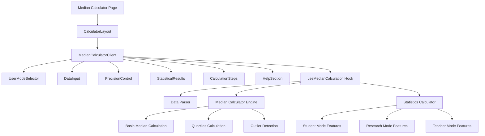

# Sprint 8 开发计划：Median Calculator 统计分析工具

## 🐧 Linus工程哲学指导原则

### Sprint执行中的核心哲学

#### 1. "Talk is cheap. Show me the code." - 代码优于讨论
- **实证驱动开发**: Median Calculator必须有完整的测试用例验证数学准确性
- **可演示的进展**: 每日展示可工作的中位数计算功能，而非设计文档
- **测试即证明**: TDD开发模式，先写测试再实现功能
- **避免过度设计**: 专注核心统计计算逻辑，UI保持简洁实用

#### 2. "Release early, release often." - 小步快跑，频繁交付
- **功能优先级**: 基础中位数计算 → 用户模式支持 → 高级统计功能 → UI优化
- **日常交付**: 功能拆分为2天交付周期
- **即时验证**: 完成核心功能立即部署测试环境验证

#### 3. "Perfect is achieved when there is nothing left to take away." - 简单性原则
- **UI简洁性**: 参考Mean Calculator的成熟设计模式
- **代码复用**: 最大化利用现有组件和hooks
- **功能聚焦**: 专注中位数计算核心价值

---

## 📖 Sprint 基本信息

| 属性 | 值 |
|------|---|
| **Sprint 编号** | Sprint 8 |
| **Sprint 主题** | Median Calculator 统计分析工具 |
| **Sprint 目标** | 实现专业的中位数计算器，支持多用户模式和高级统计分析 |
| **开始时间** | 2025-01-30 |
| **结束时间** | 2025-02-13 (10个工作日) |
| **Sprint 时长** | 2周 |
| **发布版本** | v0.8.0 |

## 🎯 Sprint 目标

### 主要目标
1. **核心中位数计算功能**: 实现高精度的中位数计算，支持奇数/偶数数据点
2. **多用户模式支持**: 学生、研究、教师三种模式的差异化功能
3. **高级统计功能**: 四分位数、异常值检测、置信区间计算
4. **完整UI体验**: 基于CalculatorLayout的响应式设计，全英文界面

### 成功标准
- ✅ 中位数计算数学准确性100%（通过50+测试用例验证）
- ✅ 三种用户模式功能完整且差异化明显
- ✅ 移动端适配完整，响应式设计优化
- ✅ 页面加载时间 < 2秒，计算响应 < 200ms
- ✅ 用户测试满意度 > 4.5/5.0
- ✅ 所有UI文案使用英文

## 📋 用户故事清单

### 高优先级 (Must Have)
- **US-020: Median Calculator for Statistical Analysis** 
  - 估算: 13 故事点
  - 价值: 高 - 填补统计工具空白，满足教育和研究需求
  - 复杂度: 高 - 多用户模式、高级统计功能
  - 页面路径: `/calculator/median`

**总估算**: 13 故事点

## 🗃️ 技术架构和设计

### 整体架构方案



### 核心计算模块设计

```typescript
// 核心数据接口
export interface MedianResult {
  median: number;
  mean: number;
  count: number;
  validNumbers: number[];
  invalidEntries: string[];
  sortedData: number[];
  steps: string[];
  
  // Basic statistics
  min: number;
  max: number;
  q1: number;
  q3: number;
  iqr: number;
  
  // Research mode extensions
  outliers?: number[];
  confidenceInterval?: [number, number];
  bootstrapSamples?: number;
  
  // Teacher mode extensions
  gradeDistribution?: { [key: string]: number };
  scoreRange?: { min: number; max: number };
  classPerformance?: string;
}

// Hook接口
export interface UseMedianCalculationReturn {
  result: MedianResult | null;
  parseInput: (inputText: string) => { validNumbers: number[]; invalidEntries: string[] };
  calculateMedian: (inputText: string) => void;
  clearResults: () => void;
  loadExample: () => string;
}
```

### 组件层级设计

```
src/app/calculator/median/
├── page.tsx                    # Next.js page with metadata
├── MedianCalculatorClient.tsx  # Main client component
└── loading.tsx                 # Loading component

src/hooks/
└── useMedianCalculation.ts     # Core calculation hook

src/lib/
├── medianCalculations.ts       # Pure calculation functions
└── statisticalUtils.ts         # Statistical utility functions
```

## 🔧 Sprint 任务分解 (Task Breakdown)

### 第一周任务

#### 阶段 1: 核心计算引擎 (第1-2天)
**目标**: 实现基础中位数计算功能

**任务清单**:
- [ ] **创建useMedianCalculation Hook** - 估算: 6小时 - 负责人: [开发者]
  - 基础中位数计算逻辑
  - 数据解析和验证
  - 奇数/偶数数据点处理
- [ ] **实现统计计算函数** - 估算: 6小时 - 负责人: [开发者]
  - 四分位数计算
  - 基础描述统计
  - 数据排序优化
- [ ] **编写核心测试用例** - 估算: 4小时 - 负责人: [开发者]
  - 中位数计算准确性测试
  - 边界条件测试
  - 性能测试

**每日交付物**:
- Day 1: useMedianCalculation hook基础版本
- Day 2: 完整的统计计算引擎 + 测试

#### 阶段 2: 页面结构和基础UI (第3-4天)
**目标**: 搭建页面架构和基础组件

**任务清单**:
- [ ] **创建页面结构** - 估算: 4小时 - 负责人: [开发者]
  - Next.js page setup
  - CalculatorLayout集成
  - SEO metadata配置
- [ ] **实现MedianCalculatorClient** - 估算: 8小时 - 负责人: [开发者]
  - 状态管理
  - 组件集成
  - 基础交互逻辑
- [ ] **集成现有UI组件** - 估算: 4小时 - 负责人: [开发者]
  - DataInput组件适配
  - PrecisionControl集成
  - UserModeSelector集成

**每日交付物**:
- Day 3: 基础页面结构和路由
- Day 4: 可工作的基础中位数计算器

#### 阶段 3: 用户模式差异化 (第5天)
**目标**: 实现三种用户模式的差异化功能

**任务清单**:
- [ ] **学生模式功能** - 估算: 3小时 - 负责人: [开发者]
  - 简化界面
  - 教育性解释
  - 基础统计展示
- [ ] **研究模式功能** - 估算: 3小时 - 负责人: [开发者]
  - 高精度计算
  - 异常值检测
  - 置信区间计算
- [ ] **教师模式功能** - 估算: 2小时 - 负责人: [开发者]
  - 成绩分布分析
  - 批量数据处理
  - 班级表现评估

**每日交付物**:
- Day 5: 三种用户模式完整功能

### 第二周任务

#### 阶段 4: 结果展示和交互优化 (第6-7天)
**目标**: 完善结果展示和用户体验

**任务清单**:
- [ ] **StatisticalResults组件适配** - 估算: 6小时 - 负责人: [开发者]
  - 中位数结果展示
  - 多模式差异化显示
  - 导出功能集成
- [ ] **CalculationSteps组件** - 估算: 4小时 - 负责人: [开发者]
  - 详细计算步骤
  - 概念解释
  - 交互式展示
- [ ] **HelpSection实现** - 估算: 6小时 - 负责人: [开发者]
  - 中位数概念解释
  - 使用指南
  - 常见问题解答

**每日交付物**:
- Day 6: 完整的结果展示系统
- Day 7: 帮助文档和用户指导

#### 阶段 5: 测试和质量保证 (第8-9天)
**目标**: 全面测试和bug修复

**任务清单**:
- [ ] **单元测试完善** - 估算: 6小时 - 负责人: [开发者]
  - Hook测试覆盖
  - 组件测试
  - 集成测试
- [ ] **端到端测试** - 估算: 4小时 - 负责人: [开发者]
  - 用户流程测试
  - 跨浏览器测试
  - 移动端测试
- [ ] **性能优化** - 估算: 6小时 - 负责人: [开发者]
  - 计算性能优化
  - 渲染性能优化
  - 内存使用优化

**每日交付物**:
- Day 8: 完整的测试套件
- Day 9: 性能优化和bug修复

#### 阶段 6: 部署和文档 (第10天)
**目标**: 部署上线和文档完善

**任务清单**:
- [ ] **生产部署准备** - 估算: 3小时 - 负责人: [开发者]
  - 构建优化
  - 环境配置
  - 监控设置
- [ ] **文档更新** - 估算: 3小时 - 负责人: [开发者]
  - API文档
  - 用户指南
  - 开发文档
- [ ] **发布和验证** - 估算: 2小时 - 负责人: [开发者]
  - 生产环境验证
  - 用户验收测试
  - 反馈收集

**每日交付物**:
- Day 10: 生产就绪的Median Calculator

## 🧪 测试策略

### TDD 测试驱动开发方案

#### 单元测试 (Jest + Testing Library)
```typescript
// useMedianCalculation.test.ts
describe('useMedianCalculation', () => {
  test('calculates median for odd number of values', () => {
    // Test implementation
  });
  
  test('calculates median for even number of values', () => {
    // Test implementation
  });
  
  test('handles invalid input gracefully', () => {
    // Test implementation
  });
  
  test('detects outliers in research mode', () => {
    // Test implementation
  });
});
```

#### 集成测试
- 组件间数据流测试
- Hook与组件集成测试
- 用户模式切换测试

#### E2E测试 (Playwright)
- 完整用户流程测试
- 跨浏览器兼容性测试
- 移动端响应式测试

### 测试数据集

#### 基础测试数据
```typescript
export const testDataSets = {
  oddCount: [1, 2, 3, 4, 5], // median: 3
  evenCount: [1, 2, 3, 4, 5, 6], // median: 3.5
  withOutliers: [1, 2, 3, 4, 100], // median: 3, outlier: 100
  duplicates: [1, 2, 2, 3, 4], // median: 2
  singleValue: [42], // median: 42
  decimal: [1.5, 2.7, 3.1, 4.9], // median: 2.9
};
```

## 🎨 UI设计规范 (全英文)

### 页面标题和描述
- **页面标题**: "Median Calculator"
- **页面描述**: "Calculate the median (middle value) of your dataset with advanced statistical analysis tools for students, researchers, and educators."

### 组件文案规范

#### UserModeSelector
- Student Mode: "Student - Basic median calculation with educational explanations"
- Research Mode: "Research - Advanced statistics with confidence intervals and outlier detection"
- Teacher Mode: "Teacher - Grade analysis with class performance insights"

#### DataInput
- Label: "Data Values"
- Placeholder: "Enter numbers separated by commas, spaces, or line breaks..."
- Help Text: "Example: 85, 92, 78, 96, 88, 91, 83, 89"

#### StatisticalResults
- Main Result: "Median (Middle Value)"
- Secondary Results: "Count", "Mean (Average)", "Range"
- Advanced Results: "Q1 (First Quartile)", "Q3 (Third Quartile)", "IQR (Interquartile Range)"

#### CalculationSteps
- Title: "Calculation Steps"
- Steps Format: "Step 1: Sort data in ascending order", "Step 2: Find middle value(s)"

### 错误消息 (英文)
- "Please enter at least one valid number"
- "Invalid data format detected"
- "Calculation failed. Please check your input"

## 🚀 部署和发布计划

### 部署环境
- **开发环境**: 每日自动部署
- **测试环境**: Sprint中期部署 (Day 5)
- **生产环境**: Sprint结束部署 (Day 10)

### 发布检查清单
- [ ] 所有测试通过 (单元测试、集成测试、E2E测试)
- [ ] 性能指标达标 (加载时间 < 2秒, 计算响应 < 200ms)
- [ ] 移动端适配完整
- [ ] SEO优化完成
- [ ] 无障碍访问支持
- [ ] 所有UI文案使用英文
- [ ] 浏览器兼容性验证

### 监控和反馈
- Google Analytics事件跟踪
- 用户行为分析
- 错误监控和告警
- 性能监控

## 📊 定义完成 (Definition of Done)

### 功能完成标准
- [ ] 核心中位数计算功能100%准确
- [ ] 三种用户模式功能完整
- [ ] 所有UI组件响应式适配
- [ ] 所有文案使用英文
- [ ] 测试覆盖率 > 90%

### 质量标准
- [ ] 代码审查通过
- [ ] 性能测试达标
- [ ] 安全测试通过
- [ ] 用户验收测试通过

### 文档标准
- [ ] API文档完整
- [ ] 用户指南完成
- [ ] 开发文档更新

---

**Sprint负责人**: Product Owner + Technical Lead  
**开发预估**: 10个工作日  
**测试预估**: 3个工作日 (并行进行)  
**发布目标**: v0.8.0 - 专业统计分析工具集
