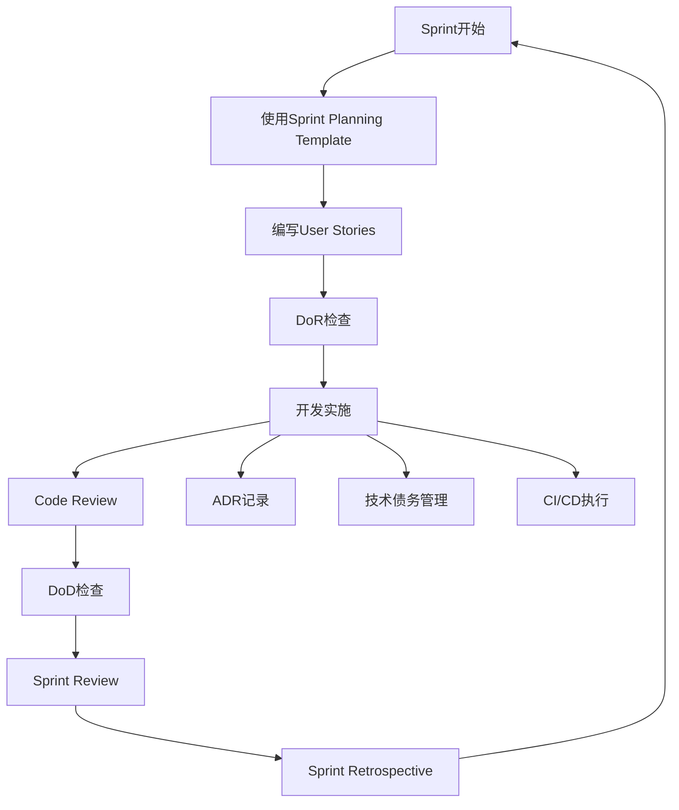

# Sprint 模板文件夹

## 🎯 概述

本文件夹包含 ClinWise EDC 项目的所有 Sprint 相关模板文件，基于 Linus 工程哲学设计，旨在提高团队协作效率和代码质量。

**Linus 工程哲学核心原则**:
- "Talk is cheap. Show me the code." - 实证优于讨论
- "Release early, release often." - 小步快跑，频繁交付  
- "Perfect is achieved when nothing left to take away." - 简洁性原则
- "Good programmers know what to rewrite." - 渐进式改进
- "Given enough eyeballs, all bugs are shallow." - 集体智慧

---

## 📁 模板文件说明

### 🏃‍♂️ Sprint 执行模板

#### 1. **Sprint-Planning-Template.md**
**用途**: Sprint 计划制定模板  
**使用时机**: 每个 Sprint 开始前  
**主要内容**:
- Linus 哲学指导原则在 Sprint 中的应用
- Sprint 目标设定和用户故事选择
- 技术架构设计和任务分解
- 测试策略和质量门禁计划
- 风险评估和团队协作安排

#### 2. **Sprint-Retrospective-Template.md** 
**用途**: Sprint 回顾总结模板  
**使用时机**: 每个 Sprint 结束后  
**主要内容**:
- 基于实际代码和数据的回顾分析
- Linus 哲学五大原则的实践效果评估
- 团队协作和技术能力成熟度评估
- 问题识别和改进行动计划
- 知识沉淀和最佳实践分享

### 📋 需求和质量模板

#### 3. **User-Story-Template.md**
**用途**: 用户故事编写标准模板  
**使用时机**: 产品需求分析和用户故事编写  
**主要内容**:
- 基于 Linus 哲学的用户故事格式
- 可验证的验收标准 (Gherkin 格式)
- DoR/DoD 完整检查清单
- 技术任务分解和测试策略
- 价值度量和迭代改进机制

#### 4. **dor-checklist.md**
**用途**: Definition of Ready 检查清单  
**使用时机**: 用户故事进入 Sprint 前  
**主要内容**:
- 快速检查版本 (5分钟完成)
- 基本信息、设计就绪、技术准备检查
- 强制检查项 (一票否决机制)
- Linus 哲学检查点

#### 5. **dod-checklist.md**
**用途**: Definition of Done 检查清单  
**使用时机**: 用户故事完成开发后  
**主要内容**:
- 三级完成标准 (功能、质量门禁、业务验收)
- Sprint 级别和发布级别 DoD
- 合规性验证 (21 CFR Part 11, ALCOA+)
- 最终签字确认流程

#### 6. **dor-dod-templates.md**
**用途**: DoR/DoD 详细标准和检查模板  
**使用时机**: 建立项目质量标准时参考  
**主要内容**:
- 完整的 DoR/DoD 标准体系
- 质量度量和持续改进机制
- 成熟度模型和改进路径
- 工具支持和自动化建议

### 🔧 开发流程模板

#### 7. **code-review-checklist.md**
**用途**: 代码审查标准清单  
**使用时机**: 每个 Pull Request 审查  
**主要内容**:
- 基于"Given enough eyeballs, all bugs are shallow"的审查理念
- 多维度审查标准 (功能、质量、安全、性能)
- 审查流程和角色定义
- 审查记录模板和度量指标

#### 8. **adr-template.md**
**用途**: 技术决策记录模板  
**使用时机**: 重要技术决策时  
**主要内容**:
- 体现"Show me the code"的实证决策框架
- 技术方案对比和 PoC 验证
- 决策实施计划和效果跟踪
- 团队讨论记录和异议处理

#### 9. **technical-debt-management.md**
**用途**: 技术债务管理模板  
**使用时机**: 持续的技术债务管理  
**主要内容**:
- "Good programmers know what to rewrite"的渐进式重构策略
- 债务识别、评估和优先级管理
- 重构方法论和最佳实践
- 债务监控度量和预防机制

### 🚀 CI/CD 和质量门禁

#### 10. **ci-cd-pipeline-template.md**
**用途**: CI/CD 流水线配置模板  
**使用时机**: 建立和优化 CI/CD 流程  
**主要内容**:
- 体现"Release early, release often"的流水线设计
- 5级质量门禁体系
- GitHub Actions 工作流配置
- 自动化脚本和支持工具

---

## 🔄 模板使用流程

### 📅 Sprint 周期中的模板使用



### 📋 每日开发中的模板应用

**每日必用**:
- [ ] **Code Review Checklist**: 每个 PR 都使用
- [ ] **CI/CD Pipeline**: 每次代码提交自动执行
- [ ] **Technical Debt**: 日常识别和记录

**按需使用**:
- [ ] **ADR Template**: 重要技术决策时
- [ ] **User Story Template**: 新需求分析时
- [ ] **DoR/DoD Checklist**: 故事流转时

**定期使用**:
- [ ] **Sprint Planning**: 每Sprint开始 (2周1次)
- [ ] **Sprint Retrospective**: 每Sprint结束 (2周1次)
- [ ] **Technical Debt Review**: 每月深度审查

---

## 📊 模板质量度量

### ✅ 使用效果指标

```yaml
template_effectiveness:
  adoption_rate: "模板使用覆盖率 (目标: 100%)"
  quality_improvement: "代码质量提升幅度"
  process_efficiency: "开发流程效率改善"
  team_satisfaction: "团队使用满意度 (目标: ≥4.0/5.0)"

linus_philosophy_embodiment:
  show_me_code: "实证驱动决策比例 (目标: ≥90%)"
  release_often: "日均代码集成次数 (目标: ≥1次)"
  simplicity: "代码复杂度控制 (目标: ≤10)"
  incremental_improvement: "重构vs重写比例 (目标: ≥80%)"
  collective_wisdom: "代码审查参与度 (目标: 100%)"
```

### 📈 持续改进机制

**每Sprint评估**:
- [ ] 模板使用情况统计
- [ ] 模板效果反馈收集
- [ ] 模板内容小幅调整

**每季度优化**:
- [ ] 模板内容重大更新
- [ ] 新模板需求识别
- [ ] 最佳实践沉淀

**每年度审查**:
- [ ] 模板体系整体评估
- [ ] 行业最佳实践对标
- [ ] 模板架构升级

---

## 🛠️ 工具集成建议

### 📋 项目管理工具集成

```yaml
tool_integration:
  jira_integration:
    - "User Story Template → Jira Story模板"
    - "DoR/DoD Checklist → Jira工作流状态"
    - "Technical Debt → Jira Task类型"
    
  confluence_integration:
    - "ADR Template → Confluence页面模板"
    - "Sprint Planning → Confluence会议模板"
    - "Sprint Retrospective → Confluence回顾模板"
    
  github_integration:
    - "Code Review Checklist → PR模板"
    - "CI/CD Pipeline → GitHub Actions"
    - "Issue Template → GitHub Issue模板"
```

### 🤖 自动化建议

```yaml
automation_opportunities:
  quality_checks:
    - "DoR/DoD检查项自动验证"
    - "代码审查清单自动检查"
    - "技术债务自动识别和统计"
    
  reporting:
    - "Sprint指标自动收集和报告"
    - "Linus哲学实践度量"
    - "模板使用效果分析"
    
  workflow:
    - "模板使用提醒和引导"
    - "质量门禁自动执行"
    - "最佳实践自动推荐"
```

---

## 📚 培训和推广

### 👥 团队培训计划

**新人入职培训**:
- [ ] Linus 工程哲学理念介绍
- [ ] Sprint 模板使用培训
- [ ] 实际项目中的模板应用

**团队提升培训**:
- [ ] 高级模板使用技巧
- [ ] 自定义模板开发
- [ ] 最佳实践案例分享

### 📖 使用指南

**快速上手**:
1. 阅读本 README 了解整体框架
2. 选择当前需要的模板开始使用  
3. 参考模板中的 Linus 哲学指导
4. 在实践中逐步掌握所有模板

**进阶使用**:
1. 深入理解 Linus 哲学在软件工程中的应用
2. 根据项目特点定制模板内容
3. 建立团队的最佳实践库
4. 参与模板的持续改进

---

## 🔗 相关资源

### 📖 参考文档
- **项目架构文档**: `../../01-architecture/`
- **编码标准**: `../../01-coding-standards/`
- **测试策略**: `../../03-testing/`
- **开发工作流**: `../../04-workflow/`

### 🌐 外部资源
- **Linus Torvalds 工程哲学**: 深入了解 Linus 的软件工程理念
- **敏捷开发最佳实践**: Sprint 管理和团队协作
- **代码质量管理**: 技术债务和重构策略
- **CI/CD 最佳实践**: 持续集成和部署

---

## 📝 变更记录

| 版本 | 日期 | 变更内容 | 变更人 |
|------|------|----------|--------|
| v1.0 | 2024-08-28 | 初始版本，包含完整的Sprint模板体系 | AI Assistant |

---

**维护团队**: ClinWise EDC 开发团队  
**审核人**: Scrum Master, 技术负责人, 产品负责人  
**更新周期**: 每季度评估，根据实际使用效果调整

**联系方式**: 如有模板使用问题或改进建议，请联系项目技术负责人