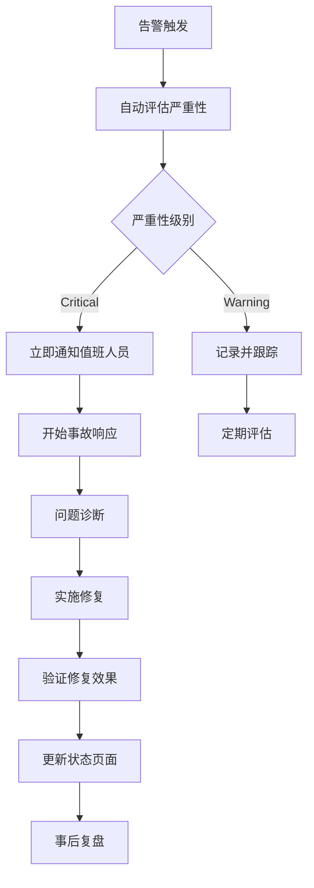

# 监控和运维策略

id: OPS-MONITORING-001
---
id: OPS-MONITORING-001
owner: @ops-team
acceptance: docs/03-acceptance/06-operations.feature
version: 1.0
created: 2025-09-05
status: Draft
reviewers: []
---

## 目的

建立 Stat Tools 的全面监控体系，确保系统稳定运行、性能达标和问题快速响应，为用户提供可靠的统计计算服务。

## 监控层级架构

```
┌─────────────────────────────────────────────┐
│                用户体验监控                  │
│  • Core Web Vitals  • 真实用户监控(RUM)     │
├─────────────────────────────────────────────┤
│                应用性能监控                  │
│  • API响应时间  • 错误率  • 吞吐量          │
├─────────────────────────────────────────────┤
│              基础设施监控                    │
│  • Cloudflare Analytics  • Worker指标       │
├─────────────────────────────────────────────┤
│                业务指标监控                  │
│  • 计算执行次数  • 用户活跃度  • 转化漏斗    │
├─────────────────────────────────────────────┤
│                安全与合规监控                │
│  • 异常访问  • 数据泄露检测  • 合规报告      │
└─────────────────────────────────────────────┘
```

## 核心监控指标

### 性能指标 (SLI - Service Level Indicators)

#### Core Web Vitals
```typescript
const coreWebVitalsTargets = {
  // Largest Contentful Paint - 最大内容绘制
  LCP: {
    target: 2500,      // ≤ 2.5s
    warning: 2000,     // > 2s 警告
    critical: 4000     // > 4s 严重
  },
  
  // First Input Delay - 首次输入延迟
  FID: {
    target: 100,       // ≤ 100ms
    warning: 100,      // > 100ms 警告  
    critical: 300      // > 300ms 严重
  },
  
  // Cumulative Layout Shift - 累积布局偏移
  CLS: {
    target: 0.1,       // ≤ 0.1
    warning: 0.1,      // > 0.1 警告
    critical: 0.25     // > 0.25 严重
  }
}
```

#### API性能指标
```typescript
const apiPerformanceTargets = {
  // 响应时间分位数
  responseTime: {
    p50: 200,          // 50% 请求 ≤ 200ms
    p95: 500,          // 95% 请求 ≤ 500ms  
    p99: 1000,         // 99% 请求 ≤ 1s
    max: 5000          // 最大超时 5s
  },
  
  // 错误率
  errorRate: {
    total: 0.5,        // 总错误率 < 0.5%
    clientError: 2,    // 4xx错误 < 2%
    serverError: 0.1   // 5xx错误 < 0.1%
  },
  
  // 可用性
  availability: {
    target: 99.9,      // 99.9% 可用性
    warning: 99.5,     // < 99.5% 警告
    critical: 99.0     // < 99% 严重
  }
}
```

#### 基础设施指标
```typescript
const infrastructureMetrics = {
  // Cloudflare Workers
  workers: {
    executionTime: 1000,     // 执行时间 < 1s
    memoryUsage: 128,        // 内存使用 < 128MB
    errorRate: 0.1           // 错误率 < 0.1%
  },
  
  // Cloudflare R2
  storage: {
    uploadLatency: 2000,     // 上传延迟 < 2s
    downloadLatency: 500,    // 下载延迟 < 500ms
    availability: 99.9       // 可用性 > 99.9%
  },
  
  // CDN缓存
  cdn: {
    cacheHitRate: 95,        // 缓存命中率 > 95%
    originLoadTime: 200      // 源站加载时间 < 200ms
  }
}
```

### 业务指标 (KPI)

```typescript
const businessMetrics = {
  // 用户活跃度
  userEngagement: {
    dailyActiveUsers: 1000,
    calculationsPerUser: 5,
    sessionDuration: 180,     // 3分钟
    bounceRate: 40           // < 40%
  },
  
  // 功能使用情况
  featureUsage: {
    meanCalculator: 60,      // 60% 使用率
    stdDevCalculator: 25,    // 25% 使用率
    weightedMean: 20,        // 20% 使用率
    gpaCalculator: 15,       // 15% 使用率
    exportFunction: 5        // 5% 使用率
  },
  
  // 转化漏斗
  conversionFunnel: {
    visitToCalculation: 70,   // 访问到计算转化 70%
    calculationToResult: 95,  // 计算到结果展示 95%
    resultToExport: 8,        // 结果到导出 8%
    repeatUsage: 25          // 重复使用率 25%
  }
}
```

## 监控工具和平台

### 1. 前端性能监控

#### Web Vitals 监控
```typescript
// 客户端Web Vitals收集
import { getCLS, getFID, getFCP, getLCP, getTTFB } from 'web-vitals'

const sendToAnalytics = (metric) => {
  // 发送到GA4或自定义分析平台
  if (typeof gtag !== 'undefined') {
    gtag('event', metric.name, {
      event_category: 'Web Vitals',
      event_label: metric.id,
      value: Math.round(metric.value),
      non_interaction: true
    })
  }
  
  // 发送到内部监控
  fetch('/api/v1/metrics/web-vitals', {
    method: 'POST',
    headers: { 'Content-Type': 'application/json' },
    body: JSON.stringify({
      name: metric.name,
      value: metric.value,
      id: metric.id,
      url: window.location.href,
      timestamp: Date.now()
    })
  })
}

// 注册所有核心指标
getCLS(sendToAnalytics)
getFID(sendToAnalytics)
getFCP(sendToAnalytics)
getLCP(sendToAnalytics)
getTTFB(sendToAnalytics)
```

#### 真实用户监控 (RUM)
```typescript
// RUM监控实现
class RealUserMonitoring {
  private metrics: Map<string, number[]> = new Map()
  
  // 页面加载性能
  trackPageLoad() {
    const navigation = performance.getEntriesByType('navigation')[0] as PerformanceNavigationTiming
    
    this.recordMetric('page_load_time', navigation.loadEventEnd - navigation.fetchStart)
    this.recordMetric('dom_content_loaded', navigation.domContentLoadedEventEnd - navigation.fetchStart)
    this.recordMetric('first_byte', navigation.responseStart - navigation.requestStart)
  }
  
  // API调用性能
  trackApiCall(endpoint: string, duration: number, status: number) {
    this.recordMetric(`api_${endpoint}_duration`, duration)
    this.recordMetric(`api_${endpoint}_status_${status}`, 1)
  }
  
  // 用户交互性能
  trackInteraction(action: string, duration: number) {
    this.recordMetric(`interaction_${action}`, duration)
  }
  
  private recordMetric(name: string, value: number) {
    if (!this.metrics.has(name)) {
      this.metrics.set(name, [])
    }
    this.metrics.get(name)!.push(value)
  }
  
  // 定期发送指标
  flush() {
    const batch = Array.from(this.metrics.entries()).map(([name, values]) => ({
      name,
      count: values.length,
      sum: values.reduce((a, b) => a + b, 0),
      avg: values.reduce((a, b) => a + b, 0) / values.length,
      min: Math.min(...values),
      max: Math.max(...values)
    }))
    
    fetch('/api/v1/metrics/rum', {
      method: 'POST',
      headers: { 'Content-Type': 'application/json' },
      body: JSON.stringify({
        metrics: batch,
        timestamp: Date.now(),
        user_agent: navigator.userAgent,
        url: window.location.href
      })
    })
    
    this.metrics.clear()
  }
}

// 使用示例
const rum = new RealUserMonitoring()
window.addEventListener('load', () => rum.trackPageLoad())
setInterval(() => rum.flush(), 30000) // 每30秒发送一次
```

### 2. 后端监控

#### Cloudflare Analytics集成
```typescript
// Cloudflare Analytics API集成
class CloudflareAnalytics {
  private accountId: string
  private apiToken: string
  
  constructor(accountId: string, apiToken: string) {
    this.accountId = accountId
    this.apiToken = apiToken
  }
  
  async getWorkerMetrics(scriptName: string, timeRange: string = '1h') {
    const query = `
      query {
        viewer {
          accounts(filter: {accountTag: "${this.accountId}"}) {
            workersInvocationsAdaptiveGroups(
              filter: {
                scriptName: "${scriptName}"
                datetime_geq: "${this.getTimeRangeStart(timeRange)}"
              }
              limit: 1000
            ) {
              count
              sum {
                requests
                errors
                duration
                cpuTime
              }
              dimensions {
                datetime
                status
              }
            }
          }
        }
      }
    `
    
    const response = await fetch('https://api.cloudflare.com/client/v4/graphql', {
      method: 'POST',
      headers: {
        'Authorization': `Bearer ${this.apiToken}`,
        'Content-Type': 'application/json'
      },
      body: JSON.stringify({ query })
    })
    
    return response.json()
  }
  
  async getPageRulesMetrics() {
    const response = await fetch(
      `https://api.cloudflare.com/client/v4/accounts/${this.accountId}/analytics/dashboard`,
      {
        headers: {
          'Authorization': `Bearer ${this.apiToken}`
        }
      }
    )
    
    return response.json()
  }
  
  private getTimeRangeStart(range: string): string {
    const now = new Date()
    switch (range) {
      case '1h': return new Date(now.getTime() - 60 * 60 * 1000).toISOString()
      case '24h': return new Date(now.getTime() - 24 * 60 * 60 * 1000).toISOString()
      case '7d': return new Date(now.getTime() - 7 * 24 * 60 * 60 * 1000).toISOString()
      default: return new Date(now.getTime() - 60 * 60 * 1000).toISOString()
    }
  }
}
```

#### 结构化日志
```typescript
// 统一日志格式
interface LogEntry {
  timestamp: string
  level: 'debug' | 'info' | 'warn' | 'error' | 'fatal'
  service: string
  request_id?: string
  user_id?: string
  event_type: string
  message: string
  metadata?: Record<string, any>
  error?: {
    name: string
    message: string
    stack?: string
  }
  performance?: {
    duration_ms: number
    memory_mb?: number
    cpu_ms?: number
  }
}

// 日志记录器
class Logger {
  private service: string
  
  constructor(service: string) {
    this.service = service
  }
  
  info(message: string, metadata?: Record<string, any>) {
    this.log('info', 'general', message, metadata)
  }
  
  error(message: string, error?: Error, metadata?: Record<string, any>) {
    this.log('error', 'error', message, metadata, error)
  }
  
  apiRequest(
    method: string,
    path: string,
    statusCode: number,
    duration: number,
    requestId: string,
    metadata?: Record<string, any>
  ) {
    this.log('info', 'api_request', `${method} ${path} ${statusCode}`, {
      ...metadata,
      http_method: method,
      http_path: path,
      http_status: statusCode,
      request_id: requestId
    }, undefined, { duration_ms: duration })
  }
  
  private log(
    level: LogEntry['level'],
    eventType: string,
    message: string,
    metadata?: Record<string, any>,
    error?: Error,
    performance?: LogEntry['performance']
  ) {
    const entry: LogEntry = {
      timestamp: new Date().toISOString(),
      level,
      service: this.service,
      event_type: eventType,
      message,
      metadata,
      performance
    }
    
    if (error) {
      entry.error = {
        name: error.name,
        message: error.message,
        stack: error.stack
      }
    }
    
    // 输出到console (开发环境) 或发送到日志服务
    if (process.env.NODE_ENV === 'development') {
      console.log(JSON.stringify(entry, null, 2))
    } else {
      // 发送到Cloudflare Logpush或外部服务
      this.sendToLogService(entry)
    }
  }
  
  private async sendToLogService(entry: LogEntry) {
    // 实现具体的日志发送逻辑
    // 例如：发送到Cloudflare Logpush、Datadog、或其他服务
  }
}

// 使用示例
const logger = new Logger('stat-tools-api')

// API请求日志
app.use((req, res, next) => {
  const start = Date.now()
  const requestId = crypto.randomUUID()
  req.requestId = requestId
  
  res.on('finish', () => {
    const duration = Date.now() - start
    logger.apiRequest(
      req.method,
      req.path,
      res.statusCode,
      duration,
      requestId,
      {
        user_agent: req.headers['user-agent'],
        ip_address: req.ip,
        request_size: req.headers['content-length'] || 0,
        response_size: res.get('content-length') || 0
      }
    )
  })
  
  next()
})
```

### 3. 应用监控

#### 错误跟踪 - Sentry集成
```typescript
// Sentry配置
import * as Sentry from "@sentry/node"
import * as SentryTracing from "@sentry/tracing"

Sentry.init({
  dsn: process.env.SENTRY_DSN,
  environment: process.env.NODE_ENV,
  
  // 性能监控
  tracesSampleRate: process.env.NODE_ENV === 'production' ? 0.1 : 1.0,
  
  // 发布版本跟踪
  release: process.env.VERCEL_GIT_COMMIT_SHA || 'development',
  
  // 集成配置
  integrations: [
    new SentryTracing.Integrations.Express({ app }),
    new SentryTracing.Integrations.Http({ tracing: true })
  ],
  
  // 错误过滤
  beforeSend(event, hint) {
    // 过滤已知的非关键错误
    if (hint.originalException?.message?.includes('Network error')) {
      return null
    }
    
    // 添加额外上下文
    event.extra = {
      ...event.extra,
      deployment: process.env.VERCEL_ENV,
      region: process.env.VERCEL_REGION
    }
    
    return event
  }
})

// 手动错误报告
const reportError = (error: Error, context?: Record<string, any>) => {
  Sentry.withScope(scope => {
    if (context) {
      Object.entries(context).forEach(([key, value]) => {
        scope.setTag(key, value)
      })
    }
    Sentry.captureException(error)
  })
}

// 性能监控
const trackPerformance = (operation: string, fn: () => Promise<any>) => {
  return Sentry.startTransaction({
    name: operation,
    op: 'function'
  }).then(async transaction => {
    try {
      const result = await fn()
      transaction.setStatus('ok')
      return result
    } catch (error) {
      transaction.setStatus('internal_error')
      throw error
    } finally {
      transaction.finish()
    }
  })
}
```

## 告警和通知系统

### 告警规则配置

```typescript
interface AlertRule {
  name: string
  condition: {
    metric: string
    operator: 'gt' | 'lt' | 'eq' | 'gte' | 'lte'
    threshold: number
    duration: string  // 持续时间，如 "5m"
  }
  severity: 'info' | 'warning' | 'critical'
  channels: ('email' | 'slack' | 'sms' | 'pagerduty')[]
  description: string
}

const alertRules: AlertRule[] = [
  {
    name: 'API响应时间过高',
    condition: {
      metric: 'api_response_time_p95',
      operator: 'gt',
      threshold: 1000,
      duration: '5m'
    },
    severity: 'warning',
    channels: ['slack', 'email'],
    description: '95%位数API响应时间超过1秒且持续5分钟'
  },
  {
    name: 'API错误率过高',
    condition: {
      metric: 'api_error_rate',
      operator: 'gt',
      threshold: 5,
      duration: '2m'
    },
    severity: 'critical',
    channels: ['slack', 'email', 'sms'],
    description: 'API错误率超过5%且持续2分钟'
  },
  {
    name: 'Core Web Vitals 恶化',
    condition: {
      metric: 'lcp_p75',
      operator: 'gt',
      threshold: 2500,
      duration: '10m'
    },
    severity: 'warning',
    channels: ['slack'],
    description: 'LCP 75%位数超过2.5秒且持续10分钟'
  },
  {
    name: '服务不可用',
    condition: {
      metric: 'service_availability',
      operator: 'lt',
      threshold: 99,
      duration: '1m'
    },
    severity: 'critical',
    channels: ['slack', 'email', 'sms', 'pagerduty'],
    description: '服务可用性低于99%'
  }
]
```

### 告警通知实现

```typescript
// 告警管理器
class AlertManager {
  private rules: AlertRule[]
  private activeAlerts: Map<string, Date> = new Map()
  
  constructor(rules: AlertRule[]) {
    this.rules = rules
  }
  
  async checkRules(metrics: Record<string, number>) {
    for (const rule of this.rules) {
      const currentValue = metrics[rule.condition.metric]
      if (currentValue === undefined) continue
      
      const triggered = this.evaluateCondition(currentValue, rule.condition)
      const alertKey = `${rule.name}_${rule.condition.metric}`
      
      if (triggered) {
        if (!this.activeAlerts.has(alertKey)) {
          this.activeAlerts.set(alertKey, new Date())
          await this.sendAlert(rule, currentValue)
        }
      } else {
        if (this.activeAlerts.has(alertKey)) {
          this.activeAlerts.delete(alertKey)
          await this.sendResolution(rule, currentValue)
        }
      }
    }
  }
  
  private evaluateCondition(value: number, condition: AlertRule['condition']): boolean {
    switch (condition.operator) {
      case 'gt': return value > condition.threshold
      case 'gte': return value >= condition.threshold
      case 'lt': return value < condition.threshold
      case 'lte': return value <= condition.threshold
      case 'eq': return value === condition.threshold
      default: return false
    }
  }
  
  private async sendAlert(rule: AlertRule, value: number) {
    const message = {
      title: `🚨 ${rule.name}`,
      description: rule.description,
      currentValue: value,
      threshold: rule.condition.threshold,
      severity: rule.severity,
      timestamp: new Date().toISOString()
    }
    
    for (const channel of rule.channels) {
      await this.sendToChannel(channel, message)
    }
  }
  
  private async sendResolution(rule: AlertRule, value: number) {
    const message = {
      title: `✅ ${rule.name} - 已恢复`,
      description: `${rule.description} - 当前值: ${value}`,
      severity: 'info' as const,
      timestamp: new Date().toISOString()
    }
    
    for (const channel of rule.channels) {
      await this.sendToChannel(channel, message)
    }
  }
  
  private async sendToChannel(channel: string, message: any) {
    switch (channel) {
      case 'slack':
        await this.sendSlackNotification(message)
        break
      case 'email':
        await this.sendEmailNotification(message)
        break
      case 'sms':
        await this.sendSMSNotification(message)
        break
      case 'pagerduty':
        await this.sendPagerDutyAlert(message)
        break
    }
  }
  
  private async sendSlackNotification(message: any) {
    const webhook = process.env.SLACK_WEBHOOK_URL
    if (!webhook) return
    
    const payload = {
      text: message.title,
      attachments: [{
        color: message.severity === 'critical' ? 'danger' : 'warning',
        fields: [
          {
            title: '描述',
            value: message.description,
            short: false
          },
          {
            title: '当前值',
            value: message.currentValue?.toString(),
            short: true
          },
          {
            title: '阈值',
            value: message.threshold?.toString(),
            short: true
          }
        ],
        ts: Math.floor(Date.now() / 1000)
      }]
    }
    
    await fetch(webhook, {
      method: 'POST',
      headers: { 'Content-Type': 'application/json' },
      body: JSON.stringify(payload)
    })
  }
}
```

## 监控仪表板

### 关键指标仪表板

```typescript
// 仪表板数据结构
interface DashboardMetric {
  name: string
  value: number
  unit: string
  trend: 'up' | 'down' | 'stable'
  status: 'good' | 'warning' | 'critical'
  target?: number
}

interface DashboardSection {
  title: string
  metrics: DashboardMetric[]
  charts?: ChartConfig[]
}

// 仪表板配置
const dashboardConfig: DashboardSection[] = [
  {
    title: '用户体验',
    metrics: [
      {
        name: 'LCP (P75)',
        value: 1.8,
        unit: 's',
        trend: 'down',
        status: 'good',
        target: 2.5
      },
      {
        name: 'FID (P95)',
        value: 85,
        unit: 'ms',
        trend: 'stable',
        status: 'good',
        target: 100
      },
      {
        name: 'CLS (P75)',
        value: 0.08,
        unit: '',
        trend: 'down',
        status: 'good',
        target: 0.1
      }
    ]
  },
  {
    title: 'API 性能',
    metrics: [
      {
        name: '响应时间 (P95)',
        value: 450,
        unit: 'ms',
        trend: 'up',
        status: 'warning',
        target: 500
      },
      {
        name: '错误率',
        value: 0.3,
        unit: '%',
        trend: 'stable',
        status: 'good',
        target: 0.5
      },
      {
        name: '可用性',
        value: 99.95,
        unit: '%',
        trend: 'stable',
        status: 'good',
        target: 99.9
      }
    ]
  },
  {
    title: '业务指标',
    metrics: [
      {
        name: '日活用户',
        value: 1250,
        unit: '',
        trend: 'up',
        status: 'good'
      },
      {
        name: '计算执行次数',
        value: 8500,
        unit: '/day',
        trend: 'up',
        status: 'good'
      },
      {
        name: '转化率',
        value: 68,
        unit: '%',
        trend: 'stable',
        status: 'good'
      }
    ]
  }
]
```

### 实时监控 API

```typescript
// 实时监控数据 API
app.get('/api/v1/monitoring/dashboard', async (req, res) => {
  try {
    // 获取各类指标
    const [
      webVitals,
      apiMetrics,
      businessMetrics,
      infraMetrics
    ] = await Promise.all([
      getWebVitalsMetrics(),
      getApiPerformanceMetrics(),
      getBusinessMetrics(),
      getInfrastructureMetrics()
    ])
    
    // 构建仪表板数据
    const dashboard = {
      timestamp: new Date().toISOString(),
      sections: [
        {
          title: '用户体验',
          metrics: [
            {
              name: 'LCP (P75)',
              value: webVitals.lcp.p75,
              status: webVitals.lcp.p75 <= 2500 ? 'good' : 'warning',
              trend: calculateTrend(webVitals.lcp.p75, webVitals.lcp.previous)
            },
            // ... 其他指标
          ]
        },
        // ... 其他部分
      ],
      alerts: await getActiveAlerts(),
      systemHealth: calculateSystemHealth([webVitals, apiMetrics, infraMetrics])
    }
    
    res.json(dashboard)
  } catch (error) {
    logger.error('获取监控仪表板数据失败', error)
    res.status(500).json({ error: 'Internal server error' })
  }
})

// 健康检查端点
app.get('/health', async (req, res) => {
  const health = {
    status: 'healthy',
    timestamp: new Date().toISOString(),
    services: {
      database: 'healthy',
      cache: 'healthy',
      storage: 'healthy',
      external_apis: 'healthy'
    },
    version: process.env.APP_VERSION || 'unknown'
  }
  
  try {
    // 检查各个依赖服务
    await Promise.all([
      checkDatabaseHealth(),
      checkCacheHealth(),
      checkStorageHealth()
    ])
    
    res.status(200).json(health)
  } catch (error) {
    health.status = 'unhealthy'
    res.status(503).json(health)
  }
})
```

## 性能优化建议

### 基于监控数据的优化策略

```typescript
// 性能优化建议生成器
class PerformanceOptimizer {
  async generateRecommendations(metrics: any): Promise<string[]> {
    const recommendations: string[] = []
    
    // LCP优化建议
    if (metrics.webVitals.lcp.p75 > 2500) {
      recommendations.push('考虑优化关键渲染路径，减少LCP')
      recommendations.push('启用图片懒加载和WebP格式')
      recommendations.push('优化服务器响应时间')
    }
    
    // API性能优化
    if (metrics.api.responseTime.p95 > 500) {
      recommendations.push('考虑增加API缓存策略')
      recommendations.push('优化数据库查询性能')
      recommendations.push('实施API响应压缩')
    }
    
    // 错误率优化
    if (metrics.api.errorRate.total > 1) {
      recommendations.push('增强输入验证逻辑')
      recommendations.push('改进错误处理和用户提示')
      recommendations.push('添加更多的边界条件测试')
    }
    
    // 缓存优化
    if (metrics.cdn.cacheHitRate < 90) {
      recommendations.push('优化CDN缓存策略')
      recommendations.push('增加静态资源缓存时间')
      recommendations.push('实施更智能的缓存失效策略')
    }
    
    return recommendations
  }
}
```

## 事件响应流程

### 故障响应流程



### 事故响应检查清单

```markdown
## 事故响应检查清单

### 立即响应 (0-15分钟)
- [ ] 确认告警真实性
- [ ] 评估影响范围和严重性
- [ ] 启动事故响应流程
- [ ] 通知相关人员
- [ ] 创建事故工单

### 诊断阶段 (15-30分钟)
- [ ] 收集相关日志和指标
- [ ] 识别根本原因
- [ ] 评估可能的解决方案
- [ ] 估算修复时间

### 修复阶段 (30分钟+)
- [ ] 实施临时缓解措施
- [ ] 应用永久修复方案
- [ ] 监控系统恢复状况
- [ ] 更新状态页面

### 恢复后
- [ ] 确认所有指标正常
- [ ] 通知利益相关者
- [ ] 安排事后复盘会议
- [ ] 更新运维文档
```

## 合规和审计

### 监控数据保留策略

```typescript
const dataRetentionPolicy = {
  // 实时监控数据
  realtime: {
    retention: '24h',
    granularity: '1m'
  },
  
  // 小时聚合数据  
  hourly: {
    retention: '30d',
    granularity: '1h'
  },
  
  // 日聚合数据
  daily: {
    retention: '1y',
    granularity: '1d'
  },
  
  // 错误日志
  errorLogs: {
    retention: '90d',
    sensitive_data: 'anonymized'
  },
  
  // 访问日志
  accessLogs: {
    retention: '90d',
    pii_data: 'hashed'
  }
}
```

### 隐私保护措施

```typescript
// 敏感数据脱敏
const sanitizeLogData = (data: any): any => {
  const sensitiveFields = ['email', 'ip_address', 'user_agent']
  
  const sanitized = { ...data }
  
  sensitiveFields.forEach(field => {
    if (sanitized[field]) {
      sanitized[field] = crypto
        .createHash('sha256')
        .update(sanitized[field])
        .digest('hex')
        .substring(0, 8)
    }
  })
  
  return sanitized
}
```

---

**维护责任人**：SRE团队 + 开发团队
**更新频率**：月度指标评估，季度策略调整
**告警响应**：7x24小时值班制度